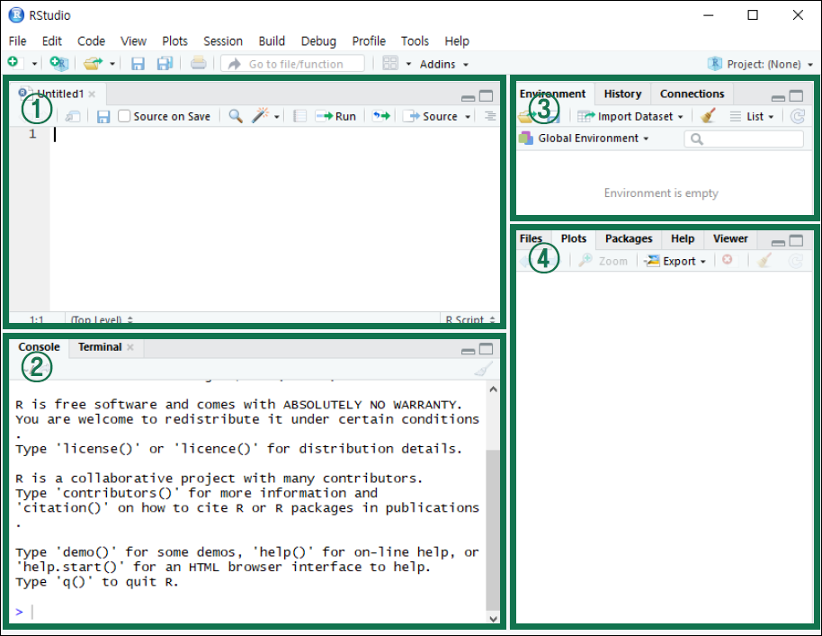

#  R 소개 및 기초


## R 및 R Studio 설치


### R
+ 통계 분석 과정에서 수행되는 복잡한 계산이나 시각화 기법 등을 쉽게 사용할 수 있도록 설계된 프로그래밍 언어 및 환경
  + 1976년 AT&T의 Bell Labs Statistics Group에서 개발한 프로그래밍 언어 S를 향상시켜 1993년 뉴질랜드 오클랜드 대학의 Ross Ihaka Robert Gentleman이 R을 개발함
  + 현재 R은 통계학 및 컴퓨터 과학 분야 등의 학자들로 이루어진 R Development Core Team에 의해 지속적으로 유지 및 개선되고 있음
+ 무료로 제공되는 오픈소스 소프트웨어
  + 접근성이 뛰어나 전 세계 많은 사용자들을 단시간에 확보할 수 있었음
  + 패키지(package)를 통한 확장성이 뛰어나 다른 R 사용자들이 개발한 새로운 분석기법을 자유롭게 추가할 수 있음 다른 소프트웨어에 비해 최신 이론이나 기법을 사용하기 쉬움
+ 다양한 통계분석 및 뛰어난 그래픽 기능
+ 편리한 도움말 기능
+ 프로그램 명령어를 직접 입력하는 방식


### R Studio
+ R을 편리하게 사용할 수 있도록 돕는 통합개발환경(IDE) 소프트웨어
+ R 구동 시 사용자가 이용하는 모든 기능들 및 도구들을 통합하여 나타냄
+ 다양하고 효과적인 편집기능을 제공하여 작업 수행의 생산성을 높임
+ 필요한 파일이나 함수를 빨리 찾을 수 있도록 도움
+ TeX, Sweave 등의 문서화 작업 도구 사용환경 지원


### 프로그램 설치
+ [R](https://r-project.org)
+ [R Studio](https://rstudio.com)


### R Studio 화면 구성
+ 크게 4개의 창으로 구성됨
  1. 편집(script) 창
  2. 콘솔(console) 창
  3. 환경(environment) 창
  4. 파일(file) 창

{width=80%}


----------------------------------------------------------------------


## R 기초


### 산술연산

|연산자|의미|
|:---:|:---:|
|+|덧셈|
|-|뺄셈|
|*|곱셈|
|/|나눗셈|
|%%|나눗셈의 나머지|
|^|제곱|


### 주석(comment)
+ 명령문의 의미를 보다 정확하게 설명한 것으로, # 다음에 주석의 내용을 작성함
+ 주석은 실행 명령문이 아니므로 R은 주석을 제외하고 실제 명령문 부분만 실행
+ 작성자가 나중에 R 프로그램을 다시 보거나 제 3자가 볼 때 프로그램의 내용을 쉽게 이해할 수 있도록 도와줌


### 함수(function)
+ 함수에 어떤 입력값(input)을 주면 일련의 과정을 거쳐서 계산된 결과값(output)을 내보내는 구조
+ 입력값은 매개변수(parameter)라고도 하며, 하나의 함수는 여러 개의 매개변수를 가질 수 있음
+ 함수의 정의에 맞추어 매개변수를 입력하면 정의된 결과값을 얻을 수 있음


### 산술연산 함수

|함수|의미|
|:---:|:---:|
|log()|로그함수|
|sqrt()|제곱근|
|abs()|절대값|
|factorial()|계승(factorial)|
|sin(), cos(), tan()|삼각함수|

```{r, eval = FALSE}
log(10)
sqrt(16)
abs(-7)
factorial(3)
sin(pi/2)
```


### 변수
+ 어떤 값을 저장해 놓을 수 있는 저장소나 보관박스
+ ```<-``` 연산자를 이용하여 변수에 값을 저장할 수 있음
+ 단축키 ```alt``` + ```-```
+ 변수에 저장된 값을 확인하려면 변수명을 입력하거나 ```print()``` 함수를 사용

```{r, eval = FALSE}
var1 <- 10
var2 <- 20
total <- var1 + var2
```

<br>

+ 변수명 지정 규칙
  1. 첫 글자는 영문자나 마침표(.)로 시작하며, 일반적으로 영문자로 시작  
  2. 두 번째 글자부터는 영문자, 숫자, 마침표(.), 밑줄(_) 사용 가능  
  3. 대문자와 소문자를 구분  
  4. 변수명 중간에 빈칸을 넣을 수 없음


### 자료형(data type)
+ 변수에 저장할 수 있는 값의 종류

|자료형|예|설명|
|:---:|:---:|:---|
|숫자형|1, -1, 2.5|정수와 실수 모두 가능|
|문자형|'Hello', "World"|작은 따옴표나 큰 따옴표로 묶어서 표현|
|논리형|TRUE, FALSE|반드시 대문자 표기, T나 F로 줄여서 사용 가능|
|특수값|NULL|정의되지 않음을 의미|
|특수값|NA|결측값(missing value)|
|특수값|NaN|수학적으로 정의가 불가능한 값|


### 변수 값 변경
+ 변수에 저장된 값은 언제라도 변경 가능
+ 자료형은 어떤 값을 저장하는가에 따라 유동적으로 바뀜

```{r eval = FALSE}
var1 <- 10
var2 <- 20
total <- var1 + var2          # var1 + var2 결과 출력

var1 <- "a"                   # var1를 문자 a로 변경
total <- var1 + var2          # error 발생
```

