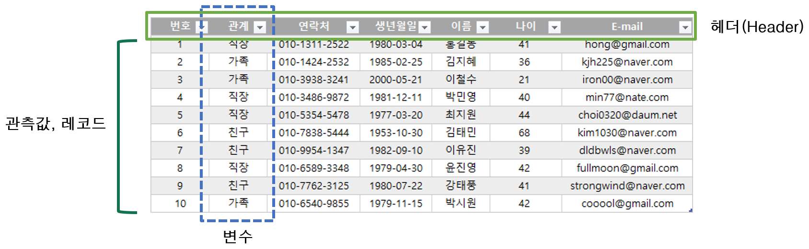
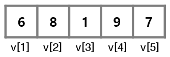

# 데이터와 자료구조

## 데이터 이해

### 데이터 구조화
+ 특정 기록을 분석하기 위해서는 해당 기록이 일정한 형태로 정리되어 있어야 하며, 대표적인 형태가 바로 테이블(table)임
+ 논리적으로 데이터를 정리하여 표 형태로 만드는 것을 **데이터 구조화** 또는 **정형화**라고 함
  + 구조화된 데이터는 쉽게 입력되고, 저장·분류할 수 있음
  + 비정형 데이터는 일정한 형태나 구조, 관계가 존재하지 않는 데이터로, 제대로 된 분석을 위해서는 이를 정형 데이터로 변형할 수 있어야 함

### 테이블(table)
+ 데이터의 저장형태로, 동질적인 데이터 값인 열과 하나의 데이터 집합인 행으로 구성됨



<br>

----------------------------------------------------------------------


## 벡터(vector)


### 벡터 이해
+ 데이터 구조의 가장 기본적인 형태로, 1차원 형태의 데이터를 저장할 수 있는 저장소
+ 변수는 하나의 값을 저장하나, 벡터는 성격이 같은 여러 개의 값도 저장할 수 있음
+ ```c()``` 함수를 이용하여 벡터를 생성
  + 하나의 벡터에는 동일한 종류의 자료형이 저장되어야 함
  + 문자와 숫자를 함께 사용하여 벡터에 저장하면, 숫자는 모두 문자로 바뀜

```{r eval = FALSE}
v1 <- c(1, 2, 3, 4, 5)                    # 숫자형 벡터
v2 <- c("a,", "b", "c")                   # 문자형 벡터
v3 <- c(TRUE, FALSE, FALSE)               # 논리형 벡터
v4 <- c(1, 2, 3, "a", "b,", "c")          # 문자형 벡터
```


<br>

+ 연속적인 숫자로 이루어진 벡터 생성 - ```:```
+ 일정한 간격의 숫자로 이루어진 벡터 생성 - ```seq(시작값, 종료값, 간격)```
+ 반복된 숫자로 이루어진 벡터 생성 - ```rep(반복대상값, 반복횟수)``` 함수

```{r eval = FALSE}
v5 <- 1:10                        # 1~10 값을 출력
v6 <- seq(1, 10, 2)               # 1~10 사이의 홀수만 출력
v7 <- rep(1:5, times = 3)         # 1~5 값을 3번 반복
v8 <- rep(1:5, each = 3)          # 1~5 값을 각각 3번 반복
```


### 인덱스(index)
+ 벡터에 저장된 각각의 값들을 구별하기 위하여 앞쪽의 값부터 시작하여 부여한 순서값
+ 인덱스를 통해 벡터의 특정 위치에 저장된 값들을 하나 또는 여러 개 추출할 수 있음
+ 인덱스는 ```[ ]```를 이용하여 나타냄

```{r eval = FALSE}
v <- c(6, 8, 1, 9, 7)
v[1]                    # 6
v[6]                    # NA
```




### 원소값 추출
+ 벡터에서 가져오고 싶은 값들의 인덱스를 ```c()``` 함수로 묶어서 ```[]``` 안에 입력 가능
+ 인덱스 부분에 ```-```를 사용하면 해당 인덱스를 제외한 나머지 값을 출력함

```{r eval = FALSE}
v <- c(6, 8, 1, 9, 7)
v[1:3]                    # 6, 8, 1 값을 출력
v[-5]                     # 5번째 인덱스만 제외하고 출력
```


### 벡터 산술연산
+ 벡터에 대한 산술연산은 벡터 안에 포함된 모든 값들에 대한 연산으로 바뀌어 실행됨
+ 벡터와 벡터 간의 연산은 대응되는 위치에 있는 값끼리의 연산으로 바뀌어 실행됨

```{r eval = FALSE}
v9 <- c(3, 7, 6)
v10 <- c(4, 2, 8)
v9 + 2                    # 5, 9, 8 값을 출력
v9 - v10                  # -1, 5, -2 값을 출력
```


<br>

+ 벡터에 적용 가능한 함수

|함수|설명|
|:---:|:---|
|sum()|벡터에 포함된 값들의 합|
|mean()|벡터에 포함된 값들의 평균|
|median()|벡터에 포함된 값들의 중앙값|
|max()|벡터에 포함된 값들의 최대값|
|min()|벡터에 포함된 값들의 최소값|
|var()|벡터에 포함된 값들의 분산|
|sd()|벡터에 포함된 값들의 표준편차|
|length()|벡터에 포함된 값들의 개수(길이)|


### 논리연산자
+ 연산의 결과가 TRUE 또는 FALSE로 출력되는 것
+ 논리연산자를 벡터에 적용하여 조건에 맞는 값들을 추출 가능

|함수|예|설명|
|:---:|:---:|:---|
|<|A < B|A보다 B가 크면 TRUE|
|>|A > B|A보다 B가 작으면 TRUE|
|<=|A <= B|A보다 B가 크거나 같으면 TRUE|
|>=|A >= B|A보다 B가 작거나 같으면 TRUE|
|==|A == B|A와 B가 같으면 TRUE|
|!=|A != B|A와 B가 같지 않으면 TRUE|
|&|A & B|A와 B 모두가 TRUE이면 TRUE|
|```|```|A```|```B|A와 B 둘 중 하나라도 TRUE이면 TRUE|
  
  
+ 논리연산도 벡터에 포함된 각각의 값에 대한 연산으로 바뀌어 실행됨
+ 논리값이 산술연산에 사용되면 FALSE는 0으로, TRUE는 1로 간주됨

```{r eval = FALSE}
v11 <- 1:10
v11 >= 5                    # 각 원소가 5보다 크거나 같으면 TRUE, 아니면 FALSE 출력
v11[v11 >= 5]               # 5보다 크거나 같은 값 출력
sum(v11 < 5)                # 5보다 작은 값의 개수 출력
sum(v11[v11 < 5])           # 5보다 작은 값의 합계 출력
```


### 리스트(list)
+ 서로 다른 자료형의 값들을 1차원 배열에 저장하고 다룰 수 있도록 함
+ ```list()``` 함수를 이용하여 리스트를 생성
+ 리스트에 저장된 값은 ```[[ ]]```를 사용하거나, ‘리스트이름$값의이름’의 형태로 추출할 수 있음

```{r eval = FALSE}
myinfo <- list(name = "Kim", age = 25, status = TRUE, score = c(70, 85, 90))
myinfo[[1]]                    # 첫번째 값인 "Kim" 출력
myinfo$score                   # 이름이 score인 벡터 값 출력
```


### 팩터(factor)
+ 문자형 데이터가 저장된 벡터의 한 종류
+ 성별, 혈액형 등과 같이 저장할 문자값들이 몇 종류로 정해져 있을 때 팩터를 사용함
+ 문자형 벡터를 만든 뒤 ```factor()``` 함수를 이용하여 팩터를 생성
+ ```levels()``` 함수는 팩터에 저장된 값들의 종류를 알려줌
+ 팩터는 사전에 정의된 값 외에 다른 값들은 입력하지 못하도록 함

```{r eval = FALSE}
season <- c("spring", "fall", "winter", "summer", "summer", "spring")
season.new <- factor(season)
levels(season.new)

season.new2 <- factor(season, levels = c("spring", "summer", "fall", "winter"))
levels(season.new2)
```


----------------------------------------------------------------------


## 행렬(matrix)과 데이터프레임(data frame)
+ 1차원 데이터 : 단일 주제의 데이터 → 벡터
+ 2차원 데이터 : 여러 주제의 데이터 → 매트릭스, 데이터프레임


### 행렬 이해
+ 2차원 테이블 형태의 자료구조
+ 모든 셀에 저장되는 값은 동일한 자료형이어야 함
+ ```matrix()``` 함수를 이용하여 행렬을 생성
  + 매개변수 nrow, ncol - 행렬의 행과 열의 개수를 지정
  + 매개변수 byrow - TRUE인 경우 행렬에 저장될 값들을 행 방향으로 채움, 기본값(default)은 FALSE

```{r}
m1 <- matrix(1:20, nrow = 4, ncol = 5)
m1
```


<br>

+ 행과 열의 위치에 대한 2개의 인덱스값으로 특정 위치의 값을 추출할 수 있음

```{r eval = FALSE}
m1[2, 4]                    # 2행 4열에 위치한 값인 14 출력
m1[3, ]                     # 3행에 있는 모든 값 출력
m1[, 5]                     # 5열에 있는 모든 값 출력
```


<br>

+ ```rbind()```, ```cbind()``` 함수를 이용하여 벡터 또는 행렬을 결합

```{r eval = FALSE}
m2 <- matrix(1:12, nrow = 4, ncol = 3, byrow = TRUE)     # 4x3 행렬
m3 <- matrix(13:18, nrow = 2, ncol = 3)                  # 2x3 행렬
m4 <- rbind(m2, m3)                                      # 6x3 행렬

v <- c(1:6)                                              # 원소가 6개인 벡터
cbind(m4, v)                                             # 6x4 행렬
```


<br>

+ ```rownames()```, ```colnames()``` 함수를 이용하여 행과 열에 각각 이름을 지정
  + 데이터를 이해하는데 도움이 됨

```{r}
score <- matrix(c(80, 67, 74,
                  82, 95, 88,
                  75, 84, 82),
                nrow = 3, ncol = 3, byrow = TRUE)
rownames(score) <- c("Kim", "Lee", "Park")
colnames(score) <- c("Kor", "Eng", "Math")
score
```


### 데이터프레임 이해
+ 서로 다른 형태의 데이터를 2차원 데이터 형태로 묶을 수 있는 자료구조
+ 외관상으로는 행렬과 차이가 없지만 행렬에 저장되는 모든 값들은 동일한 자료형인 반면, **데이터프레임은 서로 다른 자료형의 값을 함께 저장할 수 있음**
+ 데이터프레임은 특정 열을 잘라서 보았을 때는 값들의 자료형이 동일해야 함
+ ```data.frame()``` 함수를 이용하여 데이터프레임 생성
+ 일반적으로 여러 개의 벡터를 결합하는 형태
+ 데이터프레임은 행렬과 동일한 방법으로 특정 위치의 값을 추출하거나, 행과 열의 이름을 지정할 수 있음

```{r}
df1 <- data.frame(name = c("Kim", "Lee", "Park", "Choi"),
                  age = c(24, 25, 22, 27),
                  btype = factor(c("A", "B", "O", "B")),
                  religion = c(TRUE, FALSE, TRUE, TRUE))
df1
```


```{r eval = FALSE}
df1[1, 2]                    # 1행 2열에 위치한 값인 24 출력
df1[, 3]                     # 3열에 있는 btype 모든 값 출력

# 데이터프레임에서는 '(데이터프레임 이름)$(열 이름)'의 형태로 열 데이터를 추출할 수 있음
df1$btype

df2 <- cbind(df1, c("dog", "cat", "bird", "dog"))
colnames(df2)[5] <- "pet"
```


### 행렬과 데이터프레임 다루기


#### 기본 정보 확인
+ 행렬과 데이터프레임은 모두 2차원 형태의 데이터를 저장하는 자료구조이기 때문에 다루는 방법이 대부분 동일함

```{r eval = FALSE}
dim(iris)                     # 행과 열의 개수 출력 
nrow(iris)                    # 행의 개수 출력 
ncol(iris)                    # 열의 개수 출력 
colnames(iris)                # 열 이름 출력, names( )와 결과 동일 
head(iris)                    # 데이터셋의 앞부분 일부 출력 
tail(iris)                    # 데이터셋의 뒷부분 일부 출력
```


```{r eval = FALSE}
str(iris)                     # 데이터셋 요약 정보 보기 
iris[, 5]                     # 품종 데이터 보기 
unique(iris[, 5])             # 품종의 종류 보기(중복 제거) 
table(iris[, "Species"])      # 품종의 종류별 행의 개수 세기
```


#### 원소값 추출
+ ```subset()``` 함수 이용하여 조건에 맞는 행과 열의 값 추출할 수 있음
  + 매개변수 subset - 행에 대한 조건을 지정
  + 매개변수 select - 추출하고자 하는 열을 지정
  
```{r eval = FALSE}
iris.new1 <- subset(iris, Species == "setosa")
iris.new2 <- subset(iris, subset = Sepal.Length>5.0 & Sepal.Width>4.0)
iris.new3 <- subset(iris, select = c("Sepal.Length", "Sepal.Width"))
```


#### 행렬 및 데이터프레임 산술연산
+ 벡터와 같이 숫자로 구성된 행렬이나 데이터프레임도 각 원소에 대한 연산으로 바뀌어 실행됨
+ 행렬과 행렬 간의 연산은 동일한 위치에 있는 값끼리의 연산으로 바뀌어 실행되므로, **두 행렬의 크기(행과 열의 개수)가 같아야** 함

```{r eval = FALSE}
m1 <- matrix(1:20, nrow = 4, ncol = 5)                # 4x5 행렬
m2 <- matrix(21:40, nrow = 4, ncol = 5)               # 4x5 행렬

2 + m1
3 * m2

m1 + m2
m1 - m2
m1 * m2
m1 / m2
```


<br>

+ ```colSums()```, ```colMeans()```, ```rowSums()```, ```rowMeans()``` 함수 이용하여 행별, 열별 합계 및 평균을 계산할 수 있음
  
```{r eval = FALSE}
colSums(iris[, -5])           # 열별 합계 
colMeans(iris[, -5])          # 열별 평균 
rowSums(iris[, -5])           # 행별 합계 
rowMeans(iris[, -5])          # 행별 평균
```


----------------------------------------------------------------------


## 외부 파일 읽기 및 쓰기


### 작업폴더 설정
+ ```setwd()``` 함수를 이용하여 작업할 폴더의 경로를 지정

```{r eval = FALSE}
setwd("D:/jbnu-R")
```


### 외부 파일 읽기
+ ```read.csv()``` 함수를 이용하여 외부에 있는 csv 파일을 불러옴
+ 예제 - [StudentSurvey.csv](./dataset/StudentSurvey.csv)

```{r eval = FALSE}
data <- read.csv("StudentSurvey.csv")
head(data)
```


### 외부 파일 쓰기
+ ```write.csv()``` 함수를 이용하여 외부로 csv 파일을 저장

```{r eval = FALSE}
smoking <- subset(data, Smoke == "Yes")
write.csv(smoking, "smoking.csv")
```

