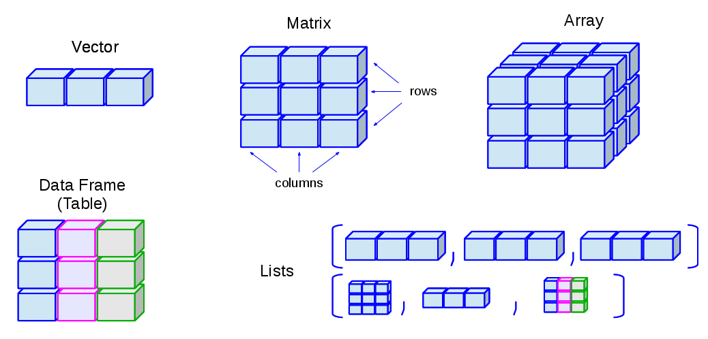
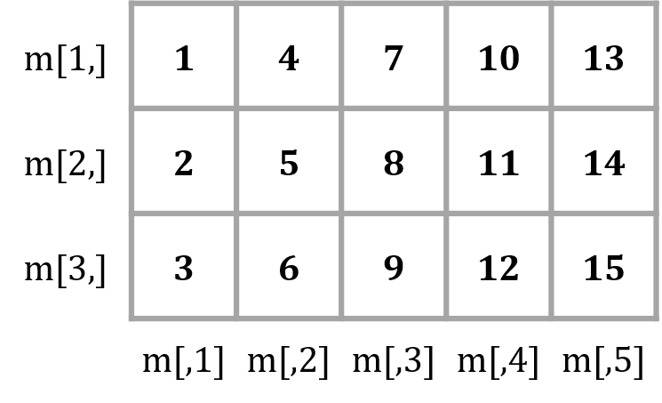

# 데이터와 자료구조

## 데이터 이해

### 형태에 따른 분류

|구분|내용|
|:---:|:---------------------|
|정형 데이터|- 일정한 규칙을 가지고 체계적으로 정리된 데이터로, 그 자체로 의미 해석이 가능 <br>- 내부 시스템에 의한 데이터로 수집하기 쉽고, 형식을 가지고 있어 처리하기 쉬움|
|반정형 데이터|- XML, HTML 등의 형태로 존재하는 데이터로, 메타데이터나 구조정보 등을 포함 <br>- API 형태로 제공되므로 데이터 처리 기술이 필요|
|비정형 데이터|- 텍스트 문서, 이미지, 동영상 등과 같이 구조화되지 않은 형태의 데이터|

<br>

### 데이터 구조화
+ 데이터를 효과적으로 분석하려면 일정한 형태로 정리되어 있어야 하며, 대표적인 형태가 바로 테이블(table)임
+ 데이터를 논리적으로 정리하여 표 형태로 만드는 것을 **데이터 구조화** 또는 **정형화**라고 함
  + 구조화된 데이터는 쉽게 입력되고, 저장·분류할 수 있음
  + 비정형 데이터는 분석을 위해서는 정형 데이터로 변환해야 함

<br>

### 테이블(table)
+ 데이터의 저장형태로, 동질적인 데이터 값인 열과 하나의 데이터 집합인 행으로 구성됨


<br>


----------------------------------------------------------------------


## 자료구조(data structure)
+ 문제해결을 위해 프로그램이 효율적으로 접근, 변경, 연산이 가능하도록 만든 값들의 구조화된 집합
  + 메모리에 실제 생성된 자료구조를 객체(object)라고 함
+ R은 벡터(vector), 행렬(matrix), 배열(array), 리스트(list), 데이터프레임(data frame)의 5개 기본 자료구조를 제공함


|구분|1차원|2차원|n차원|
|:---:|:---:|:---:|:---:|
|동질적|벡터|행렬|배열|
|이질적|리스트|데이터프레임|-|




<br>


----------------------------------------------------------------------


## 벡터(vector)
+  동일한 자료형의 값을 1차원으로 저장하는 가장 기본적인 자료구조

<br>

### 벡터 생성
+ ```c()``` 함수를 이용하여 벡터를 생성
  + 숫자와 문자를 함께 벡터에 저장하면, 숫자는 모두 문자로 바뀜

```{r eval = FALSE}
v1 <- c(1, 2, 3, 4, 5)                      # 숫자형 벡터
v2 <- c("a,", "b", "c")                     # 문자형 벡터
v3 <- c(TRUE, FALSE, FALSE)                 # 논리형 벡터
v4 <- c(1, 2, 3, "a", "b,", "c")            # 문자형 벡터
```


<br>

+ 연속적인 숫자로 이루어진 벡터 생성 - ```:```
+ 일정한 간격의 숫자로 이루어진 벡터 생성 - ```seq(from=시작값, to=종료값, by=간격)``` 함수
+ 반복된 숫자로 이루어진 벡터 생성 - ```rep(x=반복대상값, times=반복횟수)``` 함수

```{r eval = FALSE}
v5 <- 1:10                                  # 1~10 값 생성
v6 <- seq(1, 10, 2)                         # 1~10 사이의 홀수만 생성
v7 <- rep(1:5, times = 3)                   # 1~5 값을 3번 반복한 값 생성
v8 <- rep(1:5, each = 3)                    # 1~5 값을 각각 3번 반복한 값 생성
```

<br>

### 벡터 인덱싱
+ 인덱스(index) : 벡터에 저장된 각각의 값들을 구별하기 위하여 앞쪽의 값부터 시작하여 부여한 순서값
+ 인덱싱(indexing) : 인덱스를 이용하여 벡터의 특정 위치에 저장된 값들을 하나 또는 여러 개 추출하는 작업
  + 추출하려는 값의 인덱스를 벡터 형태로 **인덱싱 연산자 ```[]```** 안에 작성
  + 인덱스 앞에 ```-```를 붙이면 해당 인덱스를 제외한 나머지 값을 추출함
  + 논리형 벡터를 입력하면 TRUE에 해당하는 인덱스만 추출함


```{r eval = FALSE}
v <- c(6, 8, 1, 9, 7)
v[1]                                        # 6
v[6]                                        # NA

v[1:3]                                      # 6, 8, 1
v[-5]                                       # 5번째 인덱스만 제외한 나머지 값 추출
v[c(TRUE, TRUE, FALSE, TRUE, FALSE)]        # TRUE에 해당하는 인덱스 값 추출
```

{width=50%}

<br>

### 벡터 산술연산
+ 단일값과 벡터의 산술연산은 벡터의 모든 원소에 동일한 연산이 적용됨
+ 벡터 간 산술연산은 대응되는 위치에 있는 원소들끼리 연산이 이루어짐

```{r eval = FALSE}
v9 <- c(3, 7, 6)
v10 <- c(4, 2, 8)
v9 + 2                                      # 5, 9, 8
v9 - v10                                    # -1, 5, -2
```

<br>

+ 벡터에 적용 가능한 함수

|함수|설명|
|:---:|:---|
|sum()|벡터에 포함된 값들의 합|
|mean()|벡터에 포함된 값들의 평균|
|median()|벡터에 포함된 값들의 중앙값|
|max()|벡터에 포함된 값들의 최대값|
|min()|벡터에 포함된 값들의 최소값|
|var()|벡터에 포함된 값들의 분산|
|sd()|벡터에 포함된 값들의 표준편차|
|length()|벡터에 포함된 값들의 개수(길이)|

<br>

### 벡터 비교연산
+ 비교연산자를 벡터에 적용하면 조건에 맞는 값들을 추출할 수 있음
+ 비교연산도 벡터에 포함된 각각의 값에 대한 연산으로 바뀌어 실행됨
+ 논리값이 산술연산에 사용되면 FALSE는 0으로, TRUE는 1로 간주됨

```{r eval = FALSE}
v11 <- 1:10
v11 >= 5                                    # 각 원소가 5 이상이면 TRUE, 아니면 FALSE
v11[v11 >= 5]                               # 5 이상인 값 추출
sum(v11 < 5)                                # 5 미만인 값의 개수
sum(v11[v11 < 5])                           # 5 미만인 값의 합계
```

<br>

### 팩터(factor)
+ 문자형 데이터를 저장하는 벡터의 한 종류
+ 성별, 혈액형 등과 같이 저장할 데이터 값이 정해져 있을 때 사용함
+ 문자형 벡터를 만든 뒤 ```factor()``` 함수를 이용하여 생성
+ ```levels()``` 함수는 팩터가 가질 수 있는 값(범주)을 알려줌
+ 팩터는 정의된 값(levels) 외에 다른 값은 저장할 수 없기 때문에 오타를 방지할 수 있음

```{r eval = FALSE}
szn <- c("spring", "fall", "winter", "summer", "summer", "spring")
szn_fct <- factor(szn)
levels(szn_fct)
szn_fct[7] <- "autumn"

# 팩터의 levels 순서 지정
szn_fct2 <- factor(szn, levels = c("spring", "summer", "fall", "winter"))
levels(szn_fct2)
```

<br>


----------------------------------------------------------------------


## 행렬(matrix)과 배열(array)
+ 행렬 : 동일한 자료형의 값을 2차원으로 저장하는 자료구조
+ 배열 : 동일한 자료형의 값을 n차원으로 저장하는 자료구조

<br>

### 행렬 생성
+ ```matrix()``` 함수를 이용하여 행렬을 생성
  + 매개변수 ```nrow```, ```ncol``` - 행렬의 행과 열의 개수를 지정
  + 매개변수 ```byrow``` - TRUE인 경우 행렬에 저장될 값들을 행 방향으로 채움, 기본값(default)은 FALSE

```{r}
m1 <- matrix(1:20, nrow = 4, ncol = 5)
m1
```

<br>

+ ```dim()``` 함수 - 행렬의 차원을 반환
+ ```nrow()```, ```ncol()``` 함수 - 행렬의 행과 열의 개수를 각각 반환
+ ```rownames()```, ```colnames()``` 함수 - 행렬의 행과 열의 이름을 각각 반환
  + 데이터를 이해하는데 도움이 됨


```{r eval = FALSE}
score <- matrix(c(80, 67, 74,
                  82, 95, 88,
                  75, 84, 82,
                  95, 83, 76),
                nrow = 4, ncol = 3, byrow = TRUE)

dim(score)                                  # 행렬의 차원 4x3
nrow(score)                                 # 행의 개수 4
ncol(score)                                 # 열의 개수 3

rownames(score)                             # 행 이름 NULL
colnames(score)                             # 열 이름 NULL

rownames(score) <- c("Kim", "Lee", "Park", "Choi")
colnames(score) <- c("Kor", "Eng", "Math")
score
```

<br>

### 행렬 인덱싱
+ 행과 열의 위치에 대한 2개의 인덱스로 특정 위치의 값을 추출함
  + 인덱스가 생략된 차원은 전체 행 또는 열을 반환
+ 비교연산자를 행렬에 적용하면 행렬의 각 원소에 대한 연산으로 바뀌어 실행됨

```{r eval = FALSE}
m <- matrix(1:15, nrow = 3, ncol = 5)
m[2, 4]                                     # 2행 4열에 위치한 값 11
m[3, ]                                      # 3행에 있는 모든 값
m[, 1]                                      # 1열에 있는 모든 값

m > 7                                       # 각 원소가 7 초과면 TRUE, 아니면 FALSE
m[m > 7]                                    # 7 초과인 값 추출(벡터)
```

{width=50%}

<br>


### 행렬 산술연산
+ 단일값과 행렬의 산술연산은 행렬의 모든 원소에 동일한 연산이 적용됨
+ 행렬 간 산술연산은 대응되는 위치에 있는 원소들끼리 연산이 이루어짐
  + **두 행렬의 크기(행과 열의 개수)가 같아야** 함

```{r eval = FALSE}
m2 <- matrix(1:20, nrow = 4)                # 4x5 행렬
m3 <- matrix(21:40, nrow = 4)               # 4x5 행렬
2 + m2
3 * m2

m2 + m3
m2 - m3
m2 * m3
m2 / m3
```

<br>

### 행렬 곱셈
+ 두 행렬의 곱셈은 첫 번째 행렬의 열의 개수와 두 번째 행렬의 행의 개수가 같을 때에만 가능함

```{r eval = FALSE}
A <- matrix(1:6, nrow = 2)                  # 2x3 행렬
B <- matrix(1:12, nrow = 3)                 # 3x4 행렬
A %*% B                                     # 2x4 행렬
```

<br>

### 특수행렬

|특수행렬|설명|
|:---:|:------|
|단위행렬(identity matrix)|대각원소가 모두 1이고, 나머지 원소는 0인 행렬|
|영행렬(zero matrix)|모든 원소가 0인 행렬|
|대각행렬(diagonal matrix)|대각원소 외에는 모두 0인 행렬|
|대칭행렬(symmetric matrix)|대각원소를 기준으로 대칭인 행렬|
|전치행렬(transpose matrix)|행과 열을 서로 바꾼 행렬|
|역행렬(inverse matrix)|(행렬식이 0이 아닌 경우에만 존재)|

```{r eval = FALSE}
I <- diag(1, nrow = 3, ncol = 3)            # 단위행렬
Z <- matrix(0, nrow = 3, ncol = 3)          # 영행렬
D <- diag(c(1, 2, 3))                       # 대각행렬
S <- matrix(c(1, 2, 2, 1), nrow = 2)        # 대칭행렬

A <- matrix(1:6, nrow = 2, ncol = 3)
A_trans <- t(A)                             # 전치행렬

B <- matrix(c(1, 2, 3, 4), nrow = 2)
B_inv <- solve(B)                           # 역행렬
B %*% B_inv
```

<br>

### 행렬 결합
+ ```rbind()```, ```cbind()``` 함수를 이용하여 행렬 또는 벡터를 결합할 수 있음

```{r eval = FALSE}
m4 <- matrix(1:12, nrow = 4)                # 4x3 행렬
m5 <- matrix(13:18, nrow = 2)               # 2x3 행렬
m6 <- rbind(m4, m5)                         # 행렬과 행렬을 행 방향으로 결합 6x3 행렬

v <- c(1:6)                                 # 원소가 6개인 벡터
cbind(m6, v)                                # 행렬과 벡터를 열 방향으로 결합 6x4 행렬
```

<br>

### 배열 생성
+ ```array()``` 함수를 이용하여 배열을 생성
  + 매개변수 ```dim``` - 배열의 행의 개수, 열의 개수, 차원을 벡터 형태로 지정

```{r}
arr <- array(1:12, dim = c(2,2,3))
arr
```

<br>


----------------------------------------------------------------------


## 리스트(list)
+ 서로 다른 자료형의 값을 1차원으로 저장하는 자료구조
+ R의 모든 객체가 리스트의 원소가 될 수 있어 매우 유연함(flexible)
  + 함수의 결과값을 리스트의 형태로 반환하면 다양한 데이터를 효율적으로 저장하고 활용할 수 있음

<br>

### 리스트 생성
+ ```list()``` 함수를 이용하여 리스트를 생성

```{r}
myinfo <- list(name = "Kim", age = 25, status = TRUE, score = c(70, 85, 90))
myinfo
```

<br>

### 리스트 인덱싱
+ ```[[ ]]``` 또는 ```(리스트 이름)$(원소 이름)```을 이용하여 특정 위치의 값을 추출함

```{r eval = FALSE}
myinfo[[1]]                                 # 1번째 인덱스 값 "Kim"
myinfo$score                                # 원소 이름이 score인 벡터
```

<br>


----------------------------------------------------------------------


## 데이터프레임(data frame)
+ 서로 다른 자료형의 값을 column 단위로 2차원으로 저장하는 자료구조
+ 데이터프레임에서 특정 열을 가져오면 **값들의 자료형이 모두 동일**해야 함
  + 같은 길이의 벡터를 원소로 가지는 리스트의 특별한 경우임
+ 행렬과 데이터프레임은 모두 2차원 형태의 데이터를 저장하는 자료구조이므로, 다루는 방법이 대부분 동일함

<br>

### 데이터프레임 생성
+ ```data.frame()``` 함수를 이용하여 데이터프레임을 생성
+ 일반적으로 여러 개의 벡터를 결합하여 생성함

```{r}
df1 <- data.frame(name = c("Kim", "Lee", "Park", "Choi"),
                  age = c(24, 25, 22, 27),
                  btype = factor(c("A", "B", "O", "B")),
                  smoking = c(TRUE, FALSE, TRUE, TRUE))
df1
```

<br>

+ 데이터프레임은 행렬과 동일한 방법으로, 행과 열의 이름을 지정할 수 있음

```{r eval = FALSE}
df2 <- cbind(df1, c("dog", "cat", "bird", "dog"))
colnames(df2)[5] <- "pet"
```

<br>

### 데이터프레임 인덱싱
+ 행렬과 동일한 방법으로, 행과 열의 위치에 대한 2개의 인덱스로 특정 위치의 값을 추출함
  + 인덱스 대신 행 또는 열의 이름을 사용할 수 있음
+ 리스트의 특별한 경우이므로, ```(데이터프레임 이름)$(열 이름)```을 이용할 수 있음

```{r eval = FALSE}
df2[1, 2]                                   # 1행 2열에 위치한 값 24
df2[, 3]                                    # 3열(btype)에 있는 모든 값
df2[, "name"]                               # 인덱스에 열 이름을 사용

df2$smoking                                 # 열 이름이 smoking인 벡터
```

<br>

### 데이터프레임 요약 함수

|함수|설명|
|:---:|:------------|
|head()|객체의 처음 몇 개의 요소를 반환|
|tail()|객체의 마지막 몇 개의 요소를 반환|
|str()|객체의 구조와 각 요소의 데이터 유형 및 미리보기 출력|
|unique()|중복된 값을 제거하고 유일한 값만 반환|
|table()|각 값의 빈도를 계산하여 표 형태로 반환|
|colSums(), colMeans()|각 열에 대한 합계/평균을 계산|
|rowSums(), rowMeans()|각 행에 대한 합계/평균을 계산|

```{r eval = FALSE}
dim(iris)                                   # 데이터프레임의 차원
nrow(iris)                                  # 행의 개수
ncol(iris)                                  # 열의 개수
colnames(iris)                              # 열 이름, names()와 결과 동일

head(iris)                                  # 처음 6개 행 출력
tail(iris)                                  # 마지막 6개 행 출력
str(iris)                                   # 데이터셋 요약 정보

unique(iris[, 5])                           # 품종의 종류 보기(중복 제거) 
table(iris[, "Species"])                    # 품종의 종류별 행의 개수 세기

colSums(iris[, -5])                         # 각 열의 합계 
colMeans(iris[, -5])                        # 각 열의 평균 
rowSums(iris[, -5])                         # 각 행의 합계 
rowMeans(iris[, -5])                        # 각 행의 평균
```

<br>

