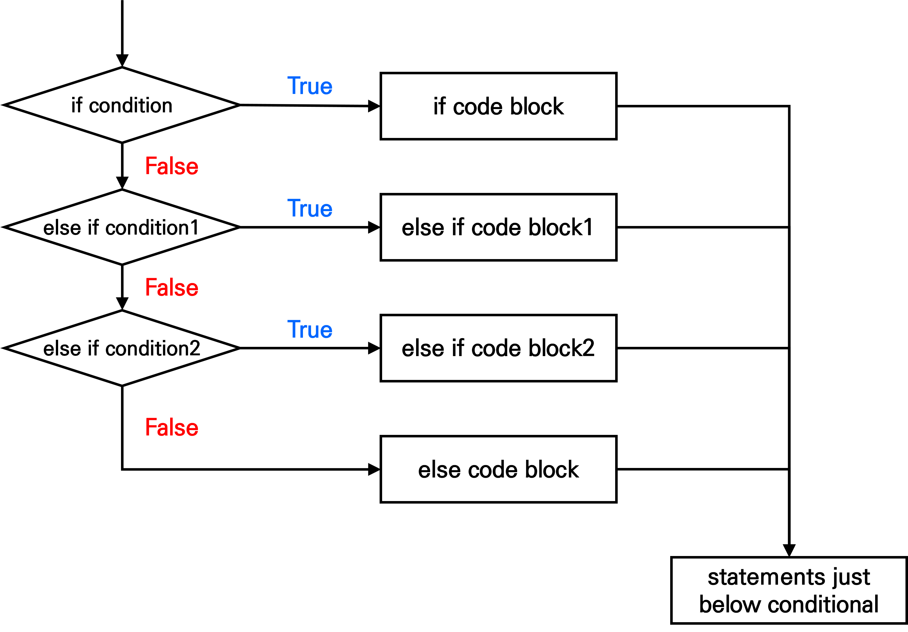
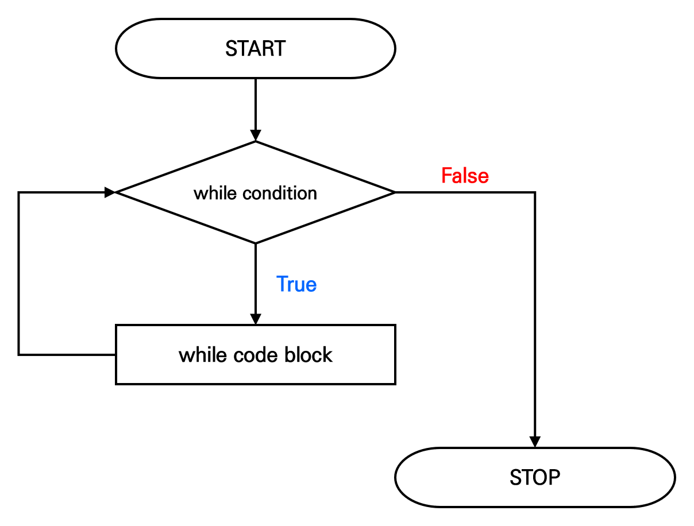

# 프로그래밍 구조

## 프로그래밍(programming)
+ 컴퓨터를 이용해 문제를 해결하기 위해 주어진 절차를 문법에 맞게 작성하는 과정
+ 데이터 분석을 진행하다 보면 R에서 제공하는 함수만으로는 해결이 되지 않는 경우가 있으며, 이때 프로그래밍 기법을 활용하면 보다 효율적으로 문제를 해결할 수 있음

<br>

## 조건문(conditional statement)
+ 조건에 따라 특정한 동작을 실행하도록 하는 프로그래밍 명령어



<br>

### if 문
+ 조건이 참(TRUE)이면 코드블록을 실행하고, 거짓(FALSE)이면 코드블록을 실행하지 않고 다음 명령문으로 넘어가는 조건문
+ [참고] 코드블록(code block)
  + 중괄호 ```{}```로 구분된 코드로, 여러 명령문을 하나로 묶은 실행 단위

```{r eval = FALSE}
if(조건) {
  조건이 참일 때 실행할 명령문
}
```

<br>

```{r}
## 시험 점수가 80점 이상이면 합격(Pass) 출력
score <- 85

if(score >= 80) {
  print("Pass")
}
```

<br>

### if-else 문
+ 조건이 참(TRUE)이면 첫 번째 코드블록을 실행하고, 거짓(FALSE)이면 두 번째 코드블록을 실행하는 조건문
+ if-else 문에서 else는 반드시 if 문의 코드블록을 닫는```}```와 같은 줄에 작성해야 함

```{r eval = FALSE}
if(조건) {
  조건이 참일 때 실행할 명령문
} else {
  조건이 거짓일 때 실행할 명령문
}
```

<br>

```{r}
## 시험 점수가 80점 이상이면 합격(Pass), 80점 미만이면 불합격(Fail) 출력
score <- 65

if(score >= 80) {
  print("Pass")
} else {
  print("Fail")
}
```

<br>

### ifelse() 함수
+ 조건에 따라 두 값 중 하나를 선택하는 경우, ifelse() 함수를 이용하면 편리함

```{r eval = FALSE}
ifelse(조건, 조건이 참일 때 선택할 값, 조건이 거짓일 때 선택할 값)
```

<br>

```{r}
## 시험 점수가 80점 이상이면 합격(Pass), 80점 미만이면 불합격(Fail) 출력
score <- 85
result <- ifelse(score >= 80, "Pass", "Fail")
print(result)
```

<br>

### else if 문
+ 첫 번째 조건이 거짓(FALSE)이면 두 번째 조건을 검사하고, 두 번째 조건이 참(TRUE)이면 해당 코드블록을 실행하는 조건문
+ 여러 조건을 순차적으로 검사할 때 사용함

```{r eval = FALSE}
if(조건1) {
  조건1이 참일 때 실행할 명령문
} else if(조건2) {
  조건1은 거짓이고 조건 2는 참일 때 실행할 명령문
} else if(조건3) {
  조건1, 조건2는 거짓이고 조건 3은 참일 때 실행할 명령문
} ... {
} else {
  모든 조건이 거짓일 때 실행할 명령문
}
```

<br>

```{r}
## 시험 점수가 90점 이상이면 A학점, 80~90점 미만이면 B학점,
## 70~80점 미만이면 C학점, 60~70점 미만이면 D학점, 60점 미만이면 F학점 출력
score <- 85

if(score >= 90) {
	grade <- "A"
} else if(score >= 80) {
	grade <- "B"
} else if(score >= 70) { 
	grade <- "C"
} else if(score >= 60) { 
	grade <- "D" 
} else { 
	grade <- "F"
}

print(grade)
```

<br>


----------------------------------------------------------------------


## 반복문(repetitive statement)
+ 정해진 동작을 반복적으로 수행할 때 사용하는 프로그래밍 명령어

### for 문
+ 지정된 횟수만큼 반복하여 코드블록을 실행하는 반복문


```{r eval = FALSE}
for(반복변수 in 반복범위) {
  반복할 명령문
} 
```

<br>

```{r}
## *을 5번 출력
for(i in 1:5) {
  print("*")
}
```

```{r}
## 구구단 2단 출력
# print() 함수 : 하나의 값을 출력
# cat() 함수 : 한 줄에 여러 개의 값을 결합하여 출력
# \n : 줄바꿈을 하도록 하는 특수문자
for(i in 1:9) {
  cat("2 *", i, "=", 2*i, "\n")
}
```

```{r}
## 1~20 사이의 숫자 중 짝수만 출력
for(i in 1:20) {
  if(i%%2 == 0) {
    print(i)
  }
}
```

```{r}
## 1~100 사이의 숫자의 합계 출력
# 어떤 변수를 계산에서 사용하려면, 그 변수를 먼저 선언해야 함
sum <- 0

for(i in 1:100) {
  sum <- sum + i
}

print(sum)
```

<br>

### while 문
+ 조건이 참(TRUE)일 동안 코드블록을 계속 반복 실행하는 명령문
+ 조건문과 반복문이 결합한 형태임

> ※ 주의 :  영원히 실행되는 반복문을 '무한루프(infinite loop)'라 하며, 컴퓨터의 작동을 멈출 수 있음



```{r eval = FALSE}
while(조건) {
  반복할 명령문
}
```

<br>

```{r}
## 1~100 사이의 숫자의 합계 출력
sum <- 0
i <- 1

while(i <= 100) {
  sum <- sum + i
  i <- i + 1
}

print(sum)
```

<br>

### break 문와 next 문
+ break 문 : 반복문을 중단시키고, 반복문 이후의 첫 번째 명령문으로 이동시킴
+ next 문 : 현재 반복을 건너뛰고, 반복문의 시작 지점으로 되돌려 다음 반복을 진행함

```{r}
## 1~5 사이의 숫자의 합계 출력 - break 문
sum <- 0

for(i in 1:10) {
	sum <- sum + i
	if(i >= 5) break
}

print(sum)
```

```{r}
## 1~10 사이의 숫자 중 홀수의 합계 출력 - next 문
sum <- 0

for(i in 1:10) {
	if (i%%2 == 0) next
	sum <- sum + i
}

print(sum)                                  
```

<br>

### apply 계열 함수
+ 주어진 함수 연산을 특정 단위로 적용할 수 있도록 지원하는 함수
+ 반복문을 사용하는 것보다 간결한 코드로 반복 연산을 처리할 수 있음

|함수|설명|
|:---:|:------------|
|apply()|- 행렬이나 배열의 특정 차원(행 또는 열)에 함수를 적용|
|lapply()|- 리스트 또는 벡터의 각 원소에 함수를 적용하고, 리스트로 반환|
|sapply()|- ```lapply()```와 비슷하지만, 가능한 경우 결과를 벡터나 행렬로 반환|
|vapply()|- ```sapply()```와 비슷하지만, 반환값의 형태를 명시적으로 지정함|
|tapply()|- 집단별로 데이터를 나누어 함수를 적용 <br>- 주로 팩터(factor)와 함께 사용|
|mapply()|- 여러 입력 벡터에 함수를 병렬로 적용하고 결과를 반환|

```{r eval = FALSE}
# apply() 예제: 행렬에서 각 열의 평균 계산
apply(iris[, 1:4], 2, mean)

# lapply() 예제: 각 열의 요약 통계량 계산
lapply(iris[, 1:4], summary)

# sapply() 예제: 각 열의 요약 통계량 계산 (벡터로 반환)
sapply(iris[, 1:4], summary)

# vapply() 예제: 각 열의 평균을 숫자로 반환
vapply(iris[, 1:4], mean, numeric(1))

# tapply() 예제: Species별로 Sepal.Length의 평균 계산
tapply(iris$Sepal.Length, iris$Species, mean)

# mapply() 예제: Sepal.Length와 Sepal.Width의 합을 구하는 함수 적용
mapply(sum, iris$Sepal.Length, iris$Sepal.Width)
```

<br>


----------------------------------------------------------------------


## 사용자 정의 함수
+ 사용자가 직접 작성하여 필요한 작업을 수행하는 함수
+ 코드의 재사용성(reusability), 가독성(readability)을 높임

```{r eval = FALSE}
함수명 <- function(매개변수 목록) {
  실행할 명령문
  return(반환 값)
}
```

<br>

```{r}
## 두 개의 값을 입력받아 큰 수를 반환하는 함수
mymax <- function(x, y) {
  max.value <- x
  if (y > x) {
    max.value <- y
  }
  return(max.value)
}

mymax(10, 20)
```

<br>

+ 사용자 정의 함수에서도 매개변수의 초기값(default value)을 설정할 수 있음

```{r eval = FALSE}
## 매개변수 x, y를 입력 받아 x/y 값을 반환하는 함수(단, y의 초기값은 2)
mydiv <- function(x, y=2) {
  result <- x / y
  return(result)
}

mydiv(x = 10, y = 3)                        # 매개변수 이름과 매개변수 값을 쌍으로 입력
mydiv(10, 3)                                # 매개변수 값만 입력
mydiv(10)                                   # x에 대한 값만 입력(y 값 생략)
```

<br>

+ 여러 개의 값을 반환해야 하는 경우에는 이를 리스트로 묶어 반환함

```{r eval = FALSE}
## 매개변수 x, y를 입력 받아 두 변수의 합과 곱을 리스트로 반환하는 함수
myfunc <- function(x, y) {
  sum.value <- x + y
  mul.value <- x * y
  return(list(sum = sum.value, mul = mul.value)) 
}

result <- myfunc(5, 8)
result$sum                                  # 5, 8의 합
result$mul                                  # 5, 8의 곱
```

<br>


----------------------------------------------------------------------


## R 패키지(R package)

+ 특정 기능을 수행하는 함수, 데이터셋, 문서 등을 묶어서 제공하는 모듈
+ 다른 사용자가 만들어서 무료로 배포하는 패키지를 설치하면 다양한 함수를 편리하게 사용할 수 있음

|함수|설명|
|:---:|:------------|
|.lib()|- 현재 설정된 패키지 저장 경로 확인 및 지정|
|install.packages()|- 패키지 설치 <br>- 패키지는 최초 한 번만 설치하면 됨|
|library()|- 설치된 패키지 로드 <br>- R Studio를 새로 시작할 때마다 패키지를 불러와야 함|

