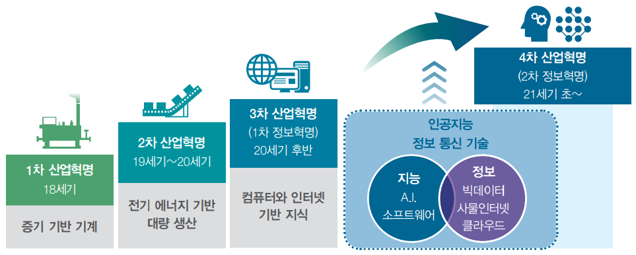
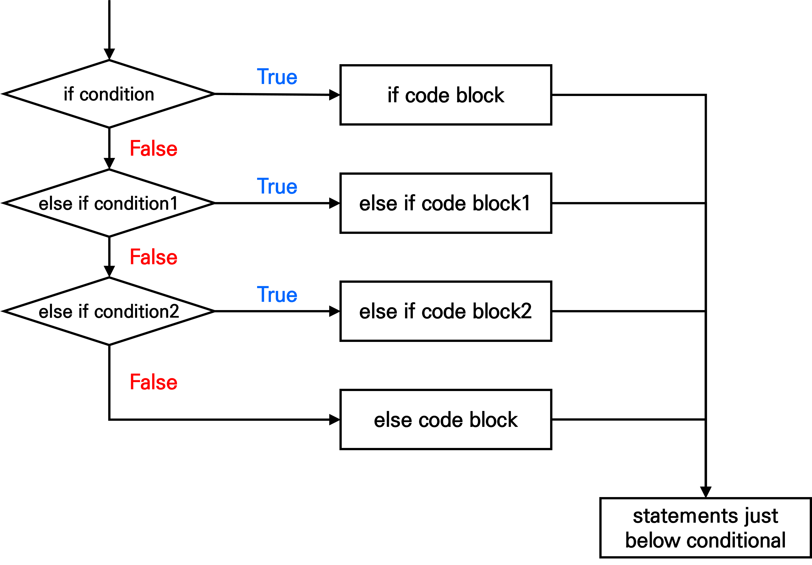

--- 
title: "R 프로그래밍"
author: "Park Sejin"
date: "2025-03-03"
site: bookdown::bookdown_site
documentclass: book
bibliography: [book.bib, packages.bib]
link-citations: yes
---


# 강의 소개 {.unnumbered}


## 교과 목표 {.unlisted .unnumbered}
+ 본 강의에서는 통계분석도구인 R의 기본적인 문법 및 사용법을 학습하고, 최종적으로 프로그래밍 언어에 대한 기본 소양을 쌓음으로써 향후 고급 분석을 위한 기초를 탄탄히 하고자 한다.


## 평가 방법 {.unlisted .unnumbered}
+ 중간(40%), 기말(40%), 출석(10%), 과제(10%)
+ 총 수업시간의 1/4 이상 결석 시 F학점 처리
+ 결석 1회당 1점 감점하며, 3번의 지각은 결석 1번으로 처리


## 참고 문헌 {.unlisted .unnumbered}
+ 누구나 R 데이터 분석 / 이윤환 / 2022 / 한빛아카데미
+ 혼자 공부하는 R 데이터 분석 / 강전희, 엄동란 / 2022 / 한빛미디어
+ 모두를 위한 R 데이터 분석 입문 / 오세종 / 2019 / 한빛아카데미 
+ R 기반 데이터 과학: 타이디버스(tidyverse) 접근 / 2018 / 한나래출판사
+ R과 knitr를 활용한 데이터 연동형 문서 만들기 / 고석범 / 2014 / 에이콘출판주식회사
+ website: [R for Data Science](https://bookdown.org/sulgi/r4ds)
+ website: [R 프로그래밍(개정판)](https://kilhwan.github.io/rprogramming/)


<!--chapter:end:index.Rmd-->

#  데이터 분석과 R

## 데이터의 이해

### 데이터의 시대
+ 정보화 시대(the age of information) → 데이터의 시대(the age of data)
+ 우리를 둘러싼 모든 것들이 데이터 소스와 연결되고, 생활의 많은 부분이 데이터에 의존하여 영위함
  + 예: E-mail, SNS, 전화사용 기록, 신용카드거래 기록, 병원진료 기록, 대중교통 승하차 기록 등
+ 4차 산업혁명
  + 인공지능(AI), 빅데이터(big data), 로봇, 사물인터넷(IoT), 생명공학기술, 3D 프린터 등 새로운 과학기술이 사회, 경제, 문화 전반에 영향을 미치게 되고, 이러한 변화를 잘 수용하고 가능성을 최대화 하는 시대
  + 향후 데이터를 잘 다룰 줄 아는 기업과 개인이 경쟁에서 우위를 점할 것임

{width=110%}

<br>

### 데이터 과학
+ 데이터 과학
  + 과학적 방법, 프로세스, 알고리즘 및 시스템을 사용하여 구조화된(정형) 데이터와 구조화되지 않은(비정형) 데이터를 통해 지식과 통찰력을 추출하고 광범위한 활용 영역에서 실행 가능한 통찰력을 적용하는 융합 분야
  + 데이터를 통해 실제 현상을 이해하고 분석하기 위해 통계학, 데이터 분석, 기계학습과 연관된 방법론을 통합하는 개념
  + Drew Conway는 데이터 과학은 **(1) 컴퓨터 과학 역량(hacking skills)**, **(2) 수학과 통계학 지식(math and statistics knowledge)**, **(3) 분야별 전문지식(substantive expertise)**의 교집합이라 소개함

{width=50%}

<br>

+ Hadley Wickham이 제시한 데이터 과학의 과정

|과정|설명|
|:---:|:------------|
|**데이터 가져오기 <br>(import)**|- 분석할 데이터를 가져오는 단계 <br>- 파일, Open API, 데이터베이스 등 다양한 데이터 소스를 분석 시스템으로 가져와 읽어 들임|
|**정리하기 <br>(tidy)**|- 가져온 데이터를 일괄된 형태로 재구조화하는 단계 <br>- 이 단계를 통해 정리한 데이터를 tidy data라 명명함|
|**변환하기<br>　(transform)**|- tidy data에서 필요로 하는 새로운 값을 구하거나, 분석에 필요한 데이터로 변환하는 과정|
|**시각화 <br>(visualization)**|- 데이터에서 의미를 도출하는 과정 중 하나로, 시각을 통해 의미를 전달함 <br>- 좋은 시각화는 예상하지 못한 것을 보여줄 수도 있고, 데이터를 잘 이해할 수 있도록 만들어 한 차원 높은 질문을 이끌어 낼 수도 있음|
|**모델링 <br>(model)**|- 데이터를 통해 수립한 모델을 이용하여 예측 등의 과정을 수행하는 단계 <br>- 향후 머신러닝으로 확장되기도 함|
|**소통하기 <br>(communicate)**|- 데이터에서 찾아낸 세상의 모습을 다른 사람들에게 공유하는 과정|

<br>


<br>


----------------------------------------------------------------------


## R 및 R Studio 설치

### R
+ 통계 분석 과정에서 수행되는 복잡한 계산이나 시각화 기법 등을 쉽게 사용할 수 있도록 설계된 프로그래밍 언어 및 환경
  + 1976년 AT&T의 Bell Labs Statistics Group에서 개발한 프로그래밍 언어 S를 향상시켜 1993년 뉴질랜드 오클랜드 대학의 Ross Ihaka Robert Gentleman이 R을 개발함
  + 현재 R은 통계학 및 컴퓨터 과학 분야 등의 학자들로 이루어진 R Development Core Team에 의해 지속적으로 유지 및 개선되고 있음
+ 무료로 제공되는 오픈소스 소프트웨어
  + 접근성이 뛰어나 전 세계 많은 사용자들을 단시간에 확보할 수 있었음
  + 패키지(package)를 통한 확장성이 뛰어나 다른 R 사용자들이 개발한 새로운 분석기법을 자유롭게 추가할 수 있음 다른 소프트웨어에 비해 최신 이론이나 기법을 사용하기 쉬움
+ 다양한 통계분석 및 뛰어난 그래픽 기능
+ 편리한 도움말 기능
+ 프로그램 명령어를 직접 입력하는 방식


### R Studio
+ R과 사용자 사이의 편리한 인터페이스를 제공하는 통합개발환경(IDE)
+ R 구동 시 사용자가 이용하는 모든 기능들 및 도구들을 통합하여 나타냄
+ 다양하고 효과적인 편집기능을 제공하여 작업 수행의 생산성을 높임
+ 필요한 파일이나 함수를 빨리 찾을 수 있도록 도움


### 프로그램 설치
+ [R](https://r-project.org)
+ [R Studio](https://posit.co)


### R Studio 화면 구성
+ R Studio 화면은 4개의 영역으로 구성됨
  + 편집(script) 영역
  + 콘솔(console) 영역
  + 환경(environment) 영역
  + 파일(files) 영역


<!--chapter:end:01-R.Rmd-->

#  R 기초

## 산술연산

|연산자|의미|
|:---:|:---:|
|+|덧셈|
|-|뺄셈|
|*|곱셈|
|/|나눗셈|
|%%|나눗셈의 나머지|
|^|제곱|

<br>

## 산술연산 함수

|함수|의미|
|:---:|:---:|
|log()|로그함수|
|sqrt()|제곱근|
|abs()|절대값|
|factorial()|계승(factorial)|
|sin(), cos(), tan()|삼각함수|


``` r
log(10)
sqrt(16)
abs(-7)
factorial(3)
sin(pi/2)
```

<br>

## 주석(comment)
+ 명령문의 의미를 보다 정확하게 설명한 것으로, # 다음에 주석의 내용을 작성함
+ 주석은 실행 명령문이 아니므로 R은 주석을 제외하고 실제 명령문 부분만 실행
+ 작성자가 나중에 R 프로그램을 다시 보거나 제 3자가 볼 때 프로그램의 내용을 쉽게 이해할 수 있도록 도와줌

<br>

## 자료형(data type)
+ 변수에 저장할 수 있는 값의 종류

|자료형|예|설명|
|:---:|:---:|:---|
|숫자형|1, -1, 2.5|정수와 실수 모두 가능|
|문자형|'Hello', "World"|작은 따옴표나 큰 따옴표로 묶어서 표현|
|논리형|TRUE, FALSE|반드시 대문자 표기, T나 F로 줄여서 사용 가능|
|특수값|NULL|정의되지 않음을 의미|
|특수값|NA|결측값(missing value)|
|특수값|NaN|수학적으로 정의가 불가능한 값|

<br>

## 비교연산
+ 두 개의 피연산자의 값을 비교한 후 TRUE 또는 FALSE를 반환

|연산자|예|의미|
|:---:|:---:|
|<|A < B|B가 A보다 크면 TRUE|
|<=|A <= B|B가 A보다 크거나 같으면 TRUE|
|>|A > B|A가 B보다 크면 TRUE|
|>=|A >= B|A가 B보다 크거나 같으면 TRUE|
|==|A == B|A와 B가 같으면 TRUE|
|!=|A != B|A와 B가 같지 않으면 TRUE|


``` r
2 < 5                                       # TRUE
2 <= 5                                      # TRUE
2 > 5                                       # FALSE
2 >= 5                                      # FALSE
2 == 5                                      # FALSE
2 != 5                                      # TRUE
```

<br>

## 논리연산
+ 논리식을 평가하여 TRUE 또는 FALSE를 반환

|연산자|예|의미|
|:---:|:---:|:---|
|\||A \| B|A 또는 B 어느 한쪽이라도 TRUE이면 TRUE|
|&|A & B|A와 B 모두 TRUE일 때만 TRUE|


``` r
(2 < 5) | (10 <= 3)                         # TRUE | FALSE -> TRUE
(2 < 5) & (10 <= 3)                         # TRUE & FALSE -> FALSE
```

<br>

## 함수(function)
+ 함수에 어떤 입력값(input)을 주면 일련의 과정을 거쳐서 계산된 결과값(output)을 내보내는 구조
+ 입력값은 매개변수(parameter)라고도 하며, 하나의 함수는 여러 개의 매개변수를 가질 수 있음
+ 함수의 정의에 맞추어 매개변수를 입력하면 정의된 결과값을 얻을 수 있음

<br>

## 변수(variable)

### 변수 값 할당
+ 어떤 값을 저장할 수 있는 공간
+ 할당 연산자 ```<-```를 이용하여 변수에 값을 저장할 수 있음
  + 할당(assign): 프로그래밍에서 사용자가 저장 공간에 원하는 값을 저장하는 것
  + 단축키 ```alt``` + ```-```
+ 변수에 저장된 값을 확인하려면 변수 이름을 입력하거나 ```print()``` 함수 사용


``` r
var1 <- 10
var2 <- 20
total <- var1 + var2
```

<br>

+ 변수 이름 지정 규칙
  1. 첫 번째 문자는 반드시 영문자 또는 ```.````로 시작
  2. 두 번째 문자부터는 영문자, 숫자, ```.```, ```_``` 사용 가능  
  3. 알파벳 대문자와 소문자를 구분
  4. 변수 이름 중간에 빈칸을 넣을 수 없음

<br>

### 변수 값 변경
+ 변수에 저장된 값은 언제라도 변경 가능
+ 자료형은 어떤 값을 저장하는지에 따라 유동적으로 바뀜


``` r
var1 <- 10
var2 <- 20
total <- var1 + var2                        # var1 + var2 결과 출력

var1 <- "a"                                 # var1를 문자 a로 변경
total <- var1 + var2                        # error 발생
```


<!--chapter:end:02-basic.Rmd-->

# 데이터와 자료구조

## 데이터 이해

### 형태에 따른 분류

|구분|내용|
|:---:|:---------------------|
|정형 데이터|- 일정한 규칙을 가지고 체계적으로 정리된 데이터로, 그 자체로 의미 해석이 가능 <br>- 내부 시스템에 의한 데이터로 수집하기 쉽고, 형식을 가지고 있어 처리하기 쉬움|
|반정형 데이터|- XML, HTML 등의 형태로 존재하는 데이터로, 메타데이터나 구조정보 등을 포함 <br>- API 형태로 제공되므로 데이터 처리 기술이 필요|
|비정형 데이터|- 텍스트 문서, 이미지, 동영상 등과 같이 구조화되지 않은 형태의 데이터|

<br>

### 데이터 구조화
+ 데이터를 효과적으로 분석하려면 일정한 형태로 정리되어 있어야 하며, 대표적인 형태가 바로 테이블(table)임
+ 데이터를 논리적으로 정리하여 표 형태로 만드는 것을 **데이터 구조화** 또는 **정형화**라고 함
  + 구조화된 데이터는 쉽게 입력되고, 저장·분류할 수 있음
  + 비정형 데이터는 분석을 위해서는 정형 데이터로 변환해야 함

<br>

### 테이블(table)
+ 데이터의 저장형태로, 동질적인 데이터 값인 열과 하나의 데이터 집합인 행으로 구성됨


<br>


----------------------------------------------------------------------


## 자료구조(data structure)
+ 문제해결을 위해 프로그램이 효율적으로 접근, 변경, 연산이 가능하도록 만든 값들의 구조화된 집합
  + 메모리에 실제 생성된 자료구조를 객체(object)라고 함
+ R은 벡터(vector), 행렬(matrix), 배열(array), 리스트(list), 데이터프레임(data frame)의 5개 기본 자료구조를 제공함


|구분|1차원|2차원|n차원|
|:---:|:---:|:---:|:---:|
|동질적|벡터|행렬|배열|
|이질적|리스트|데이터프레임|-|


<br>


----------------------------------------------------------------------


## 벡터(vector)
+  동일한 자료형의 값을 1차원으로 저장하는 가장 기본적인 자료구조

<br>

### 벡터 생성
+ ```c()``` 함수를 이용하여 벡터를 생성
  + 숫자와 문자를 함께 벡터에 저장하면, 숫자는 모두 문자로 바뀜


``` r
v1 <- c(1, 2, 3, 4, 5)                      # 숫자형 벡터
v2 <- c("a,", "b", "c")                     # 문자형 벡터
v3 <- c(TRUE, FALSE, FALSE)                 # 논리형 벡터
v4 <- c(1, 2, 3, "a", "b,", "c")            # 문자형 벡터
```


<br>

+ 연속적인 숫자로 이루어진 벡터 생성 - ```:```
+ 일정한 간격의 숫자로 이루어진 벡터 생성 - ```seq(from=시작값, to=종료값, by=간격)``` 함수
+ 반복된 숫자로 이루어진 벡터 생성 - ```rep(x=반복대상값, times=반복횟수)``` 함수


``` r
v5 <- 1:10                                  # 1~10 값 생성
v6 <- seq(1, 10, 2)                         # 1~10 사이의 홀수만 생성
v7 <- rep(1:5, times = 3)                   # 1~5 값을 3번 반복한 값 생성
v8 <- rep(1:5, each = 3)                    # 1~5 값을 각각 3번 반복한 값 생성
```

<br>

### 벡터 인덱싱
+ 인덱스(index): 벡터에 저장된 각각의 값들을 구별하기 위하여 앞쪽의 값부터 시작하여 부여한 순서값
+ 인덱싱(indexing): 인덱스를 이용하여 벡터의 특정 위치에 저장된 값들을 하나 또는 여러 개 추출하는 작업
  + 추출하려는 값의 인덱스를 벡터 형태로 **인덱싱 연산자 ```[]```** 안에 작성
  + 인덱스 앞에 ```-```를 붙이면 해당 인덱스를 제외한 나머지 값을 추출함
  + 논리형 벡터를 입력하면 TRUE에 해당하는 인덱스만 추출함


``` r
v <- c(6, 8, 1, 9, 7)
v[1]                                        # 6
v[6]                                        # NA

v[1:3]                                      # 6, 8, 1
v[-5]                                       # 5번째 인덱스만 제외한 나머지 값 추출
v[c(TRUE, TRUE, FALSE, TRUE, FALSE)]        # TRUE에 해당하는 인덱스 값 추출
```

{width=50%}

<br>

### 벡터 산술연산
+ 단일 값과 벡터의 산술연산은 벡터의 모든 원소에 동일한 연산이 적용됨
+ 벡터 간 산술연산은 대응되는 위치에 있는 원소들끼리 연산이 이루어짐


``` r
v9 <- c(3, 7, 6)
v10 <- c(4, 2, 8)

v9 + 2                                      # 5, 9, 8 - 벡터화(vectorization)
v9 - v10                                    # -1, 5, -2
v9 * c(10, 5)                               # 경고: 30, 35, 60 - 재활용 규칙(recycling rule) 적용
```

<br>

+ 벡터에 적용 가능한 함수

|함수|설명|
|:---:|:---|
|sum()|벡터에 포함된 값들의 합|
|mean()|벡터에 포함된 값들의 평균|
|median()|벡터에 포함된 값들의 중앙값|
|max()|벡터에 포함된 값들의 최대값|
|min()|벡터에 포함된 값들의 최소값|
|var()|벡터에 포함된 값들의 분산|
|sd()|벡터에 포함된 값들의 표준편차|
|length()|벡터에 포함된 값들의 개수(길이)|

<br>

### 벡터 비교연산
+ 비교연산자를 벡터에 적용하면 조건에 맞는 값들을 추출할 수 있음
+ 비교연산도 벡터에 포함된 각각의 값에 대한 연산으로 바뀌어 실행됨
+ 논리값이 산술연산에 사용되면 FALSE는 0으로, TRUE는 1로 간주됨


``` r
v11 <- 1:10
v11 >= 5                                    # 각 원소가 5 이상이면 TRUE, 아니면 FALSE
v11[v11 >= 5]                               # 5 이상인 값 추출
sum(v11 < 5)                                # 5 미만인 값의 개수
sum(v11[v11 < 5])                           # 5 미만인 값의 합계
```

<br>

### 팩터(factor)
+ 문자형 데이터를 저장하는 벡터의 한 종류
+ 성별, 혈액형 등과 같이 저장할 데이터 값이 정해져 있을 때 사용함
+ 문자형 벡터를 만든 뒤 ```factor()``` 함수를 이용하여 생성
+ ```levels()``` 함수는 팩터가 가질 수 있는 값(범주)을 알려줌
+ 팩터는 정의된 값(levels) 외에 다른 값은 저장할 수 없기 때문에 오타를 방지할 수 있음


``` r
szn <- c("spring", "fall", "winter", "summer", "summer", "spring")
szn_fct <- factor(szn)
levels(szn_fct)
szn_fct[7] <- "autumn"

# 팩터의 levels 순서 지정
szn_fct2 <- factor(szn, levels = c("spring", "summer", "fall", "winter"))
levels(szn_fct2)
```

<br>


----------------------------------------------------------------------


## 행렬(matrix)과 배열(array)
+ 행렬: 동일한 자료형의 값을 2차원으로 저장하는 자료구조
+ 배열: 동일한 자료형의 값을 n차원으로 저장하는 자료구조

<br>

### 행렬 생성
+ ```matrix()``` 함수를 이용하여 행렬을 생성
  + 매개변수 ```nrow```, ```ncol``` - 행렬의 행과 열의 개수를 지정
  + 매개변수 ```byrow``` - TRUE인 경우 행렬에 저장될 값들을 행 방향으로 채움, 기본값(default)은 FALSE


``` r
m1 <- matrix(1:20, nrow = 4, ncol = 5)
m1
```

```
##      [,1] [,2] [,3] [,4] [,5]
## [1,]    1    5    9   13   17
## [2,]    2    6   10   14   18
## [3,]    3    7   11   15   19
## [4,]    4    8   12   16   20
```

<br>

+ ```dim()``` 함수 - 행렬의 차원을 반환
+ ```nrow()```, ```ncol()``` 함수 - 행렬의 행과 열의 개수를 각각 반환
+ ```rownames()```, ```colnames()``` 함수 - 행렬의 행과 열의 이름을 각각 반환
  + 데이터를 이해하는데 도움이 됨


``` r
score <- matrix(c(80, 67, 74,
                  82, 95, 88,
                  75, 84, 82,
                  95, 83, 76),
                nrow = 4, ncol = 3, byrow = TRUE)

dim(score)                                  # 행렬의 차원 4x3
nrow(score)                                 # 행의 개수 4
ncol(score)                                 # 열의 개수 3

rownames(score)                             # 행 이름 NULL
colnames(score)                             # 열 이름 NULL

rownames(score) <- c("Kim", "Lee", "Park", "Choi")
colnames(score) <- c("Kor", "Eng", "Math")
score
```

<br>

### 행렬 인덱싱
+ 행과 열의 위치에 대한 2개의 인덱스로 특정 위치의 값을 추출함
  + 인덱스가 생략된 차원은 전체 행 또는 열을 반환
+ 비교연산자를 행렬에 적용하면 행렬의 각 원소에 대한 연산으로 바뀌어 실행됨


``` r
m <- matrix(1:15, nrow = 3, ncol = 5)
m[2, 4]                                     # 2행 4열에 위치한 값 추출
m[3, ]                                      # 3행에 있는 모든 값 추출
m[, 1]                                      # 1열에 있는 모든 값 추출
m[, 1:3]                                    # 1~3열에 있는 모든 값 추출
m[-2, ]                                     # 2행만 제외한 나머지 모든 값 추출

m > 7                                       # 각 원소가 7 초과면 TRUE, 아니면 FALSE
m[m > 7]                                    # 7 초과인 값 추출(벡터)
```

{width=50%}

<br>


### 행렬 산술연산
+ 단일 값과 행렬의 산술연산은 행렬의 모든 원소에 동일한 연산이 적용됨
+ 행렬 간 산술연산은 대응되는 위치에 있는 원소들끼리 연산이 이루어짐
  + **두 행렬의 크기(행과 열의 개수)가 같아야** 함


``` r
m2 <- matrix(1:20, nrow = 4)                # 4x5 행렬
m3 <- matrix(21:40, nrow = 4)               # 4x5 행렬
2 + m2
3 * m2

m2 + m3
m2 - m3
m2 * m3
m2 / m3
```

<br>

### 행렬 곱셈
+ 두 행렬의 곱셈은 첫 번째 행렬의 열의 개수와 두 번째 행렬의 행의 개수가 같을 때에만 가능함


``` r
A <- matrix(1:6, nrow = 2)                  # 2x3 행렬
B <- matrix(1:12, nrow = 3)                 # 3x4 행렬
A %*% B                                     # 2x4 행렬
```

<br>

### 특수행렬

|특수행렬|설명|
|:---:|:------|
|단위행렬(identity matrix)|대각원소가 모두 1이고, 나머지 원소는 0인 행렬|
|영행렬(zero matrix)|모든 원소가 0인 행렬|
|대각행렬(diagonal matrix)|대각원소 외에는 모두 0인 행렬|
|대칭행렬(symmetric matrix)|대각원소를 기준으로 대칭인 행렬|
|전치행렬(transpose matrix)|행과 열을 서로 바꾼 행렬|
|역행렬(inverse matrix)|(행렬식이 0이 아닌 경우에만 존재)|


``` r
I <- diag(1, nrow = 3, ncol = 3)            # 단위행렬
Z <- matrix(0, nrow = 3, ncol = 3)          # 영행렬
D <- diag(c(1, 2, 3))                       # 대각행렬
S <- matrix(c(1, 2, 2, 1), nrow = 2)        # 대칭행렬

A <- matrix(1:6, nrow = 2, ncol = 3)
A_trans <- t(A)                             # 전치행렬

B <- matrix(c(1, 2, 3, 4), nrow = 2)
B_inv <- solve(B)                           # 역행렬
B %*% B_inv
```

<br>

### 행렬 결합
+ ```rbind()```, ```cbind()``` 함수를 이용하여 행렬 또는 벡터를 결합할 수 있음


``` r
m4 <- matrix(1:12, nrow = 4)                # 4x3 행렬
m5 <- matrix(13:18, nrow = 2)               # 2x3 행렬
m6 <- rbind(m4, m5)                         # 행렬과 행렬을 행 방향으로 결합 6x3 행렬

v <- c(1:6)                                 # 원소가 6개인 벡터
cbind(m6, v)                                # 행렬과 벡터를 열 방향으로 결합 6x4 행렬
```

<br>

### 배열 생성
+ ```array()``` 함수를 이용하여 배열을 생성
  + 매개변수 ```dim``` - 배열의 행의 개수, 열의 개수, 차원을 벡터 형태로 지정


``` r
arr <- array(1:12, dim = c(2,2,3))
arr
```

```
## , , 1
## 
##      [,1] [,2]
## [1,]    1    3
## [2,]    2    4
## 
## , , 2
## 
##      [,1] [,2]
## [1,]    5    7
## [2,]    6    8
## 
## , , 3
## 
##      [,1] [,2]
## [1,]    9   11
## [2,]   10   12
```

<br>


----------------------------------------------------------------------


## 리스트(list)
+ 서로 다른 자료형의 값을 1차원으로 저장하는 자료구조
+ R의 모든 객체가 리스트의 원소가 될 수 있어 매우 유연함(flexible)
  + 함수의 결과값을 리스트의 형태로 반환하면 다양한 데이터를 효율적으로 저장하고 활용할 수 있음

<br>

### 리스트 생성
+ ```list()``` 함수를 이용하여 리스트를 생성


``` r
myinfo <- list(name = "Kim", age = 25, status = TRUE, score = c(70, 85, 90))
myinfo
```

```
## $name
## [1] "Kim"
## 
## $age
## [1] 25
## 
## $status
## [1] TRUE
## 
## $score
## [1] 70 85 90
```

<br>

### 리스트 인덱싱
+ ```[[ ]]``` 또는 ```(리스트 이름)$(원소 이름)```을 이용하여 특정 위치의 값을 추출함


``` r
myinfo[[1]]                                 # 1번째 인덱스 값 "Kim"
myinfo$score                                # 원소 이름이 score인 벡터
```

<br>


----------------------------------------------------------------------


## 데이터프레임(data frame)
+ 서로 다른 자료형의 값을 column 단위로 2차원으로 저장하는 자료구조
+ 데이터프레임에서 특정 열을 가져오면 **값들의 자료형이 모두 동일**해야 함
  + 같은 길이의 벡터를 원소로 가지는 리스트의 특별한 경우임
+ 행렬과 데이터프레임은 모두 2차원 형태의 데이터를 저장하는 자료구조이므로, 다루는 방법이 대부분 동일함

<br>

### 데이터프레임 생성
+ ```data.frame()``` 함수를 이용하여 데이터프레임을 생성
+ 일반적으로 여러 개의 벡터를 결합하여 생성함


``` r
df1 <- data.frame(name = c("Kim", "Lee", "Park", "Choi"),
                  age = c(24, 25, 22, 27),
                  btype = factor(c("A", "B", "O", "B"), levels = c("A", "B", "O", "AB")),
                  smoking = c(TRUE, FALSE, TRUE, TRUE))
df1
```

```
##   name age btype smoking
## 1  Kim  24     A    TRUE
## 2  Lee  25     B   FALSE
## 3 Park  22     O    TRUE
## 4 Choi  27     B    TRUE
```

<br>

+ 데이터프레임은 행렬과 동일한 방법으로, 행과 열의 이름을 지정할 수 있음


``` r
df2 <- cbind(df1, c("dog", "cat", "bird", "dog"))
colnames(df2)[5] <- "pet"
```

<br>

### 데이터프레임 인덱싱
+ 행렬과 동일한 방법으로, 행과 열의 위치에 대한 2개의 인덱스로 특정 위치의 값을 추출함
  + 인덱스 대신 행 또는 열의 이름을 사용할 수 있음
+ 리스트의 특별한 경우이므로, ```(데이터프레임 이름)$(열 이름)```을 이용할 수 있음


``` r
df2[1, 2]                                   # 1행 2열에 위치한 값 24
df2[, 3]                                    # 3열(btype)에 있는 모든 값
df2[, "name"]                               # 인덱스에 열 이름을 사용

df2$smoking                                 # 열 이름이 smoking인 벡터
```

<br>

### 데이터프레임 요약 함수

|함수|설명|
|:---:|:------------|
|head()|처음 몇 개의 원소를 반환|
|tail()|마지막 몇 개의 원소를 반환|
|str()|자료구조와 각 원소의 자료형, 미리보기 출력|
|unique()|중복된 값을 제거하고 유일한 값만 반환|
|table()|각 값의 빈도를 계산하여 표 형태로 반환|
|colSums(), colMeans()|각 열에 대한 합계/평균을 계산|
|rowSums(), rowMeans()|각 행에 대한 합계/평균을 계산|


``` r
dim(iris)                                   # 데이터프레임의 차원
nrow(iris)                                  # 행의 개수
ncol(iris)                                  # 열의 개수
colnames(iris)                              # 열 이름, names()와 결과 동일

head(iris)                                  # 처음 6개 행 출력
tail(iris)                                  # 마지막 6개 행 출력
str(iris)                                   # 데이터셋 요약 정보

unique(iris[, 5])                           # 품종의 종류 보기(중복 제거) 
table(iris[, "Species"])                    # 품종의 종류별 행의 개수 세기

colSums(iris[, -5])                         # 각 열의 합계 
colMeans(iris[, -5])                        # 각 열의 평균 
rowSums(iris[, -5])                         # 각 행의 합계 
rowMeans(iris[, -5])                        # 각 행의 평균
```

<br>


<!--chapter:end:03-data-structure.Rmd-->

# 프로그래밍 구조

## 프로그래밍(programming)
+ 컴퓨터를 이용해 문제를 해결하기 위해 주어진 절차를 문법에 맞게 작성하는 과정
+ 데이터 분석을 진행하다 보면 R에서 제공하는 함수만으로는 해결이 되지 않는 경우가 있으며, 이때 프로그래밍 기법을 활용하면 보다 효율적으로 문제를 해결할 수 있음

<br>

## 조건문(conditional statement)
+ 조건에 따라 특정한 동작을 실행하도록 하는 프로그래밍 명령어



<br>

### if 문
+ 조건이 참(TRUE)이면 코드블록을 실행하고, 거짓(FALSE)이면 코드블록을 실행하지 않고 다음 명령문으로 넘어가는 조건문
+ [참고] 코드블록(code block)
  + 중괄호 ```{}```로 구분된 코드로, 여러 명령문을 하나로 묶은 실행 단위


``` r
if(조건) {
  조건이 참일 때 실행할 명령문
}
```

<br>


``` r
## 시험 점수가 80점 이상이면 합격(Pass) 출력
score <- 85

if(score >= 80) {
  print("Pass")
}
```

```
## [1] "Pass"
```

<br>

### if-else 문
+ 조건이 참(TRUE)이면 첫 번째 코드블록을 실행하고, 거짓(FALSE)이면 두 번째 코드블록을 실행하는 조건문
+ if-else 문에서 else는 반드시 if 문의 코드블록을 닫는```}```와 같은 줄에 작성해야 함


``` r
if(조건) {
  조건이 참일 때 실행할 명령문
} else {
  조건이 거짓일 때 실행할 명령문
}
```

<br>


``` r
## 시험 점수가 80점 이상이면 합격(Pass), 80점 미만이면 불합격(Fail) 출력
score <- 65

if(score >= 80) {
  print("Pass")
} else {
  print("Fail")
}
```

```
## [1] "Fail"
```

<br>

### ifelse() 함수
+ 조건에 따라 두 값 중 하나를 선택하는 경우 ifelse() 함수를 이용하면 편리함


``` r
ifelse(조건, 조건이 참일 때 선택할 값, 조건이 거짓일 때 선택할 값)
```

<br>


``` r
## 시험 점수가 80점 이상이면 합격(Pass), 80점 미만이면 불합격(Fail) 출력
score <- 85
result <- ifelse(score >= 80, "Pass", "Fail")
print(result)
```

```
## [1] "Pass"
```

<br>

### else if 문
+ 첫 번째 조건이 거짓(FALSE)이면 두 번째 조건을 검사하고, 두 번째 조건이 참(TRUE)이면 해당 코드블록을 실행하는 조건문
+ 여러 조건을 순차적으로 검사할 때 사용함


``` r
if(조건1) {
  조건1이 참일 때 실행할 명령문
} else if(조건2) {
  조건1은 거짓이고 조건 2는 참일 때 실행할 명령문
} else if(조건3) {
  조건1, 조건2는 거짓이고 조건 3은 참일 때 실행할 명령문
} ... {
} else {
  모든 조건이 거짓일 때 실행할 명령문
}
```

<br>


``` r
## 시험 점수가 90점 이상이면 A학점, 80~90점 미만이면 B학점,
## 70~80점 미만이면 C학점, 60~70점 미만이면 D학점, 60점 미만이면 F학점 출력
score <- 85

if(score >= 90) {
	grade <- "A"
} else if(score >= 80) {
	grade <- "B"
} else if(score >= 70) { 
	grade <- "C"
} else if(score >= 60) { 
	grade <- "D" 
} else { 
	grade <- "F"
}

print(grade)
```

```
## [1] "B"
```

<br>


----------------------------------------------------------------------


## 반복문(repetitive statement)
+ 정해진 동작을 반복적으로 수행할 때 사용하는 프로그래밍 명령어

### for 문
+ 지정된 횟수만큼 반복하여 코드블록을 실행하는 반복문


``` r
for(반복변수 in 반복범위) {
  반복할 명령문
} 
```

<br>


``` r
## *을 5번 출력
for(i in 1:5) {
  print("*")
}
```

```
## [1] "*"
## [1] "*"
## [1] "*"
## [1] "*"
## [1] "*"
```


``` r
## 구구단 2단 출력
# print() 함수: 하나의 값을 출력
# cat() 함수: 한 줄에 여러 개의 값을 결합하여 출력
# \n: 줄바꿈을 하도록 하는 특수문자
for(i in 1:9) {
  cat("2 *", i, "=", 2*i, "\n")
}
```

```
## 2 * 1 = 2 
## 2 * 2 = 4 
## 2 * 3 = 6 
## 2 * 4 = 8 
## 2 * 5 = 10 
## 2 * 6 = 12 
## 2 * 7 = 14 
## 2 * 8 = 16 
## 2 * 9 = 18
```


``` r
## 1~20 사이의 숫자 중 짝수만 출력
for(i in 1:20) {
  if(i%%2 == 0) {
    print(i)
  }
}
```

```
## [1] 2
## [1] 4
## [1] 6
## [1] 8
## [1] 10
## [1] 12
## [1] 14
## [1] 16
## [1] 18
## [1] 20
```


``` r
## 1~100 사이의 숫자의 합계 출력
# 어떤 변수를 계산에서 사용하려면, 그 변수를 먼저 선언해야 함
sum <- 0

for(i in 1:100) {
  sum <- sum + i
}

print(sum)
```

```
## [1] 5050
```

<br>

### while 문
+ 조건이 참(TRUE)일 동안 코드블록을 계속 반복 실행하는 명령문
+ 조건문과 반복문이 결합한 형태임

> ※ 주의: 영원히 실행되는 반복문을 '무한루프(infinite loop)'라 하며, 컴퓨터의 작동을 멈출 수 있음


``` r
while(조건) {
  반복할 명령문
}
```

<br>


``` r
## 1~100 사이의 숫자의 합계 출력
sum <- 0
i <- 1

while(i <= 100) {
  sum <- sum + i
  i <- i + 1
}

print(sum)
```

```
## [1] 5050
```

<br>

### break 문와 next 문
+ break 문: 반복문을 중단시키고, 반복문 이후의 첫 번째 명령문으로 이동시킴
+ next 문: 현재 반복을 건너뛰고, 반복문의 시작 지점으로 되돌려 다음 반복을 진행함


``` r
## 1~5 사이의 숫자의 합계 출력 - break 문
sum <- 0

for(i in 1:10) {
	sum <- sum + i
	if(i >= 5) break
}

print(sum)
```

```
## [1] 15
```


``` r
## 1~10 사이의 숫자 중 홀수의 합계 출력 - next 문
sum <- 0

for(i in 1:10) {
	if (i%%2 == 0) next
	sum <- sum + i
}

print(sum)                                  
```

```
## [1] 25
```

<br>

### apply 계열 함수
+ 주어진 함수 연산을 특정 단위로 적용할 수 있도록 지원하는 함수
+ 반복문을 사용하는 것보다 간결한 코드로 반복 연산을 처리할 수 있음

|함수|설명|
|:---:|:------------|
|apply()|- 행렬이나 배열의 특정 차원(행 또는 열)에 함수를 적용|
|lapply()|- 리스트 또는 벡터의 각 원소에 함수를 적용하고, 리스트로 반환|
|sapply()|- ```lapply()```와 비슷하지만, 가능한 경우 결과를 벡터나 행렬로 반환|
|vapply()|- ```sapply()```와 비슷하지만, 반환값의 형태를 명시적으로 지정함|
|tapply()|- 집단별로 데이터를 나누어 함수를 적용 <br>- 주로 팩터(factor)와 함께 사용|
|mapply()|- 여러 입력 벡터에 함수를 병렬로 적용하고 결과를 반환|


``` r
## apply() 예제: 행렬에서 각 열의 평균 계산
apply(iris[, 1:4], 2, mean)


## lapply() 예제: 각 열의 요약 통계량 계산
lapply(iris[, 1:4], summary)


## sapply() 예제: 각 열의 요약 통계량 계산 (벡터로 반환)
sapply(iris[, 1:4], summary)


## vapply() 예제: 각 열의 평균을 숫자로 반환
vapply(iris[, 1:4], mean, numeric(1))


## tapply() 예제: Species별로 Sepal.Length의 평균 계산
tapply(iris$Sepal.Length, iris$Species, mean)


## mapply() 예제: Sepal.Length와 Sepal.Width의 합을 구하는 함수 적용
mapply(sum, iris$Sepal.Length, iris$Sepal.Width)
```

<br>


----------------------------------------------------------------------


## 사용자 정의 함수
+ 사용자가 직접 작성하여 필요한 작업을 수행하는 함수
+ 코드의 재사용성(reusability), 가독성(readability)을 높임


``` r
함수명 <- function(매개변수 목록) {
  실행할 명령문
  return(반환값)
}
```

<br>


``` r
## 두 개의 값을 입력받아 큰 수를 반환하는 함수
mymax <- function(x, y) {
  max.value <- x
  if (y > x) {
    max.value <- y
  }
  return(max.value)
}

mymax(10, 20)
```

```
## [1] 20
```

<br>

+ 사용자 정의 함수에서도 매개변수의 초기값(default value)을 설정할 수 있음


``` r
## 매개변수 x, y를 입력 받아 x/y 값을 반환하는 함수(단, y의 초기값은 2)
mydiv <- function(x, y=2) {
  result <- x / y
  return(result)
}

mydiv(x = 10, y = 3)                        # 매개변수 이름과 매개변수 값을 쌍으로 입력
mydiv(10, 3)                                # 매개변수 값만 입력
mydiv(10)                                   # x에 대한 값만 입력(y 값 생략)
```

<br>

+ 여러 개의 값을 반환해야 하는 경우에는 이를 리스트로 묶어 반환함


``` r
## 매개변수 x, y를 입력 받아 두 변수의 합과 곱을 리스트로 반환하는 함수
myfunc <- function(x, y) {
  sum.value <- x + y
  mul.value <- x * y
  return(list(sum = sum.value, mul = mul.value)) 
}

result <- myfunc(5, 8)
result$sum                                  # 5, 8의 합
result$mul                                  # 5, 8의 곱
```

<br>


----------------------------------------------------------------------


## R 패키지(R package)

+ 특정 기능을 수행하는 함수, 데이터셋, 문서 등을 묶어서 제공하는 모듈
+ 다른 사용자가 만들어서 무료로 배포하는 패키지를 설치하면 다양한 함수를 편리하게 사용할 수 있음

|함수|설명|
|:---:|:------------|
|.libPaths()|- 현재 설정된 패키지 저장 경로 확인 및 지정|
|install.packages()|- 패키지 설치 <br>- 패키지는 최초 한 번만 설치하면 됨|
|library()|- 설치된 패키지 로드 <br>- R Studio를 새로 시작할 때마다 패키지를 불러와야 함|


<!--chapter:end:04-programming.Rmd-->


# tidyverse 통합 패키지

## tidyverse 이해
+ Hadley Wickham이 개발한 데이터 과학을 위한 R 패키지의 집합체(collection)
+ 모든 패키지는 공통적이고 일관된 설계 철학, 문법, 데이터 구조를 공유함
+ 정돈된 세계(tidy + universe)를 구성하여 작업을 직관적이고 일관성있게 수행하도록 도와줌
+ tidy API의 4가지 원칙
  + 기존 자료구조의 재사용(reuse existing data structures)
  + 파이프 연산자를 이용한 단순한 함수 조합(compose simple function with pipe)
  + 함수형 프로그래밍을 적극 포용(embrace functional programming)
  + 사람을 위한 설계(design for humans)


|패키지|설명|
|:---:|:------------|
|tibble|tidyverse에서 사용하는 R 데이터 객체 제공|
|readr|tibble로 외부 파일을 불러오거나 저장하는 함수 제공|
|tidyr|타이디 데이터(tidy data)를 구현하는 함수 제공|
|dplyr|데이터 가공, 탐색적 자료분석 등을 위한 함수 제공|
|stringr|문자열(string)을 다루는 함수 제공|
|forcats|팩터(factor)를 다루는 함수 제공|
|lubridate, hms|날짜, 시간을 다루는 함수 제공|
|purrr|함수형 프로그래밍 도구 제공|
|ggplot2|데이터 시각화를 위한 함수 제공|


<br>


<br>


----------------------------------------------------------------------


## tidyverse 작업 흐름
+ tidyverse 통합 패키지는 다음과 같은 데이터 분석 프로젝트의 작업 흐름을 지원하도록 설계됨


<br>


----------------------------------------------------------------------


## 타이디 데이터(tidy data)
+ tidyverse에서 사용되는 데이터 표준 저장 형태로, 분석에 용이하고 깔끔한(tidy) 데이터
+ 타이디 데이터의 3가지 규칙
  1. 모든 열은 변수이다(Every column is variable).
  2. 모든 행은 관측값이다(Every row is an observation).
  3. 모든 셀은 단일 값을 가진다(Every cell is a single value).


<br>


----------------------------------------------------------------------


## 파이프(pipe) 연산자
+ ```%>%``` - 다중 연산을 하나의 순차적인 연산의 결합으로 표현하는 강력한 도구
+ 단축키 ```ctrl``` + ```shift``` + ```m```
+ 데이터 연산의 흐름을 좌에서 우로 변경(기존 방식은 안에서 밖임)
  + 왼쪽 표현식(left-hand side expression)의 결과를 오른쪽 표현식(right-hand side expression)으로 전달함
  + 이때, lhs은 rhs의 첫 번째 매개변수로 사용됨
  + lhs가 사용될 위치를 지정하기 위해서는 rhs에서 place-holder ```.```를 사용해야 함
+ 연산 작업 중 어느 위치에서나 쉽게 단계를 추가할 수 있음
+ 복잡한 코드를 단순화시켜 가독성 크게 향상시킴
+ 2014년 개발된 magrittr 패키지에 포함되어 있음
+ 2021년 R version 4.1.0부터는 기본 파이프 연산자 ```|>``` 새롭게 추가됨
  + 인자없이 함수를 호출하더라도 항상 괄호가 필요함
  + place-holder로 ```_```를 사용하며, 이때 반드시 전달받을 인자를 명시해야 함


``` r
# 데이터프레임 x에 f(), g(), h() 함수를 순차적으로 적용
# 일반적인 경우: 함수를 중첩해서 사용
h(g(f(x)))

# 파이프 연산자를 사용하는 경우: 연쇄적인 연산의 결합으로 표현
x %>% 
  f() %>% 
  g() %>% 
  h()
```


``` r
# magrittr 파이프 연산자 %>%
mtcars %>% head
mtcars %>% head(10)
mtcars %>% lm(mpg ~ disp, .)
mtcars %>% .$gear
```


``` r
# R 기본 파이프 연산자 |>
mtcars |> head                              # Error
mtcars |> head()
mtcars |> head(10)
mtcars |> lm(mpg ~ disp, _)                 # Error
mtcars |> lm(mpg ~ disp, data = _)
mtcars |> _$gear
```


<br>


----------------------------------------------------------------------


## tibble 패키지

### tibble
+ tidyverse에서 사용하는 R 데이터 자료구조
+ 좀 더 편리하게 사용할 수 있도록 수정된 특수한 종류의 데이터프레임으로, 데이터프레임과 근본적으로 큰 차이는 없음
+ 데이터를 출력할 때 콘솔 창이 넘어가지 않도록 설계되어 있음
  + ```str()``` 함수 기능을 가져와 각 변수(열)의 자료형과 이름을 함께 표시
  + 처음 10개의 행과 한 화면에 들어갈 수 있는 열만 표시
  + 전체 데이터셋을 보기 위해서는 ```View()``` 함수 사용
+ 입력 유형(input's type)이 변경하지 않음
+ 변수 이름을 바꾸거나 행 이름을 생성하지 않음

|변수 라벨|설명|
|:---:|:------------|
|\<chr\>|문자형(character)|
|\<int\>|정수형(integer)|
|\<dbl\>|실수형(double)|
|\<date\>|날짜(date)|
|\<time\>|시간(time)|
|\<dttm\>|날짜와 시간(date-time)|
|\<lgl\>|논리형(logical)|
|+lbl|변수의 값에 부여된 라벨 값이 추가되어 있음을 표시|


``` r
library(nycflights13)
flights
fligths %>% View()
```

<br>

### tibble 이해
+ 새로운 tibble 생성 - ```tibble()``` 함수
  + 길이가 1인 입력은 자동으로 재사용(recycle)함
  + 방금 만든 변수를 참조할 수 있음
  + 변수 이름 지정이 훨씬 유연함 - ``` `` ```(backticks) 사용
  

``` r
library(tibble)

mytbl <- tibble(
  x = 1:5, 
  y = 1, 
  z = x ^ 2 + y
)

mytbl
```

```
## # A tibble: 5 × 3
##       x     y     z
##   <int> <dbl> <dbl>
## 1     1     1     2
## 2     2     1     5
## 3     3     1    10
## 4     4     1    17
## 5     5     1    26
```

<br>

+ 데이터프레임을 tibble로 변환 - ```as_tibble()``` 함수
+ tibble을 데이터프레임으로 변환 - ```as.data.frame()``` 함수


``` r
as_tibble(iris)
as.data.frame(flights)
```


<br>

+ 부분집합(subset)에 엄격하며, ```[]```은 항상 tibble을 반환함
+ 하나의 열만 추출하려면 ```[[]]``` 또는 ```$```을 사용


``` r
df <- data.frame(x = 1:3, y = 3:1)
class(df[, 1:2])                            # "data.frame"
class(df[, 1])                              # "integer"

tbl <- tibble(x = 1:3, y = 3:1)
class(tbl[, 1:2])                           # "tbl_df"  "tbl"  "data.frame"
class(tbl[, 1])                             # "tbl_df"  "tbl"  "data.frame"

class(tbl[[1]])                             # "integer"
class(tbl$x)                                # "integer"
```


<!--chapter:end:05-tidyverse.Rmd-->


# 데이터 랭글링

## readr 패키지

### readr 패키지 소개
+ **tibble**로 외부 파일을 불러오거나 저장하는 함수를 제공하는 패키지

|함수|설명|
|:---:|:------------|
|read_csv()|쉼표로 구분된 파일 불러오기|
|read_tsv()|탭으로 구분된 파일 불러오기|
|read_delim()|임의의 구분자로 구분된 파일 불러오기|
|read_table()|공백으로 구분된 파일 불러오기|
|read_spss()|spss 데이터 파일 불러오기(haven 패키지)|
|read_sas()|sas 데이터 파일 불러오기(haven 패키지)|


<br>

### read_csv() 함수
+ ```read.csv()``` 함수에 비해 약 10배 정도 빠르며, 좀 더 재현성이 뛰어남
+ 첫 번째 행은 변수 이름(header)으로 사용
+ 매개변수 ```col_names``` - 변수명(header)이 없는 경우 사용
  + ```col_names = FALSE``` - 변수명을 X1부터 Xn까지 순차적으로 붙여줌
  + ```col_names = c("x", "y", "z")```와 같이 변수명으로 사용할 문자형 벡터를 입력 가능
+ 매개변수 ```skip``` - 파일의 첫 n행 생략
+ 매개변수 ```na``` - 특정 값을 결측값으로 지정
+ 예제 - [StudentSurvey.csv](./dataset/StudentSurvey.csv)


``` r
library(readr)
data <- read_csv("StudentSurvey.csv")
data
```

<br>


----------------------------------------------------------------------


## dplyr 패키지

### dplyr 패키지 소개
+ 데이터 가공, 탐색적 자료분석 등에 매우 유용하고 편리한 함수를 제공하는 패키지
+ 적용 대상에 따른 dplyr 함수
  + **행**: filter(), arrange()
  + **열**: select(), mutate(), rename(), relocate()
  + **집단**: summarise(), group_by()
  
<br>

+ [예제] 2013년 뉴욕시 출발 항공편 데이터셋 flights

|변수|설명|
|:---:|:------------|
|year|출발 연도|
|month|출발 월|
|day|출발 일|
|dep_time|실제 출발 시간(HHMM 또는 HMM)|
|arr_time|실제 도착 시간(HHMM 또는 HMM)|
|sched_dep_time|예정된 출발 시간(HHMM 또는 HMM)|
|sched_arr_time|예정된 도착 시간(HHMM 또는 HMM)|
|dep_delay|출발 지연 시간(분)|
|arr_delay|도착 지연 시간(분)|
|carrier|항공사 약어|
|flight|항공편 번호|
|tailnum|비행기 식별 번호|
|origin|출발지|
|dest|목적지|
|air_time|비행 시간(분)|
|distance|비행 거리(miles)|
|hour|예정된 출발 시간; 시|
|minute|예정된 출발 시간; 분|
|time_hour|예정된 비행 날짜 및 시간(POSIXct date)|


``` r
library(dplyr)
library(nycflights13)
flights %>% glimpse
```

<br>

### 행 관련 함수

#### filter() 함수
+ 조건에 맞는 행 추출
+ ```%in%``` 연산자 - 벡터의 원소가 다른 벡터에 포함되어 있는지 확인


``` r
flights %>% filter(arr_delay >= 120)                  # 120분 이상 연착한 항공편
flights %>% filter(month == 1 & day == 1)             # 1월 1일에 출발한 항공편
flights %>% filter(month == 1, day == 1)              # 여러 인자는 and로 결합됨
flights %>% filter(month %in% c(3,5,8))               # 3,5,8월에 출발한 항공편
```

<br>

#### arrange() 함수
+ 특정 변수를 기준으로 행 정렬, 기본값(default)은 오름차순
  + 결측값(NA)은 항상 마지막에 정렬됨
+ 정렬 기준 변수가 여러 개인 경우 순차적으로 적용
+ ```desc()``` 함수 - 내림차순 정렬


``` r
flights %>% arrange(year, month, day, dep_time)
filghts %>% arrange(desc(dep_delay))                  # 출발 지연 시간이 가장 긴 항공편 확인
flights %>%
  filter(dep_delay <= 10 & dep_dalay >= -10) %>%      # 대체로 정시에 출발한 항공편 중에서 
  arrange(desc(arr_delay))                            # 도착 지연 시간이 가장 긴 항공편 확인
```

<br>

### 열 관련 함수

#### select() 함수
+ 특정 변수 추출
+ 추출한 변수 이름을 바꿀 수 있음
+ 도우미(helpers) 함수

|함수|설명|
|:---:|:------------|
|starts_with()|특정 문자열로 시작하는 이름 매칭|
|ends_with()|특정 문자열로 끝나는 이름 매칭|
|contains()|특정 문자열을 포함하는 이름 매칭|
|num_range(prefix, range)|숫자 접미사를 가지는 일련의 이름 매칭|


``` r
flights %>% select(year, month, day)                  # 출발 연월일 변수 추출
flights %>% select(year:day)
flights %>% select(-(year:day))                       # 출발 연월일 변수 제외
flights %>%
  select(dep.time = dep_time, arr.time = arr_time)    # 변수 이름 변경
flights %>% select(starts_with("sched"))              # 변수 이름이 "sched"로 시작하는 경우
flights %>% select(ends_with("time"))                 # 변수 이름이 "time"으로 끝나는 경우
flights %>% select(contains("arr"))                   # 변수 이름이 "arr"를 포함하는 경우
```

<br>

#### mutate() 함수
+ 데이터셋에 존재하는 변수로부터 새로운 변수 생성
+ 새로운 변수는 항상 데이터셋 마지막 열에 추가됨
  + 매개변수 ```.before``` - 새로운 변수를 특정 위치 앞에 추가
  + 매개변수 ```.after``` - 새로운 변수를 특정 위치 뒤에 추가


``` r
flights %>% mutate(gain = dep_delay - arr_delay)                      # 출발 지연 - 도착 지연(분)
flights %>% mutate(speed = distance / (air_time/60), .before = 1)     # 첫번째 변수 앞에 추가
flights %>% mutate(hour = air_time / 60, .after = air_time)           # air_time 변수 뒤에 추가
```

<br>

+ mutate()와 자주 쓰이는 함수

|함수|설명|
|:---:|:------------|
|row_number()|행 번호 반환|
|min_rank()|순위 부여(동순위 발생 시 건너뜀)|
|dense_rank()|순위 부여(동순위 발생 시 연속된 값 부여)|
|na_if()|특정 값을 결측값(NA)으로 변환|
|coalesce()|결측값(NA)을 여러 열 중 첫 번째 비결측값으로 변환)|
|if_else()|단순 조건문(이분법적 분류)|
|case_when()|여러 개의 조건을 처리|
|recode()|특정 값을 새로운 값으로 변환|


``` r
flights %>% mutate(flight_order = row_number())                       # 비행기 순서대로 번호 부여
flights %>% mutate(delay_rank = min_rank(dep_delay))                  # 출발 지연 시간의 순위(동순위 건너뛰기)
flights %>% mutate(delay_dense = dense_rank(dep_delay))               # 출발 지연 시간의 순위(동순위 연속)
flights %>% mutate(dep_delay_na = na_if(dep_delay, 0))                # 출발 지연 시간이 0이면 NA로 변환
flights %>% mutate(first_non_na = coalesce(dep_delay, arr_delay))     # 출발 지연 시간이 NA인 경우 도착 지연 시간 사용

# 비행 시간이 3시간 이상이면 Long Flight, 아니면 Short Flight로 구분
flights %>% mutate(flight_duration = if_else(air_time >= 180, "Long Flight", "Short Flight"))

# 비행 거리가 500마일 미만이면 Short-haul,
# 500~1500마일 미만이면 Medium-haul,
# 1500마일 이상이면 Long-haul로 구분
flights %>%
  mutate(flight_distance = case_when(
    distance < 500 ~ "Short-haul",
    distance < 1500 ~ "Medium-haul",
    TRUE ~ "Long-haul"
  ))

# 항공사 이름 변경
flights %>%
  mutate(carrier_name = recode(carrier,
                               "AA" = "American Airlines Inc.",
                               "DL" = "Delta Air Lines Inc."))
```

<br>

#### rename() 함수
+ 특정 변수 이름 변경
+ 명시적으로 언급하지 않은 모든 변수를 유지함


``` r
flights %>% rename(dep.time = dep_time, arr.time = arr_time)
```

<br>

#### relocate() 함수
+ 변수 위치 변경, 기본값(default)은 첫번째 열
+ ```mutate()``` 함수와 같이 매개변수 ```.before```, ```.after```를 이용하여 위치 지정


``` r
flights %>% relocate(air_time, distance)
flights %>% relocate(carrier:tailnum, .after = day)
```

<br>

### 집단 관련 함수

#### summarise() 함수
+ 통계량을 계산하여 하나의 행으로 요약
+ 여러 개의 다양한 요약 함수를 사용할 수 있음

|함수|설명|
|:---:|:------------|
|n()|관측값 개수|
|n_distinct()|유일한 값의 개수|
|sum()|합계|
|mean()|평균|
|sd()|표준편차|
|median()|중앙값|
|IQR()|사분위수범위|
|min()|최소값|
|max()|최대값|
|quantile()|분위수|
|first()|첫 번째 값|
|nth()|n 번째 값|
|last|마지막 값|


``` r
flights %>% summarise(mean = mean(air_time, na.rm = TRUE),            # 평균
                      std_dev = sd(air_time, na.rm = TRUE),           # 표준편차
                      n = n())                                        # 데이터 개수
```

<br>

#### group_by() 함수
+ 특정 변수를 기준으로 데이터를 그룹화할 수 있음
+ 일반적으로 summarise()와 함께 사용하여 각 집단에 대한 요약 통계를 구할 때 활용
+ 여러 개의 변수를 기준으로 복합적인 그룹화 가능
+ ```ungroup()``` 함수 - 그룹화 해제


``` r
flights %>% group_by(month)                                           # 데이터 변화 x, 그룹화되어 있음
flights %>% group_by(month) %>%                                       # 월별 평균 출발 지연 시간, 집단 크기
  summarise(delay = mean(dep_delay, na.rm = TRUE), n = n())
flights %>% group_by(year, month, day) %>% summarise(n = n())
flights %>% group_by(month) %>% ungroup() %>% summarise(n = n())      # 그룹화 해제
```

<br>

#### count() 함수
  + 변수의 고유값별로 관측값 개수를 계산(빈도표 생성)
  + `group_by()` + `summarise(n = n())`를 간결하게 표현한 도우미 함수
  + 매개변수 `wt` - 집계 기준이 되는 가중 변수를 지정하며, 해당 변수의 합계를 산출(가중합)


``` r
flights %>% count(carrier)                                            # 항공사별 항공편 개수
flights %>% count(carrier, wt = air_time)                             # 항공사별 비행 시간 총합
```
  

<br>

### 관계형 데이터

#### 관계형 데이터 소개
+ 관계형 데이터
  + 일반적으로 데이터 테이블이 많이 있고, 관심있는 질문에 대답하기 위해 이들을 결합해야 함
  + 여러 데이터 테이블을 총칭하여 **관계형 데이터**라고 함

<br>

+ [예제] nycflights13 패키지에서 flights와 관련된 4개의 데이터 테이블


``` r
# airlines 테이블: 항공사 약어 코드와 전체 항공사 이름 정보
airlines
```

```
## # A tibble: 16 × 2
##    carrier name                       
##    <chr>   <chr>                      
##  1 9E      Endeavor Air Inc.          
##  2 AA      American Airlines Inc.     
##  3 AS      Alaska Airlines Inc.       
##  4 B6      JetBlue Airways            
##  5 DL      Delta Air Lines Inc.       
##  6 EV      ExpressJet Airlines Inc.   
##  7 F9      Frontier Airlines Inc.     
##  8 FL      AirTran Airways Corporation
##  9 HA      Hawaiian Airlines Inc.     
## 10 MQ      Envoy Air                  
## 11 OO      SkyWest Airlines Inc.      
## 12 UA      United Air Lines Inc.      
## 13 US      US Airways Inc.            
## 14 VX      Virgin America             
## 15 WN      Southwest Airlines Co.     
## 16 YV      Mesa Airlines Inc.
```


``` r
# airports 테이블: 각 공항에 대한 정보가 faa 공항 코드로 식별됨
airports
```

```
## # A tibble: 1,458 × 8
##    faa   name                             lat    lon   alt    tz dst   tzone    
##    <chr> <chr>                          <dbl>  <dbl> <dbl> <dbl> <chr> <chr>    
##  1 04G   Lansdowne Airport               41.1  -80.6  1044    -5 A     America/…
##  2 06A   Moton Field Municipal Airport   32.5  -85.7   264    -6 A     America/…
##  3 06C   Schaumburg Regional             42.0  -88.1   801    -6 A     America/…
##  4 06N   Randall Airport                 41.4  -74.4   523    -5 A     America/…
##  5 09J   Jekyll Island Airport           31.1  -81.4    11    -5 A     America/…
##  6 0A9   Elizabethton Municipal Airport  36.4  -82.2  1593    -5 A     America/…
##  7 0G6   Williams County Airport         41.5  -84.5   730    -5 A     America/…
##  8 0G7   Finger Lakes Regional Airport   42.9  -76.8   492    -5 A     America/…
##  9 0P2   Shoestring Aviation Airfield    39.8  -76.6  1000    -5 U     America/…
## 10 0S9   Jefferson County Intl           48.1 -123.    108    -8 A     America/…
## # ℹ 1,448 more rows
```


``` r
# planes 테이블: 각 여객기에 대한 정보가 tailnum으로 식별됨
planes
```

```
## # A tibble: 3,322 × 9
##    tailnum  year type              manufacturer model engines seats speed engine
##    <chr>   <int> <chr>             <chr>        <chr>   <int> <int> <int> <chr> 
##  1 N10156   2004 Fixed wing multi… EMBRAER      EMB-…       2    55    NA Turbo…
##  2 N102UW   1998 Fixed wing multi… AIRBUS INDU… A320…       2   182    NA Turbo…
##  3 N103US   1999 Fixed wing multi… AIRBUS INDU… A320…       2   182    NA Turbo…
##  4 N104UW   1999 Fixed wing multi… AIRBUS INDU… A320…       2   182    NA Turbo…
##  5 N10575   2002 Fixed wing multi… EMBRAER      EMB-…       2    55    NA Turbo…
##  6 N105UW   1999 Fixed wing multi… AIRBUS INDU… A320…       2   182    NA Turbo…
##  7 N107US   1999 Fixed wing multi… AIRBUS INDU… A320…       2   182    NA Turbo…
##  8 N108UW   1999 Fixed wing multi… AIRBUS INDU… A320…       2   182    NA Turbo…
##  9 N109UW   1999 Fixed wing multi… AIRBUS INDU… A320…       2   182    NA Turbo…
## 10 N110UW   1999 Fixed wing multi… AIRBUS INDU… A320…       2   182    NA Turbo…
## # ℹ 3,312 more rows
```


``` r
# weather 테이블: 각 NYC 공항의 매 시각 날씨 정보
weather
```

```
## # A tibble: 26,115 × 15
##    origin  year month   day  hour  temp  dewp humid wind_dir wind_speed
##    <chr>  <int> <int> <int> <int> <dbl> <dbl> <dbl>    <dbl>      <dbl>
##  1 EWR     2013     1     1     1  39.0  26.1  59.4      270      10.4 
##  2 EWR     2013     1     1     2  39.0  27.0  61.6      250       8.06
##  3 EWR     2013     1     1     3  39.0  28.0  64.4      240      11.5 
##  4 EWR     2013     1     1     4  39.9  28.0  62.2      250      12.7 
##  5 EWR     2013     1     1     5  39.0  28.0  64.4      260      12.7 
##  6 EWR     2013     1     1     6  37.9  28.0  67.2      240      11.5 
##  7 EWR     2013     1     1     7  39.0  28.0  64.4      240      15.0 
##  8 EWR     2013     1     1     8  39.9  28.0  62.2      250      10.4 
##  9 EWR     2013     1     1     9  39.9  28.0  62.2      260      15.0 
## 10 EWR     2013     1     1    10  41    28.0  59.6      260      13.8 
## # ℹ 26,105 more rows
## # ℹ 5 more variables: wind_gust <dbl>, precip <dbl>, pressure <dbl>,
## #   visib <dbl>, time_hour <dttm>
```

<br>


<br>

#### 키(key)
+ <u>두 테이블을 연결할 때 사용</u>하는 변수로, 관측값을 고유하게 식별하는 역할을 함
+ 두 가지 주요 키 유형이 있음:
  + **기본키(primary key)**
    + 한 테이블 내에서 각 관측값을 고유하게 식별하는 변수(또는 변수 집합)
    + 예 : planes\$tailnum은  planes 테이블에서 각 비행기를 고유하게 구분함
  + **외래키(foreign key)**
    + 다른 테이블의 기본키를 참조하여 두 테이블을 연결하는 변수(또는 변수 집합)
    + 예 : flights\$tailnum은 flights 테이블에서 각 항공편을 planes 테이블의 비행기와 연결함
+ 기본키는 반드시 모든 관측값을 유일하게 식별해야 하므로, 실제로 중복이 없는지 확인하는 것이 중요
+ 일부 테이블은 명시적으로 기본키가 정의되어 있지 않기도 함
+ 일반적으로 기본키와 외래키는 일대다(one-to-many) 관계를 형성함
  + 예 : 하나의 비행기(tailnum)는 여러 항공편(flights)에 사용될 수 있음


``` r
# 기본키 중복 확인1
planes %>% count(tailnum) %>% filter(n > 1)
```

```
## # A tibble: 0 × 2
## # ℹ 2 variables: tailnum <chr>, n <int>
```

``` r
# 기본키 중복 확인2
weather %>% count(year, month, day, hour, origin) %>% filter(n > 1)
```

```
## # A tibble: 3 × 6
##    year month   day  hour origin     n
##   <int> <int> <int> <int> <chr>  <int>
## 1  2013    11     3     1 EWR        2
## 2  2013    11     3     1 JFK        2
## 3  2013    11     3     1 LGA        2
```

<br>

#### 뮤테이팅 조인(mutating join)
+ 관측값을 키로 매칭한 후, 한 테이블의 변수를 다른 테이블에 복사하여 결합함
+ 1개의 내부 조인(inner join)과 3개의 외부 조인(outer join) 방식이 있음

<br>


|함수|설명|
|:---:|:------------|
|inner_join(x, y)|키가 일치하는 관측값만 결합(x, y 모두에 존재하는 값만 유지)|
|left_join(x, y)|x의 모든 관측값을 유지하고, 일치하는 y의 값을 결합|
|right_join(x, y)|y의 모든 관측값을 유지하고, 일치하는 x의 값을 결합|
|full_join(x, y)|x와 y의 모든 관측값을 유지하고, 가능한 부분은 결합|


``` r
x <- tibble(key = c(1, 2, 3), value_x = c("x1", "x2", "x3"))
y <- tibble(key = c(1, 2, 4), value_y = c("y1", "y2", "x3"))
```


``` r
x %>% inner_join(y, by = "key")                       # inner join
x %>% left_join(y, by = "key")                        # left join
x %>% right_join(y, by = "key")                       # right join
x %>% full_join(y, by = "key")                        # full join
```


``` r
## flights 데이터셋 일부 추출
flights2 <- flights %>% 
  select(year:day, hour, origin, dest, tailnum, carrier)


## by = NULL (기본값) : 두 테이블에 있는 모든 변수를 사용하여 조인(natural join)
flights2 %>% left_join(weather)


## by = "x" : 일부 공통 변수 x만 사용하여 조인
# flights와 planes에는 year 변수가 있지만 서로 다른 의미이므로, tailnum 변수로만 조인
# year 변수는 접미사가 붙어 출력에서 헷갈리지 않음
flights2 %>% left_join(planes, by = "tailnum")


## by = c("a" = b") : 테이블 x의 a 변수와 테이블 y의 b 변수를 매칭
flights2 %>% left_join(airports, by = c("dest" = "faa"))
flights2 %>% left_join(airports, by = c("origin" = "faa"))
```

<br>

#### 필터링 조인(filtering join)
+ 뮤테이팅 조인처럼 키를 기준으로 관측값을 매칭하지만, 변수를 결합하지 않고 관측값 자체를 필터링함
+ 매칭 여부만 중요하며, 어떤 관측값이 매칭되었는지는 중요하지 않음

|함수|설명|
|:---:|:------------|
|semi_join(x, y)|x의 관측값 중 y와 키가 일치하는 값만 유지(결합 ×)|
|anti_join(x, y)|x의 관측값 중 y와 키가 일치하지 않는 값만 반환(결합 ×)|


``` r
# 가장 인기있는 상위 10개 도착지
top_dest <- flights %>% count(dest, sort = TRUE) %>% head(10)

# 목적지 중 한 곳으로 운행한 항공편 필터링
flights %>% semi_join(top_dest)

# 여객기에 매칭되지 않는 항공편 필터링
flights %>% anti_join(planes, by = "tailnum") %>% count(tailnum, sort = TRUE)
```

<br>


----------------------------------------------------------------------


## tidyr 패키지

### wide format과 long format
+ wide format
  + 사람이 읽기 좋은 데이터 구조
  + 통계학에서 다루는 데이터 테이블 구조와 동일한 개념
  + 각 행은 관측 단위(사람, 가구 등)를 나타내며, 각 열은 관측 단위에 대한 측정값(키, 몸무게 등)으로 표현된 형태
+ long format
  + 컴퓨터가 이해하기 편한 데이터 구조
  + 각 행은 wide format에서 특정 셀의 정보를 반영하며, 각 열은 요인(factor)으로 표현된 형태
  + wide format보다 유연하여 데이터 추가 및 삭제가 용이함


<br>

+ [예제] WHO에서 발표한 1999~2000년 3개 국가(아프가니스탄, 브라질, 중국)의 결핵 사례 수
  + 동일한 데이터셋을 다양한 format으로 보여줌


``` r
library(tidyr)
table1                                                # tidy data
```

```
## # A tibble: 6 × 4
##   country      year  cases population
##   <chr>       <dbl>  <dbl>      <dbl>
## 1 Afghanistan  1999    745   19987071
## 2 Afghanistan  2000   2666   20595360
## 3 Brazil       1999  37737  172006362
## 4 Brazil       2000  80488  174504898
## 5 China        1999 212258 1272915272
## 6 China        2000 213766 1280428583
```


``` r
table2
```

```
## # A tibble: 12 × 4
##    country      year type            count
##    <chr>       <dbl> <chr>           <dbl>
##  1 Afghanistan  1999 cases             745
##  2 Afghanistan  1999 population   19987071
##  3 Afghanistan  2000 cases            2666
##  4 Afghanistan  2000 population   20595360
##  5 Brazil       1999 cases           37737
##  6 Brazil       1999 population  172006362
##  7 Brazil       2000 cases           80488
##  8 Brazil       2000 population  174504898
##  9 China        1999 cases          212258
## 10 China        1999 population 1272915272
## 11 China        2000 cases          213766
## 12 China        2000 population 1280428583
```


``` r
table3
```

```
## # A tibble: 6 × 3
##   country      year rate             
##   <chr>       <dbl> <chr>            
## 1 Afghanistan  1999 745/19987071     
## 2 Afghanistan  2000 2666/20595360    
## 3 Brazil       1999 37737/172006362  
## 4 Brazil       2000 80488/174504898  
## 5 China        1999 212258/1272915272
## 6 China        2000 213766/1280428583
```


``` r
table4a
```

```
## # A tibble: 3 × 3
##   country     `1999` `2000`
##   <chr>        <dbl>  <dbl>
## 1 Afghanistan    745   2666
## 2 Brazil       37737  80488
## 3 China       212258 213766
```


``` r
table4b
```

```
## # A tibble: 3 × 3
##   country         `1999`     `2000`
##   <chr>            <dbl>      <dbl>
## 1 Afghanistan   19987071   20595360
## 2 Brazil       172006362  174504898
## 3 China       1272915272 1280428583
```


``` r
table5
```

```
## # A tibble: 6 × 4
##   country     century year  rate             
##   <chr>       <chr>   <chr> <chr>            
## 1 Afghanistan 19      99    745/19987071     
## 2 Afghanistan 20      00    2666/20595360    
## 3 Brazil      19      99    37737/172006362  
## 4 Brazil      20      00    80488/174504898  
## 5 China       19      99    212258/1272915272
## 6 China       20      00    213766/1280428583
```

<br>

### long format으로 변환
+ wide format을 long format으로 변환 - ```pivot_longer()``` 함수(권장)
  + 행의 개수를 늘리고 열의 개수를 줄여서 데이터셋을 길게 만듬
  + long format으로 변환하고자 하는 열을 지정하는 방법은 ```dplyr::select()``` 함수와 동일
  + [참고] ```gather()```, ```reshape2::melt()``` 함수


``` r
## long format 변환1
table4a %>%
  pivot_longer(c(`1999`, `2000`), names_to = "year", values_to = "cases") %>% 
  mutate(year = parse_integer(year))                  # year 변수를 정수형으로 변경
```

```
## # A tibble: 6 × 3
##   country      year  cases
##   <chr>       <int>  <dbl>
## 1 Afghanistan  1999    745
## 2 Afghanistan  2000   2666
## 3 Brazil       1999  37737
## 4 Brazil       2000  80488
## 5 China        1999 212258
## 6 China        2000 213766
```


``` r
## long format 변환2
table4b %>% 
  pivot_longer(c(`1999`, `2000`), names_to = "year", values_to = "population") %>% 
  mutate(year = parse_integer(year))                  # year 변수를 정수형으로 변경
```

```
## # A tibble: 6 × 3
##   country      year population
##   <chr>       <int>      <dbl>
## 1 Afghanistan  1999   19987071
## 2 Afghanistan  2000   20595360
## 3 Brazil       1999  172006362
## 4 Brazil       2000  174504898
## 5 China        1999 1272915272
## 6 China        2000 1280428583
```


``` r
## long format 변환3
relig_income %>%
  pivot_longer(-religion, names_to = "income", values_to = "count")

## long format 변환4
billboard %>%
  pivot_longer(cols = starts_with("wk"),              # dplyr::select()의 helpers 함수 사용
               names_to = "week",
               names_prefix = "wk",
               values_to = "rank",
               values_drop_na = TRUE)                 # 결측값(NA) 제거
```

<br>

### wide format으로 변환
+ long format을 wide format으로 변환 - ```pivot_wider()``` 함수(권장)
  + 관측값이 여러 행에 흩어져 있을 때 사용
  + [참고] ```spread()```, ```reshape2::dcast()``` 함수


``` r
## wide format 변환1
table2 %>%
  pivot_wider(names_from = type,
              values_from = count) %>%                                # type에 대한 wide format
  mutate(rate = cases/population*100000) %>%                          # 인구 10만 명당 결핵 건수
  pivot_wider(names_from = year,                                      # year에 대한 wide format
              values_from = c(cases, population, rate)) %>%
  relocate(country, contains("1999"))                                 # 변수 위치 변경
```

```
## # A tibble: 3 × 7
##   country     cases_1999 population_1999 rate_1999 cases_2000 population_2000
##   <chr>            <dbl>           <dbl>     <dbl>      <dbl>           <dbl>
## 1 Afghanistan        745        19987071      3.73       2666        20595360
## 2 Brazil           37737       172006362     21.9       80488       174504898
## 3 China           212258      1272915272     16.7      213766      1280428583
## # ℹ 1 more variable: rate_2000 <dbl>
```


``` r
## wide format 변환2
fish_encounters %>%
  pivot_wider(names_from = station,
              values_from = seen,
              values_fill = 0)                                        # 결측값(NA)은 0으로 대체
```

<br>

### 열의 분리 및 결합
+ 하나의 열에 저장되어 있는 여러 개의 변수를 분리 - ```separate()``` 함수
+ 여러 개의 열을 하나의 열로 결합 - ```unite()``` 함수


``` r
## 열의 분리
table3 %>% separate(col = rate, into = c("cases", "population"), sep = "/")
```

```
## # A tibble: 6 × 4
##   country      year cases  population
##   <chr>       <dbl> <chr>  <chr>     
## 1 Afghanistan  1999 745    19987071  
## 2 Afghanistan  2000 2666   20595360  
## 3 Brazil       1999 37737  172006362 
## 4 Brazil       2000 80488  174504898 
## 5 China        1999 212258 1272915272
## 6 China        2000 213766 1280428583
```


``` r
## 열의 결합
table5 %>%
  unite(col = new_year, century, year, sep = "") %>% 
  mutate(new_year = parse_integer(new_year))          # new_year 변수를 정수형으로 변경
```

```
## # A tibble: 6 × 3
##   country     new_year rate             
##   <chr>          <int> <chr>            
## 1 Afghanistan     1999 745/19987071     
## 2 Afghanistan     2000 2666/20595360    
## 3 Brazil          1999 37737/172006362  
## 4 Brazil          2000 80488/174504898  
## 5 China           1999 212258/1272915272
## 6 China           2000 213766/1280428583
```

<br>

### 결측값(missing value) 처리
+ 결측값 ```NA```은 누락된 값(not available)을 나타냄
+ 결측값은 알 수 없으므로, 전염성(contagious)을 가짐
  + 결측값에 대한 산술연산, 비교연산 결과도 알 수 없음(NA)
+ 결측값 확인 - ```is.na()``` 함수

``` r
NA + 10
NA / 2
NA > 5
10 == NA

# Let x be Mary's age. We don't know how old she is.
# Let y be John's age. We don't know how old he is.
# Are Mary and John the same age?
# We don't know!
NA == NA

is.na(NA)
```

<br>

+ 명시적 결측값(explicitly missing value) - ```NA```로 표시된 값
+ 암묵적 결측값(implicitly missing value) - 데이터셋에 존재하지 않는 값


``` r
# 2015년 4분기 수익은 NA로 표시되어 있으므로, 명시적 결측값임
# 2016년 1분기 수익은 데이터셋이 존재하지 않으므로, 암묵적 결측값임
stocks <- tibble(
  year   = c(2015, 2015, 2015, 2015, 2016, 2016, 2016),
  qtr    = c(   1,    2,    3,    4,    2,    3,    4),
  return = c(1.88, 0.59, 0.35,   NA, 0.92, 0.17, 2.66))

stocks %>%
  pivot_wider(names_from = year,                      # year를 열로 pivot하여 명시적으로 만듬
              values_from = return) %>%
  pivot_longer(cols = c(`2015`, `2016`),              # 명시적 결측값이 중요하지 않다면
               names_to = "year",                     # 암묵적으로 만듬(NA 제거)
               values_to = "return",
               values_drop_na = TRUE)
```

<br>

|함수|설명|
|:---:|:------------|
|complete()|지정한 열의 모든 고유 조합을 생성한 후, 필요한 경우 결측값을 명시적으로 추가|
|fill()|결측값을 가장 최근에 존재하는 값(이월된 마지막 관측값)으로 대체|
|drop_na()|결측값이 포함된 행 제거|
|replace_na()|결측값을 사용자가 지정한 값으로 대체|


``` r
## complete() 예제
stocks %>% complete(year, qtr)


## fill() 예제
tibble(person = c("Derrick Whitmore", NA, NA, "Katherine Burke"),
       treatment = c(1, 2, 3, 1), response = c(7, 10, 9, 4)) %>% 
  fill(person)


## drop_na() 예제
mytbl <- tibble(x = c(1, 2, NA), y = c("a", NA, "b"))
mytbl %>% drop_na(x)                                  # x 변수에서 결측값이 있는 행 제거
mytbl %>% drop_na()                                   # 모든 변수에 대해 결측값이 있는 행 제거


## replace_na() 예제
# 데이터 프레임에 있는 결측값을 대체하는 경우, 매개변수 replace는 list로 입력
# x 변수의 결측값은 0, y 변수의 결측값은 "unknown"으로 대체
mytbl %>% replace_na(list(x = 0, y = "unknown"))

# 벡터에 있는 결측값을 대체하는 경우, 매개변수 replace는 단일 값(single value)으로 입력
mytbl$x %>% replace_na(0)
mytbl$y %>% replace_na("unknown")
mytbl %>% mutate(x = replace_na(x, 0), y = replace_na(y, "unknown"))
```

<br>


----------------------------------------------------------------------


## stringr 패키지

### stringr 패키지 소개
+ 문자열(string)을 다루는 함수를 제공하는 패키지
+ 모든 함수가 ```str_```로 시작하여 일관성있게 설계됨

<br>

### 문자열 기초

#### str_length() 함수
+ 문자열에서 문자의 개수(길이) 확인


``` r
## Example 1
library(stringr)
str_length(c("a", "R for data science", NA))


## Example 2
# dplyr::count() 함수 - 변수의 고유값별로 관측값 개수를 계산
#        매개변수 wt - 기본값은 NULL로 집단별 관측값 개수(행의 개수) 산출,
#                      가중 변수를 입력하면 집단별 합계 산출(가중합)
library(babynames)
babynames%>% 
  count(length = str_length(name), wt = n)            # 이름 길이의 분포

babynames %>% 
  filter(str_length(name) == 15) %>%                  # 가장 긴 이름 찾기
  count(name, wt = n, sort = TRUE)
```

<br>

#### str_sub() 함수
+ 문자열에서 특정 위치의 문자 추출
+ 매개변수 ```start```, ```end```도 포함되기 때문에 반환되는 문자열의 길이는 end - start + 1임


``` r
## Example 1
x <- c("Apple", "Banana", "Pear")
str_sub(x, 1, 3)                            # 1번째 문자부터 3번째 문자까지 추출
str_sub(x, -3, -1)                          # 끝에서 3번째 문자부터 마지막 문자까지 추출
str_sub("a", 1, 5)                          # 문자열이 너무 짧을 때도 에러는 발생하지 않음!


## Example 2
babynames %>% 
  mutate(first = str_sub(name, 1, 1),       # 이름의 첫번째 문자 추출
         last = str_sub(name, -1, -1))      # 이름의 마지막 문자 추출
```

<br>

#### str_to_lower(), str_to_upper() 함수
+ 대소문자 변환
+ 언어마다 대소문자 변경 규칙이 다르기 때문에 주의해야 함


``` r
str_to_lower(c("Apple", "Banana", "Pear"))
str_to_upper(c("Apple", "Banana", "Pear"))
```

<br>

### 데이터에서 문자열 생성

#### str_c() 함수
+ 두 개 이상의 문자 벡터를 원소별로 결합하여 하나의 문자형 벡터(single character vector) 생성
+ 매개변수 ```sep``` - 각 원소를 결합할 때 사용할 구분자
+ 매개변수 ```collapse``` - 전체 벡터를 하나의 문자열로 합칠 때 사용할 구분자
+ 결측값(NA)이 포함된 경우 해당 결과도 NA로 반환됨
+ ```dplyr::mutate()``` 함수와 함께 사용하면 열 단위 문자열 생성이 가능함


``` r
## Example 1
str_c("Letter: ", letters)
str_c("Letter", letters, sep = ": ")
str_c(letters, " is for", "...")
str_c(letters[-26], " comes before ", letters[-1])


## Example 2
# 단일 문자열(single string)로 결합
str_c(letters, collapse = "")
str_c(letters, collapse = ", ")


## Example 3
# 결측값(NA)이 있는 경우
x <- c("a", NA, "b")
str_c(x, "-d")
str_c(str_replace_na(x), "-d")              # 결측값을 "NA" 그대로 출력


## Example 4
# dplyr::mutate()와 함께 사용
info <- tibble(name = c("Kim", "Lee", "Park"))
info %>% mutate(greeting = str_c("Hi, ", name, "!"))
```

<br>

#### str_glue() 함수
+ 고정 문자열과 변수를 직관적으로 결합할 수 있도록 지원
+ 반복적인 ```""``` 사용 없이 가독성이 높은 코드 작성 가능
+ ```{}```안에 작성한 표현식은 문자열 외부처럼 평가되어 값으로 치환됨


``` r
## Example 1
name <- "Park"
str_glue("Hello, {name}!")

str_glue("2 + 2 = {2 + 2}")
str_glue("Today is {toupper('monday')}.")


## Example 2
# 특수문자 \n가 없어도 자연스럽게 줄바꿈을 포함
name <- "Kim"
str_glue("Hello, {name}!
          Welcome to the team.")


## Example 3
# 결측값(NA)이 있으면 지정한 문자열로 대체
names <- c("Kim", NA, "Park")
str_glue("Hi, {names}!", .na = "Friend")


## Example 4
info <- tibble(name = c("Kim", "Lee", "Park"))
info %>% mutate(greeting = str_glue("Hi, {name}!"))
```

<br>

#### str_glue_data() 함수
+ ```str_glue()``` 함수와 유사하지만, 데이터프레임을 명시적으로 참조하여 문자열을 생성
+ ```str_glue()``` 함수보다 더 빠르고 메모리 효율적이며, 벡터화된 처리로 대규모 데이터 처리에 적합
+ ```dplyr::mutate()``` 함수와 함께 사용하면 열(column) 값을 활용한 문자열 결합에 매우 유용함


``` r
## Example 1
info <- tibble(name = c("Kim", "Lee", "Park"),
               age = c(25, 30, 42),
               city = c("Seoul", "Jeonbuk", "Gwangju"))
str_glue_data(info, "{name} is {age} years old and lives in {city}.")


## Example 2
info2 <- tibble(name = c("Kim", NA, "Park"),
                age = c(25, 30, NA),
                city = c("Seoul", "Jeonbuk", "Gwangju"))
str_glue_data(info2, "{name} lives in {city}.", .na = "Unknown")


## Example 3
info <- tibble(name = c("Kim", "Lee", "Park"),
               age = c(25, 30, 42),
               city = c("Seoul", "Jeonbuk", "Gwangju"))
info %>%
  mutate(message = str_glue_data(info, "{name} ({age} years old) lives in {city}."))
```

<br>

#### str_flatten() 함수
+ 문자 벡터의 각 원소를 하나의 문자열로 결합
+ ```dplyr::summarise()``` 함수와 함께 사용하면 집단별 문자열 요약에 활용 가능
+ 매개변수 ```collapse``` - 전체 벡터를 하나의 문자열로 합칠 때 사용할 구분자
+ 매개변수 ```last``` - 마지막 원소 앞에 사용할 접속어


``` r
## Example 1
str_flatten(c("x", "y", "z"))
str_flatten(c("x", "y", "z"), collapse = ", ")
str_flatten(c("x", "y", "z"), collapse = ", ", last = ", and ")


## Example 2
mytbl <- tibble(name = c("Carmen", "Carmen", "Marvin", "Terence", "Terence", "Terence"),
                fruit = c("banana", "apple", "nectarine", "cantaloupe", "papaya", "madarine"))
mytbl %>%
  group_by(name) %>% 
  summarize(fruits = str_flatten(fruit, ", "))
```

<br>

### 정규 표현식을 이용한 패턴 매칭

#### 정규 표현식(regular expression; regex, regexp)
+ 문자열의 규칙(패턴)을 표현하는 특수한 언어
+ 일정한 규칙을 만족하는 문자열을 탐색하거나 추출, 변경하는 데 사용
+ 특정 패턴을 나타내기 위해 사용하는 특수 기호를 <u>메타 문자(meta character)</u>라고 함
+ ```str_view()``` 함수 - 정규 표현식이 문자 벡터에 어떻게 매칭되는지 시각적으로 보여줌


|표현식|설명|
|:---:|:------------|
|.|어떤 문자 한 개와 일치(줄 바꿈 제외)|
|^|^ 뒤의 표현식이 문자열의 시작과 일치|
|\$|\$ 앞의 표현식이 문자열의 끝과 일치|
|?|? 앞의 표현식이 0번 또는 1번(0 or 1) 일치|
|+|+ 앞의 표현식이 1번 이상(1 or more) 반복되어 일치|
|\*|\* 앞의 표현식이 0번 이상(0 or more) 반복되어 일치|
|()|표현식을 하나의 집단으로 묶음|


``` r
## 기초 매칭
x <- c("apple", "banana", "pear")
str_view(x, "an")                           # "an"을 포함하는 문자열
str_view(x, ".a.")                          # "a"가 중간에 있는 문자열
```


``` r
## 앵커(anchor) - 문자열 내 특정 위치(시작 또는 끝) 지정
x <- c("apple", "banana", "pear")
str_view(x, "^a")                           # "a"로 시작하는 문자열
str_view(x, "a$")                           # "a"로 끝나는 문자열
str_view(c("abc", ""), "^$")                # 빈 문자열
```

<br>

+ ```{}```을 사용하여 매칭 횟수를 정확하게 제어 가능
  + ```{n}``` - 정확히 n회 매칭
  + ```{n,}``` - n회 이상 매칭
  + ```{n,m}``` - n회 이상 m회 이하 매칭


``` r
## 반복
x <- "1888 is the longest year in Roman numerals: MDCCCLXXXVIII"
str_view(x, "CC?")                      # 두번째 "C"가 0번 또는 1번 반복 → C, CC
str_view(x, "CC+")                      # 두번째 "C"가 1번 이상 반복 → CC, CCC, CCCC, ...
str_view(x, "CC*")                      # 두번째 "C"가 0번 이상 반복 → C, CC, CCC, CCCC, ...

str_view(x, "C{2}")                     # "C"가 정확히 2번 반복 → CC
str_view(x, "C{2,}")                    # "C"가 2번 이상 반복 → CC, CCC, CCCC, ...
str_view(x, "C{2,3}")                   # "C"가 2번 이상 3번 이하 반복 → CC, CCC

str_view(c("color", "colour"), "colou?r")
```


``` r
## 그룹화
str_view(c("gray", "grey"), "gr(a|e)y")
str_view(c("summarize", "summarise"), "summari(z|s)e")
```

<br>

+ 정규 표현식에서 특수 동작이 아닌 기호 자체로 사용하기 위해서는 그 앞에 ```\``` 사용
  + 작은 따옴표 ```\'```
  + 큰 따옴표 ```\"```
  + 백슬래시 ```\\\\```
  + 점(dot) ```\\.```


``` r
writeLines("a\\b")
str_view(c("a\\b"), "\\\\")

str_view(c("abc", "a.c", "bef"), "a\\.c")
```

<br>

+ ```[]```을 사용하여 문자 집합(character class)과 매칭
  + ```[abcd]``` - "a", "b", "c", "d" 중 하나 이상과 매칭
  + ```[^abcd]``` - "a", "b", "c", "d"를 제외한 문자와 매칭
+ 자주 사용되는 문자 클래스(character class)
  + ```\d``` - 임의의 숫자와 매칭
  + ```\s``` - 임의의 여백 문자(whitespace; 공백, 탭, 줄 바꿈)와 매칭


``` r
names <- c("Hadley", "Mine", "Garrett")
str_view_all(names, "[aeiou]")          # 모음과 매칭
str_view_all(names, "[^aeiou]")         # 자음과 매칭
str_view_all(names, "[^aeiou]+")        # 자음이 1개 이상 반복되는 부분과 매칭
                                        # [^aeiou]는 각 자음 문자를 개별적으로 매칭하지만,
                                        # [^aeiou]+는 다음이 연속되는 부분을 하나의 매칭으로 처리

text <- "The total cost is 29 dollars\nand 99 cents."
writeLines(text)
str_view_all(text, "\\d")               # 숫자(0~9)와 매칭
str_view_all(text, "\\s")               # 여백 문자(공백, 줄 바꿈)와 매칭
```

<br>

#### str_detect() 함수
+ 문자열에 특정 패턴이 존재하는지 확인
+ 패턴이 일치하면 TRUE 반환
+ 정규 표현식을 사용하여 다양한 조건 지정 가능
+ ```str_subset()``` - 패턴이 일치하는 문자열 벡터를 반환
+ ```dplyr::filter()```와 함께 사용하면 조건에 맞는 행 선택 가능


``` r
## Example 1
str_detect(c("apple", "banana", "pear"), "e")


## Example 2
sum(str_detect(words, "^t"))            # "t"로 시작하는 단어의 개수
str_subset(words, "^t")                 # "t"로 시작하는 단어

mean(str_detect(words, "[aeiou]$"))     # 모음으로 끝나는 단어의 비율


## Example 3
# "x"로 끝나는 이름
babynames %>% filter(str_detect(name, "x"))

# 연도별로 "x"로 끝나는 고유한 이름의 비율
babynames %>% 
  group_by(year) %>% 
  summarise(prop_x = mean(str_detect(name, "x$")))
```

<br>

#### str_count() 함수
+ ```str_detect()``` 함수의 변형으로, 문자열 내에서 일치하는 패턴의 개수 계산
+ ```dplyr::mutate()```와 함께 사용하면 열 단위로 패턴의 빈도를 구할 수 있음


``` r
## Example 1
str_count(c("apple", "banana", "pear"), "p")


## Example 2
babynames %>% 
  count(name) %>% 
  mutate(vowels = str_count(name, "[aeiou]"),         # 모음 개수
         consonants = str_count(name, "[^aeiou]"))    # 자음 개수
```

<br>

#### str_extract(), str_extract_all() 함수
+ 문자열에서 일치하는 텍스트를 추출


``` r
## 문장 데이터에서 색상 텍스트 추출
head(sentences)
color <- c("red", "orange", "yellow", "green", "blue", "purple")
color_match <- str_c(color, collapse = "|")           # 색상 벡터를 하나의 정규 표현식으로 변환

has_color <- str_subset(sentences, color_match)       # 색상을 포함하는 문장 추출
matches <- str_extract(has_color, color_match)        # 일치하는 텍스트 추출

# str_extract() 함수는 처음 일치하는 패턴만 추출
more <- sentences[str_count(sentences, color_match) > 1]
str_view(more, color_match)
str_extract(more, color_match)

# str_extract_all() 함수는 모든 일치하는 패턴을 추출 → 리스트 반환
str_extract_all(more, color_match)
str_extract_all(more, color_match, simplify = TRUE)   # 행렬로 반환 가능
```

<br>

#### str_replace(), str_replace_all() 함수
+ 일치하는 패턴을 새 문자열로 변경


``` r
## Example 1
# 모음을 - 기호로 변경
x <- c("apple", "pear", "banana")
str_replace(x, "[aeiou]", "-")          # 처음 일치하는 패턴만 변경
str_replace_all(x, "[aeiou]", "-")      # 모든 일치하는 패턴을 변경


## Example 2
# 벡터를 이용하여 여러 패턴을 한 번에 변경 가능(multiple replacement)
x <- c("1 house", "2 cars", "3 people")
str_replace_all(x, c("1" = "one", "2" = "two", "3" = "three"))
```

<br>

#### str_split() 함수
+ 문자열을 일정한 기준(패턴 또는 경계)으로 나누어 분할
+ 각 문자열마다 조각 수가 다르므로, 결과는 리스트로 반환됨
+ 매개변수 ```simplify = TRUE``` - 가장 긴 조각 수에 맞춰 확장하여 행렬로 반환
+ ```boundary``` 함수를 사용하여 문자(character), 줄(line_break), 문장(sentence), 단어(word)를 경계로 분할 가능


``` r
## Example 1
sentences %>% head(5) %>% str_split(" ")
sentences %>% head(5) %>% str_split(" ", simplify = TRUE)


## Example 2
x <- "This is a sentence. This is another sentence."
str_view(x, boundary("word"))
str_view(x, boundary("sentence"))
str_view(x, boundary("line_break"))
str_view(x, boundary("character"))
```

<br>


----------------------------------------------------------------------


## forcats 패키지

### forcats 패키지 소개
+ 팩터(factor)를 다루는 함수를 제공하는 패키지
  + 팩터는 범주형 변수에 사용하는 데이터 객체로, 문자형보다 다루기 더 쉬움
  + 범주형 변수는 가질 수 있는 값이 미리 고정되고 알려져 있음
  + 문자형 벡터를 알파벳순이 아닌 순서로 표현하고 싶을 때 유용
+ [예제] 종합사회조사(General Social Survey) 데이터셋 gss_cat
  + 시카고 대학교 독립연구기관 NORC에서 장기간 수행한 General Social Survey의 샘플 데이터

|변수|설명|
|:---:|:------------|
|year|조사 연도, 2000~2014년(2년 주기)|
|marital|결혼 상태|
|age|연령|
|race|인종|
|rincome|소득|
|partyid|정치 성향|
|relig|종교|
|denom|교파|
|tvhours|하루 TV 시청 시간|


``` r
library(stringr)
gss_cat %>% glimpse
```

<br>

### 팩터 수준(levels) 재정렬

|함수|설명|
|:---:|:------------|
|fct_inorder()|데이터에 나타난 순서대로 팩터 수준을 재정렬|
|fct_infreq()|빈도가 높은 수준부터 순서대로 재정렬|
|fct_inseq()|수준을 숫자로 변환 가능한 경우, 작은 수부터 재정렬|
|fct_rev()|팩터 수준의 순서를 반대로 뒤집어 재정렬|


``` r
## fct_inorder(), fct_infreq() 예제
fct1 <- factor(c("b", "b", "a", "c", "c", "c"))
fct_inorder(fct1)                                     # Levels: b a c
fct_infreq(fct1)                                      # Levels: c b a


## inseq() 예제
fct2 <- factor(1:3, levels = c("2", "3", "1"))
fct_inseq(fct2)                                       # Levels : 1 2 3


## inrev() 예제
fct_rev(fct1)                                         # Levels : c b a
fct_rev(fct2)                                         # Levels : 1 3 2


## Excample
# fct_infreq(), fct_rev() 함수를 조합하여 marital 수준을 빈도 기준으로 내림차순 정렬
gss_cat %>%
  mutate(marital = marital %>% fct_infreq() %>% fct_rev()) %>%
  ggplot(aes(marital)) + geom_bar()
```

<br>

|함수|설명|
|:---:|:------------|
|fct_reorder()|특정 변수를 기준으로 팩터 수준을 재정렬|
|fct_relevel()|지정한 수준을 앞쪽(처음)으로 이동하여 재정렬|


``` r
## fct_reorder() 예제
# 결혼 상태에 따른 하루 평균 TV 시청 시간
summary1 <- gss_cat %>% 
              group_by(marital) %>% 
              summarise(tvhours = mean(tvhours, na.rm = TRUE),
                        n = n()) %>% 
              mutate(marital = fct_reorder(marital, tvhours))

## [그래프를 통한 확인]
# 하루 평균 TV 시청 시간을 기준으로 marital 수준이 재정렬됨
library(ggplot2)
ggplot(summary1, aes(tvhours, marital)) +
  geom_bar(stat = "identity")
```


``` r
## fct_relevel() 예제
# 소득에 따른 평균 연령
summary2 <- gss_cat %>%
              group_by(rincome) %>%
              summarise(age = mean(age, na.rm = TRUE), n = n())

## [그래프를 통한 확인]
# reorder() 함수를 사용하면 어떤 소득 집단이 평균 연령이 가장 높고 낮은지 파악하기 쉬우나,
# rincome 변수는 순서형 변수(ordinal variable)이기 때문에 이는 바람직하지 않음
# relevel() 함수를 사용하여 "Not applicable" 수준을 앞쪽(처음)으로 이동할 수 있음
#ggplot(summary2, aes(age, fct_reorder(rincome, age))) + geom_point()
ggplot(summary2, aes(age, fct_relevel(rincome, "Not applicable"))) + geom_point()
```


<br>

### 팩터 수준(levels) 변경

|함수|설명|
|:---:|:------------|
|fct_recode()|- 명시적으로 언급되지 않은 수준은 그대로 유지됨 <br>- 여러 수준을 하나로 묶으려면 동일한 새 수준에 할당 <br>※ 주의: 서로 다른 범주를 잘못 묶으면 결과가 왜곡될 수 있음|
|fct_collapse()|- 여러 수준을 하나의 집단으로 병합 <br>- 새 수준에 대해 기존 수준들의 벡터를 지정|
|fct_lump()|- 상대적으로 빈도가 낮은 수준을 묶어 ```"Other"```로 병합 <br>- 매개변수 ```n``` \- ```"Other"```를 제외한 수준의 개수 설정 <br>- 매개변수 ```prop``` \- ```"Other"```로 묶을 수준의 전체 비중 기준을 설정|


``` r
## fct_recode() 예제1
gss_cat %>%
  mutate(partyid = fct_recode(partyid,
                              "Republican, strong"    = "Strong republican",
                              "Republican, weak"      = "Not str republican",
                              "Independent, near rep" = "Ind,near rep",
                              "Independent, near dem" = "Ind,near dem",
                              "Democrat, weak"        = "Not str democrat",
                              "Democrat, strong"      = "Strong democrat")) %>%
  count(partyid)


## fct_recode() 예제2
gss_cat %>%
  mutate(partyid = fct_recode(partyid,
                              "Republican, strong"    = "Strong republican",
                              "Republican, weak"      = "Not str republican",
                              "Independent, near rep" = "Ind,near rep",
                              "Independent, near dem" = "Ind,near dem",
                              "Democrat, weak"        = "Not str democrat",
                              "Democrat, strong"      = "Strong democrat",
                              "Other"                 = "No answer",
                              "Other"                 = "Don't know",
                              "Other"                 = "Other party")) %>%
  count(partyid)


## fct_collapse() 예제1
gss_cat %>%
  mutate(partyid = fct_collapse(partyid,
                                other = c("No answer", "Don't know", "Other party"),
                                rep = c("Strong republican", "Not str republican"),
                                ind = c("Ind,near rep", "Independent", "Ind,near dem"),
                                dem = c("Not str democrat", "Strong democrat"))) %>%
  count(partyid)


## fct_lump() 예제1
gss_cat %>%
  mutate(relig = fct_lump(relig)) %>%
  count(relig)


## fct_lump() 예제2
gss_cat %>%
  mutate(relig = fct_lump(relig, n = 10)) %>%
  count(relig, sort = TRUE) %>%
  print(n = Inf)


## fct_lump() 예제3
gss_cat %>%
  mutate(relig = fct_lump(relig, prop = 0.05)) %>%
  count(relig, sort = TRUE) %>%
  print(n = Inf)
```

<br>


----------------------------------------------------------------------


## lubridate 패키지

### lubridate 패키지 소개
+ 날짜, 시간을 다루는 함수를 제공하는 패키지
+ 핵심 ```tidyverse```에 포함되지 않으므로 별도로 불러와야 함
+ 시간 정보만 다루고 싶을 때는 ```hms``` 패키지를 사용

<br>

### 날짜/시간 생성

#### 날짜/시간 유형

|유형|설명|
|:---:|:------------|
|date|- 날짜를 나타내며, tibble에서 \<date\>로 출력|
|time|- 하루 중 시간을 나타내며, tibble에서 \<time\>로 출력|
|date-time|- 날짜와 시간을 나타내며, tibble에서 \<dttm\>로 출력 <br>- 시점을 고유하게 식별|


``` r
today()                                 # 오늘 날짜(date)
now()                                   # 현재 날짜 및 시간(date-time)
```

<br>

#### 문자열(string)로부터 생성
+ 문자열에서 연(year), 월(month), 일(day)의 순서를 파악한 후, "y", "m", "d"를 그 순서대로 함수 이름에 사용
+ ```date-time```을 생성하려면 함수 이름에 ```_```와 "h", "m", "s" 중 하나 이상을 추가함


``` r
library(lubridate)
ymd("2025-03-02")
mdy("March 2nd, 2025")
dmy("02-Mar-2025")

ymd_hms("2025-03-02 12:34:59")
mdy_hm("03/31/2025 18:30")
```

<br>

#### 개별 구성요소로부터 생성
+ 날짜/시간의 개별 구성요소들이 여러 열(변수)에 저장되어 있는 경우 ```make_date()```, ```make_datetime()``` 함수 사용


``` r
library(nycflights13)

## Example 1
# 예정된 출발 일시를 date-time 형식으로 생성
flights %>% 
  select(year, month, day, hour, minute) %>% 
  mutate(departure = make_datetime(year, month, day, hour, minute))


## Example2
# 예정된 도착 일시, 실제 출발 일시, 실제 도착 일시를 date-time 형식으로 생성
# → sched_arr_time, dep_time, arr_time은 HHMM 또는 HMM 형식으로 되어 있어,
#   시(hour)와 분(minute)을 각각 분리하여 추출해야 함
make_datetime_100 <- function(year, month, day, time) {
  make_datetime(year, month, day, time %/% 100, time %% 100)
}

flights_dt <- flights %>% 
  filter(!is.na(dep_time), !is.na(arr_time)) %>% 
  mutate(dep_time = make_datetime_100(year, month, day, dep_time),
         arr_time = make_datetime_100(year, month, day, arr_time),
         sched_dep_time = make_datetime_100(year, month, day, sched_dep_time),
         sched_arr_time = make_datetime_100(year, month, day, sched_arr_time)) %>% 
  select(origin, dest, ends_with("delay"), ends_with("time"))
```

<br>

#### 기존의 날짜/시간로부터 생성
+ ```date```와 ```date-time``` 간 상호 전환이 필요한 경우 ```as_datetime()```, ```as_date()``` 함수 사용


``` r
as_datetime(today())
as_date(now())
```

<br>

### 날짜/시간 구성요소

|함수|설명|
|:---:|:------------|
|year()|연도(year) 추출|
|month()|월(month) 추출|
|week()|주(week) 추출|
|day()|일(day) 추출|
|hour()|시(hour) 추출|
|minute()|분(minute) 추출|
|second()|초(second) 추출|
|yday()|해당 연도의 몇 번째 일(day)인지 반환|
|mday()|해당 월의 몇 번째 일(day)인지 반환|
|wday()|해당 주의 무슨 요일(1=일요일, 7=토요일)인지 반환|

<br>

+ ```month()```, ```wday()``` 함수 관련 매개변수
  + 매개변수 ```label``` - TRUE이면 문자열, FALSE이면 숫자로 표시
  + 매개변수 ```abbr``` - FALSE이면 이름 전체 반환(label이 FALSE인 경우 무시)


``` r
datetime <- ymd_hms("2025-05-19 12:34:56")

year(datetime)
month(datetime)
month(datetime, label = TRUE)
day(datetime)
hour(datetime)
minute(datetime)
second(datetime)

yday(datetime)
mday(datetime)
wday(datetime)
wday(datetime, label = TRUE, abbr = FALSE)
```

<br>

### 시간 범위(time spans)

#### 시간 범위 유형

|유형|설명|
|:---:|:------------|
|duration|초(second) 단위의 정확한 시간 길이를 나타냄|
|period|주(week), 월(month) 등 사람의 단위(human units)로 표현함|
|interval|시작 시점과 종료 시점을 나타냄|

<br>

#### duration
+ ```date```에 뺄셈을 적용하면 ```difftime```이 생성되며, 이는 초(second), 분(minute), 시(hour), 일(day) 또는 주(week) 단위로 시간 범위를 기록하므로 작업이 어려움
+ 이를 보완하기 위한 ```duration```은 항상 **초(second) 단위**를 사용하여 시간 범위를 나타냄
  + 1분 = 60초, 1시간 = 3600초(60분), 1일 = 86400초(24시간), 1주일 = 604800초(7일)
+ ```duration```은 덧셈, 뺄셈, 곱셈 연산이 가능함
  + 윤년, 일광 절약 시간제(daylight saving time) 같은 규칙의 영향을 받기 때문에 시간(hour), 월(month), 연(year)과 같은 큰 시간 단위로 측정한 값에 대해 연산 결과가 실제와 항상 일치하지 않을 수 있음
  + [참고] 일광 절약 시간제 - 하절기에 표준시를 원래 시간보다 한 시간 앞당긴 시간을 쓰는 제도로, 미국과 캐나다에서는 각 시간대의 지역 시간을 기준으로 3월 두 번째 주 일요일 오전 2시부터 11월 첫 번째 주 일요일 오전 2시까지에 적용됨


``` r
## Example 1
# duration 생성
dday <- today() - ymd(20250302)
as.duration(dday)

dseconds(15)
dminutes(10)
dhours(c(12, 24))
ddays(0:5)
dweeks(3)
dmonths(1:6)
dyears(1)


## Example 2
# 덧셈, 뺄셈, 곱셈 연산
dyears(1) + dweeks(12) + dhours(15)
2 * dyears(1)

tomorrow <- today() + ddays(1)
last_year <- today() - dyears(1)


## Example 3
# 일광 절약 시간제
one_pm <- ymd_hms("2025-03-08 13:00:00", tz = "America/New_York")
one_pm                                  # "2025-03-08 13:00:00 EST"
one_pm + ddays(1)                       # "2025-03-09 14:00:00 EDT"
```

<br>

#### period
+ 지정된 시간 단위로 ```period``` 생성
+ 사람이 인식하는 단위를 사용하므로, 작동 방식이 더 직관적임


``` r
## Example 1
# period 생성
seconds(15)
minutes(10)
hours(c(12, 24))
days(0:5)
weeks(3)
months(1:6)
years(1)


## Example 2
# 덧셈, 뺄셈, 곱셈 연산
10 * (months(6) + days(1))
days(50) + hours(25) + minutes(2)


## Example 3
# 윤년
ymd("2024-01-01") + dyears(1)
ymd("2024-01-01") + years(1)


## Example 4
# 일광 절약 시간제
one_pm <- ymd_hms("2025-03-08 13:00:00", tz = "America/New_York")
one_pm                                  # "2025-03-08 13:00:00 EST"
one_pm + days(1)                        # "2025-03-09 13:00:00 EDT"


## Example 5
# 자정 이후 도착한 항공편(심야 항공편)의 도착 일시에 하루(days(1))를 더해 정확한 시점을 보정
flights_dt %>% 
  filter(arr_time < dep_time)

flights_dt <- flights_dt %>% 
  mutate(overnight = arr_time < dep_time,
         arr_time = arr_time + days(overnight * 1),
         sched_arr_time = sched_arr_time + days(overnight * 1))

flights_dt %>% 
  filter(overnight, arr_time < dep_time)
```

<br>

#### interval
+ ```interval```은 시작 시점과 종료 시점을 나타내며, 정확한 시간 범위를 확인할 수 있음
+ ```interval``` 생성 - ```ineterval()``` 함수, ```%--%``` 연산자
+ ```duration```과의 나눗셈 연산을 통해 ```interval``` 기간을 확인할 수 있음


``` r
## Example 1
# interval 생성
next_year <- today() + years(1)
interval(start = today(), end = next_year)            # today() %--% next_year


## Example 2
# interval 기간 확인
years(1) / days(1)                                    # 365.25
dyears(1) / ddays(1)                                  # 365

(today() %--% next_year) / ddays(1)                   # 365
(ymd("2024-01-01") %--% ymd("2025-01-01")) / ddays(1) # 366(윤년)
```


<!--chapter:end:06-data-wrangling.Rmd-->


# 데이터 시각화

## 데이터 시각화 이해

### 데이터 시각화(data visualization)
+ 데이터나 정보를 그래프, 차트 등 시각적 형식으로 표현하는 것
+ 시각적 이미지는 보다 직관적인 인식을 가능하게 하고 강렬한 인상을 남김
+ 다양한 시각화를 통해 데이터에 대한 다층적인 이해 가능
+ 빅데이터를 효과적으로 요약하고 전달할 수 있음

<br>

### 데이터 유형에 따른 시각화 방법

|유형|설명|예제|시각화 방법|
|:------:|:-------------|:---:|:---------|
|범주형 데이터 <br>(categorical data)|- 집단으로 구분되는 데이터 <br>- 기본적으로 숫자로 표현할 수 없음 <br>- 대소비교, 산술연산 불가능|성별, 종교|- 막대 그래프(bar chart) <br>- 원 그래프(pie chart)|
|수치형 데이터 <br>(numerical data)|- 수치 값을 가지는 데이터 <br>- 대소비교, 산술연산 가능|키, 몸무게|- 히스토그램(histogram) <br>- 상자 그림(box plot) <br>- 산점도(scatter plot) <br>- 선 그래프(line plot)|


<br>


----------------------------------------------------------------------


## R base graphics
+ R에 기본적으로 내장되어 있는 데이터 시각화 도구
+ 다양한 종류의 그래프 생성이 가능하며, 매개변수를 통해 세부적인 그래픽 요소를 설정할 수 있음

<br>


----------------------------------------------------------------------


## ggplot2 패키지

### ggplot2 패키지 소개
+ 범용성, 명료함, 일관성 있는 인터페이스, 미적인 그래픽 결과를 제공하는 패키지
+ Leland Wilkinson(2005)이 제한한 그래픽 문법(grammar of graphics)을 구현함
+ 현재 R을 활용한 데이터 시각화의 표준으로 자리 잡고 있음
+ **독립적인 시각적 구성요소**를 정의하고, 이를 **층층이 쌓아올리는 방식**으로 그래프를 생성
  + 원시 데이터를 나타내는 층(layer)를 먼저 정의한 후, 각종 주석이나 통계 객체 등을 추가할 수 있음
+ 시각화 과정을 표준화하므로 그래픽 문법에 익숙해지면 다양한 그래프를 자유자재로 그릴 수 있음

<br>

+ 그래픽 문법의 7가지 요소

|요소|설명|
|:---:|:------------|
|data|데이터|
|aesthetics|시각적 표현 양식(x축, y축, 크기, 색상, 모양 등)|
|geometries|시각화 그래픽 요소(기하 객체)(점, 선, 막대 등)|
|facets|화면 분할|
|statistics|통계량|
|coordinates|좌표계|
|theme|그래프 꾸미기|


<br>


<br>


### ggplot2 기본 구조
+ 가장 기본적인 구조는 ```ggplot()``` 함수와 ```geom_``` 계열 함수로 구성됨
+ 각 구성요소는 ```+```로 연결되며, 줄 바꿈 시에는 반드시 ```+```는 줄 마지막에 위치해야 함
  + ```ggplot()``` 함수
    + 좌표 시스템(빈 그래프)을 생성하며, 이후 레이어를 추가하여 그래프를 완성
    + 첫 번째 매개변수는 데이터프레임(data frame)을 지정
  + ```geom_``` 계열 함수
    + ggplot 객체에 다양한 유형의 레이어를 추가
    + 범주형 데이터 시각화 - ```geom_bar()```
    + 수치형 데이터 시각화 - ```geom_histogram()```, ```geom_boxplot()```, ```geom_point()```, ```geom_line()```

<br>

```
ggplot(data = <DATA>) + <GEOM_FUNCTION>(mapping = aes(<MAPPINGS>))
```
<br>

### 막대 그래프(bar chart)
+ 범주형 데이터를 시각화한 것으로, 집단별 빈도를 막대로 나타낸 그래프
+ [예제] 다이아몬드 가격 데이터셋 diamonds
  + cut : 컷 품질(Fair, Good, Very Good, Premium, Ideal)
  + color : 다이아몬드 색상(from D(best) to J(worst))
  + clarity : 다이아몬드 투명도(I1(worst), SI2, SI1, VS2, VS1, VVS2, VVS1, IF(best))


``` r
library(ggplot2)

## Example 1
# 컷 품질에 대한 막대 그래프
ggplot(diamonds, aes(x = cut)) + geom_bar()
ggplot(diamonds, aes(x = cut)) + geom_bar(fill ="orange")
ggplot(diamonds, aes(x = cut, fill = cut)) + geom_bar()


## Example 2
# 컷 품질, 다이아몬드 투명도에 대한 막대 그래프
p <- ggplot(diamonds, aes(x = cut, fill = clarity))
p + geom_bar()                                        # 누적 막대 그래프
p + geom_bar(position="fill")                         # 100% 누적 막대 그래프
p + geom_bar(position="dodge")
p + geom_bar(position="identity", alpha = 0.2)
```


``` r
## Example 3
# 인종의 빈도가 큰 순서대로 시각화
library(forcats)
library(dplyr)
gss_cat %>% 
  mutate(race = fct_infreq(race)) %>%                 # 각 수준의 빈도가 큰 순서대로 재정렬
  ggplot(aes(race, fill = race)) +
    geom_bar() +
    scale_x_discrete(drop = FALSE) +                  # 관측값이 없는 수준(levels)도 표시
    scale_fill_manual(values = c("#d1495b", "#edae49", "#66a182", "#2389da")) +
    labs(x = "", y = "Frequency") +
    theme(axis.title.y = element_text(size = 15, margin = margin(r=10)),
          axis.text.x = element_text(size = 12),
          legend.position = "none")
```


``` r
## Example 4
# 항공편 출발 요일의 분포 시각화
library(lubridate)
library(nycflights13)

# 예정된 도착 일시, 실제 출발 일시, 실제 도착 일시를 date-time 형식으로 생성
make_datetime_100 <- function(year, month, day, time) {
  make_datetime(year, month, day, time %/% 100, time %% 100)
}

flights_dt <- flights %>% 
  filter(!is.na(dep_time), !is.na(arr_time)) %>% 
  mutate(dep_time = make_datetime_100(year, month, day, dep_time),
         arr_time = make_datetime_100(year, month, day, arr_time),
         sched_dep_time = make_datetime_100(year, month, day, sched_dep_time),
         sched_arr_time = make_datetime_100(year, month, day, sched_arr_time)) %>% 
  select(origin, dest, ends_with("delay"), ends_with("time"))

# 시각화
library(RColorBrewer)
flights_dt %>% 
  mutate(wday = wday(dep_time, label = TRUE)) %>% 
  ggplot(aes(x = wday, fill = wday)) +
    geom_bar() +
    scale_fill_manual(values = brewer.pal(7, "Spectral")) +
    labs(x = "", y = "Frequency") +
    theme(legend.position = "none") +
    theme(axis.title.y = element_text(size = 15, margin = margin(r=10)),
          axis.text.x = element_text(size = 12),
          legend.position = "none")
```


<br>

### 히스토그램(histogram)
+ 수치형 데이터를 일정 구간으로 나눈 후, 각 구간별 빈도를 막대로 나타낸 그래프
+ [예제] 식물 성장 실험 데이터셋 PlantGrowth
  + weight : 식물의 건조 중량
  + group : 처리 집단(ctrl, trt1, trt2)


``` r
## Example 1
# 건조 중량에 대한 히스토그램
ggplot(PlantGrowth, aes(x = weight)) +
  geom_histogram(fill = "#2389da", bins=10) +
  labs(title="Histogram of the dried weight of plants", x = "Weight", y ="") +
  theme_classic()
```


``` r
## Example 2
# 처리 집단에 따른 건조 중량의 분포 비교
labels <- c("ctrl" = "대조군", "trt1" = "실험군 A", "trt2" = "실험군 B")
ggplot(PlantGrowth, aes(x = weight, fill = group)) +
  geom_histogram(binwidth = 0.5) +
  labs(title="Histogram of the dried weight of plants", x = "Weight", y ="") +
  facet_grid(group ~ ., labeller = labeller(group = labels)) +
  theme(plot.title = element_text(size = 20, margin = margin(b=10), hjust = 0.5),
        axis.title.x = element_text(size = 15, margin = margin(t=10)),
        axis.text = element_text(size = 12),
        strip.text =  element_text(size = 15, face="bold"))
```


<br>

### 상자 그림(box plot)
+ 다섯숫자 요약값(five number summary)에 기반으로 한 그래프
  + 사분위수(quantile) - 데이터를 크기 순으로 정렬한 후, 사등분하는 값
    + 최소값
    + 1사분위수(Q1) : 관측값의 25% 순서에 있는 값
    + 중앙값(median) : 관측값의 50% 순서에 있는 값
    + 3사분위수(Q3) : 관측값의 75% 순서에 있는 값
    + 최대값
    + 사분위수범위(IQR) = Q3 - Q1
+ 일반 범위 (Q1 - 1.5\*IQR, Q3 + 1.5\*IQR)를 벗어난 경우를 이상치(outlier)로 판단
+ 집단별 수치형 데이터의 분포를 비교하는데 유용

<br>

{width=80%}


<br>

+ [예제] 펭귄 데이터셋 penguins
  + species : 품종(Adelie, Gentoo, Chinstrap)
  + island : 서식지(Biscoe, Dream, Torgersen)
  + body_mass_g : 체중(g)
  + sex : 성별(male, female)


``` r
## Example 1
# 품종에 따른 체중에 대한 상자그림
library(palmerpenguins)
```

```
## 
## Attaching package: 'palmerpenguins'
```

```
## The following objects are masked from 'package:datasets':
## 
##     penguins, penguins_raw
```

``` r
penguins %>%
  drop_na() %>%
  ggplot(aes(x = factor(species), y = body_mass_g)) +
    geom_boxplot() +
    coord_flip() +
    labs(title="Boxplot of Body Mass by Species", x = "", y ="Weight (g)") +
    theme_classic() +
    theme(plot.title = element_text(size = 20, margin = margin(b=10)),
          axis.title.x = element_text(size = 15, margin = margin(t=10)),
          axis.text = element_text(size = 12))
```


``` r
## Example 2
# 서식지, 품종, 성별에 따른 체중 분포 비교
pg <- penguins %>% 
        drop_na() %>% 
        ggplot(aes(x = island, y = body_mass_g)) +
        geom_boxplot() +
        facet_grid(sex ~ species) +
        labs(x = "", y ="Weight (g)") +
        theme_bw() +
        theme(axis.title.y = element_text(size = 15, margin = margin(r=10)),
              axis.text = element_text(size = 12),
              strip.text =  element_text(size = 15, face="bold"),
              legend.position = "none",
              panel.grid.major.x = element_blank(),
              panel.grid.minor = element_blank())

#pg + geom_point(color = "#2389da", alpha = 0.5)
pg + geom_jitter(color = "#2389da", alpha = 0.5, width=0.2)
```


<br>

### 산점도(scatter plot)
+ 두 수치형 데이터의 관측 순서쌍을 이차원 평면 상에 점(point)으로 나타낸 그래프
+ 한 변수의 변화에 따른 다른 변수의 변화(trend)를 파악하는데 용이
+ ```pch``` - 점(point) 유형
  + 0~14 : 채우기 없음, 테두리 색상만 ```color```로 설정
  + 15~20 : 채우기 색상만 ```color```로 설정, 테두리 없음
  + 21~24 : 채우기 색상은 ```fill```, 테두리 색상은 ```color```로 설정


<br>

+ [예제] 펭귄 데이터셋 penguins
  + species : 품종(Adelie, Gentoo, Chinstrap)
  + island : 서식지(Biscoe, Dream, Torgersen)
  + bill_length_mm : 부리 길이(mm)
  + flipper_length_mm : 지느러미 길이(mm)
  + body_mass_g : 체중(g)
  + sex : 성별(male, female)


``` r
## Example 1
# 지느러미 길이와 체중에 대한 산점도 및 회귀선
penguins %>%
  drop_na() %>% 
  ggplot(aes(x = flipper_length_mm, y = body_mass_g)) +
    geom_point(size = 4, color = "#2389da", alpha = 0.5, pch = 18) +
    geom_rug(size = 0.2) +                            # 러그(작은 선)
    geom_smooth(method = lm, color = "red") +         # 회귀선
    labs(x = "Flipper Length (mm)", y = "Weight (g)") +
    theme_classic() +
    theme(axis.title.x = element_text(size = 15, margin = margin(t=10)),
          axis.title.y = element_text(size = 15, margin = margin(r=10)),
          axis.text = element_text(size = 12))
```

```
## Warning: Using `size` aesthetic for lines was deprecated in ggplot2 3.4.0.
## ℹ Please use `linewidth` instead.
## This warning is displayed once every 8 hours.
## Call `lifecycle::last_lifecycle_warnings()` to see where this warning was
## generated.
```

```
## `geom_smooth()` using formula = 'y ~ x'
```


``` r
## Example 2
# 지느러미 길이와 체중에 대한 산점도 + 부리 길이(색상)
penguins %>%
  drop_na() %>% 
  ggplot(aes(x = flipper_length_mm, y = body_mass_g)) +
    geom_point(aes(color = bill_length_mm), size = 4, alpha = 0.7, pch = 19) +
    scale_color_gradient(low = "#FFF59D", high = "#388E3C") +
    labs(x = "Flipper Length (mm)", y = "Weight (g)", color = "Bill Length (mm)") +
    theme_classic() +
    theme(axis.title.x = element_text(size = 15, margin = margin(t=10)),
          axis.title.y = element_text(size = 15, margin = margin(r=10)),
          axis.text = element_text(size = 12))
```


``` r
## Example 3
# 지느러미 길이와 체중에 대한 산점도 + 부리 길이(크기), 성별(색상)
penguins %>%
  drop_na() %>% 
  ggplot(aes(x = flipper_length_mm, y = body_mass_g)) +
  geom_point(aes(color = sex, size = bill_length_mm), alpha = 0.5) +
  labs(x = "Flipper Length (mm)", y = "Weight (g)", color = "Sex", size = "Bill Length (mm)") +
  theme_classic() +
  theme(axis.title.x = element_text(size = 15, margin = margin(t=10)),
        axis.title.y = element_text(size = 15, margin = margin(r=10)),
        axis.text = element_text(size = 12),
        legend.title = element_text(size = 15),
        legend.text = element_text(size = 15)) +
  guides(color = guide_legend(override.aes = list(size = 3))) +
  scale_size_continuous(breaks = c(35, 40, 45, 50))
```


<br>

### 선 그래프(line plot)
+ 한 변수의 변화에 따른 다른 변수의 변화를 선(line)으로 연결하여 나타낸 그래프
+ 일반적으로 x축에는 시계열 데이터가 자주 사용됨
  + 범주형 데이터 : 순서가 있는 경우에만 표현 가능
  + 연속형 데이터 : 몇 개의 이산적인 값으로 표현되는 경우가 많음


``` r
## Example 1
# 시간에 따른 이름에 "x"가 포함되는 아기의 비율 변화
library(babynames)
babynames %>% 
  group_by(year) %>% 
  summarise(prop_x = mean(str_detect(name, "x"))) %>% 
  ggplot(aes(year, prop_x)) + 
    geom_line(size = 1.2, color = "#66a182") +
    labs(x = "", y = "Proportion of Names Containing \"x\"") +
    theme_classic() +
    theme(axis.title.y = element_text(size = 15, margin = margin(r=10)),
          axis.text = element_text(size = 12))
```


<br>

+ [예제] 국가별 사회·경제지표 시계열 데이터셋 gapminder
  + continent : 대륙 이름
  + year : 연도(1952 ~ 2007년, 5년 단위)
  + lifeExp : 기대 수명


``` r
## Example 2
# 시간에 따른 대륙별 기대 수명의 중앙값 변화
library(gapminder)
library(wesanderson)
gapminder %>%
  group_by(continent, year) %>%
  summarise(lifeExp = median(lifeExp)) %>%
  ggplot(aes(x = year, y = lifeExp, color = continent)) +
    geom_line(size = 1) +
    geom_point(size = 2.5) +
    labs(x = "", y = "Median Life Expectancy (years)") +
    theme(axis.title.y = element_text(size = 15, margin = margin(r=10)),
          axis.text = element_text(size = 12),
          legend.title = element_text(size = 15),
          legend.text = element_text(size = 12)) +
    #scale_color_brewer(palette = "Set1")
    scale_color_manual(values = wes_palette("Darjeeling1"))
```

```
## `summarise()` has grouped output by 'continent'. You can override using the
## `.groups` argument.
```


<!--chapter:end:07-visualization.Rmd-->

# R Markdown

## R Markdown 이해

### Markdown과 R Markdown
+ Markdown
  + 일반 텍스트 기반의 경량 마크업 언어(markup language)
  + 특수 기호와 문자를 이용한 간단한 문법으로 웹 콘텐츠를 빠르게 작성할 수 있음
  + 일반 마크업 언어에 비해 문법이 쉽고 간단하며 직관적임
  + 마크업 언어 : 태그(tag) 등을 이용하여 문서나 데이터의 구조를 명시하는 언어의 일종
+ R Markdown
  + Markdown을 기반으로 한 **데이터 과학을 위한 통합 문석 작성 도구**
  + R 코드와 분석 결과(표, 그래프 등)를 포함하는 콘텐츠 제작 도구
  + 완벽하게 재현 가능하며, HTML, PDF, MS Word 등 다양한 출력 형식을 지원
  + 파일 확장자 - ```.Rmd```
  + R Markdown 사용 방식
    1. 분석 결과에만 관심 있는 의사결정권자와의 소통(for communicating)
    2. 분석 결과와 그 과정에 관심 있는 다른 데이터 과학자와의 협업(for collaborating)
    3. 데이터 과학을 수행하는 환경으로써 현대식 실험실 노트와 같은 용도
  + 대표적인 3가지 활용 방법
    + 문서(pdf, html, docx) - ```bookdown``` 패키지
    + 프리젠테이션(pdf, html, pptx) - ```xaringan```, ```revealjs``` 패키지
    + 웹, 블로그(html) - ```blogdown```, ```distill```, ```quarto``` 패키지
  + [참고] [R Markdown Cheat Sheet](./file/rmarkdown-2.0.pdf)
  + [참고] [R Markdown Reference Guide](./file/rmarkdown-reference.pdf)
  + [참고] [R Markdown: The Definitive Guide (2022)](https://bookdown.org/yihui/rmarkdown/)

<br>

### R Markdown 시작하기

#### R Markdown 파일 생성
+ ```rmarkdown```, ```knitr``` 패키지 자동 사용(별도로 로드할 필요 없음)
+ R Markdown 파일 생성 - **[RStudio] > [File] > [New File] > [R Markdown...]**
+ 최종 결과물(HTML, PDF, MS Word) 생성
  + **Knit** 아이콘
  + 단축키 ```ctrl``` + ```shift``` + ```k```

<br>

#### R Markdown 구조
+ ```---```으로 둘러싼 **YAML** (option)
+ **Markdown 텍스트**
+ ``` ` ```(backtick)으로 둘러싼 **R 코드 청크(code chunk)**

<br>


<br>

#### R Markdown 작업 흐름
1. R Markdown 파일(.Rmd) 생성
2. 문서를 니트(knit)하면 .Rmd 파일을 ```knitr```로 보냄
3. ```knitr```는 코드 청크(code chunk)를 모두 실행하고, 코드와 그 출력을 포함하는 새로운 Markdown 파일(.md) 생성
4. 생성된 .md 파일은 pandoc 문서 변환기를 통해 다양한 형식(HTML, PDF, MS Word 등)으로 변환됨

<br>


<br>


----------------------------------------------------------------------


## YAML 헤더
+ R Markdown 문서의 메타 데이터(meta data)로, 문서의 맨 처음에 위치해야 함
+ 문서의 제목, 저자, 작성 날짜, 출력 형식 등의 정보를 포함
+ 사용하는 R 패키지(bookdown, rticles 등)에 따라 포함할 수 있는 항목이 달라질 수 있음
+ 기본적으로 ```key: value``` 형식이며, ``:``` 바로 뒤에는 반드시 공백(space)이 있어야 함

```
---
title: "제목"
subtitle: "부제목"
author: "작성자"
date: "작성일" 
output: 
   - "html_document"
   - "word_document"
   - "pdf_document"
   - "md_document"
   - "isoslides_presentation"
   - "slidy_presentation"
   - "beamer_presentation"
---
```

<br>


----------------------------------------------------------------------


## Markdown 문법

### 인라인 서식(inline formatting)
+ 강조(emphasis)
  + 이탤릭체 - *italic*, _italic_
  + 굵은글씨 - **bold**, __bold__

```
*italic*     _italic_
**bold**     __bold__
```

<br>

+ 인라인 코드(inline code) : ``` ` ```(backtick)으로 둘러쌈

```
We defined the `add` function to compute the sum of two numbers.
```

<br>

+ 고정된 코드 블록(plain code blocks) : ```` ``` ````(backticks)으로 둘러쌈

````
```
This text is displayed verbatim / preformatted
```
````

<br>

+ 줄 바꿈(manual line breks) : 줄 마지막에 두 개 이상의 공백(space) 입력
+ 가로줄(horizontal rule) : 세 개 이상의 ```***```(asterisks), ```---```(dashes) 입력


******

------


```
******

------
```

<br>

+ 표(tables)

 First Header |  Second Header  | Third Header
:-------------|:---------------:|--------------:
 Left-aligned |    Centered     | Right-aligned
 Content Cell |  Content Cell   |  Content Cell

```
 First Header |  Second Header  | Third Header
:-------------|:---------------:|--------------:
 Left-aligned |    Centered     | Right-aligned
 Content Cell |  Content Cell   |  Content Cell
```

<br>

+ 그 외 서식(miscellaneous)
  + 위 첨자 : superscript^2^
  + 아래 첨자 : subscript~2~
  + 삭제 표시 : ~~strikethrough~~

```
superscript^2^
subscript~2~
~~strikethrough~~
```

<br>

### 블록 요소(block-level elements)


+ 장/절(headers) : ```#```기호의 숫자로 표시하며, 최대 6단계까지 있음

```
# First-level header
## Second-level header
### Third-level header
```

<br>

+ 목록(list)
  + 순서가 없는 목록 : ```-```, ```+```, ```*``` 기호 중 하나를 사용
  + 순서가 있는 목록 : 숫자로 표현

```
* Item 1
* Item 2
    + Item 2a
    + Item 2b

1. Item 1
2. Item 2
3. Item 3
    + Item 3a
    + Item 3b
```

<br>

+ 인용구(blockquotes) : ```>``` 기호로 표시

> "Blaze with the fire that is never extinguished."
>
> ---Luisa Sigea de Velasco(1521~1577)

```
> "Blaze with the fire that is never extinguished."
>
> ---Luisa Sigea de Velasco(1521~1577)
```

<br>

+ 이미지(images)

{width=30%}

```

```

<br>

+ 링크(links) : [The Comprehensive R Archive Network](https://cran.r-project.org/)

```
[The Comprehensive R Archive Network](https://cran.r-project.org/)
```

<br>


### 수학 표현식(math expressions)
+ 인라인 수식(inline equation) : 문장 중간에 삽입되는 수식으로, ```$```으로 둘러쌈
+ 디스플레이 수식(display equation) : 한 줄 전체를 표현하는 수식으로, ```$$```으로 둘러쌈
+ 수학 표현식은 LaTeX 문법을 따름
$$f(k) = {n \choose k} p^{k} (1-p)^{n-k}$$

```
$$f(k) = {n \choose k} p^{k} (1-p)^{n-k}$$
```

<br>


----------------------------------------------------------------------


## R 코드 청크(code chunk)

### R 코드 청크 이해
+ 실제 R 코드가 실행되는 부분으로, 계산을 위한 코드 블록
+ ```` ```{r} ````와 ```` ``` ````사이에 코드를 작성함
+ 단축키 ```ctrl``` + ```alt``` + ```i```
+ 청크 옵션을 사용하여 코드 출력 여부, 결과 형식, 그래프 크기 등 다양한 설정 가능

````markdown
```{r, chunk_name, chunk_options, ...}
codes
```
````

<br>

### 청크 이름(chunk name)
+ 청크 이름 사용의 3가지 이점
  1. 편집(script) 영역 왼쪽 하단의 드롭다운 코드 탐색기를 통해 특정 청크로 쉽게 이동할 수 있음
  2. 청크에서 생성된 그래프가 의미 있는 이름을 가져 다른 곳에서 쉽게 활용 가능
  3. 캐시된 청크 네트워크 설정 시 불필요한 계산을 줄일 수 있음

<br>

### 청크 옵션(chunk options)
+ [참고] [Options (2020)](https://yihui.org/knitr/options/)

|옵션|초기값|자료형|설명|
|:--:|:--:|:--:|:--------------------|
|eval|TRUE|logical|코드 실행 여부|
|include|TRUE|logical|최종 문서에 코드와 출력 결과 포함 여부|
|echo|TRUE|logical|코드 출력 여부|
|results|'markup'|character|출력 결과 포맷 지정을 위한 옵션 <br>ㆍ'markup' : 출력 형식에 따라 적절한 환경으로 텍스트를 마크업 <br>ㆍ'asis' : 변환하지 않은 원래 R 출력 결과를 그대로(as is) 출력 <br>ㆍ'hide' : 출력 결과를 숨김 <br>ㆍ'hold' : 생성된 모든 코드와 출력을 단일 블록으로 축소|
|message|TRUE|logical|코드로부터 생성된 메세지 출력 여부|
|warning|TRUE|logical|경고 메세지 출력 여부|
|error|TRUE|logical|에러 메세지 출력 여부|


<br>

+ 청크 옵션이 제어 가능한 출력 유형

|Option|Run code|Show code|Output|Plots|Messages|Warnings|
|:---:|:---:|:---:|:---:|:---:|:---:|:---:|
|eval = FALSE|○||○|○|○|○|
|include = FALSE||○|○|○|○|○|
|echo = FALSE||○|||||
|results = "hide"|||○||||
|fig.show = "hide"||||○|||
|message = FALSE|||||○||
|warning = FALSE||||||○|


<br>

````markdown
# results = "markup"(default)
```{r, results = "markup"}
cat("I'm raw **Markdown** content.\n")
```

# results = "asis"
```{r, results = "asis"}
cat("I'm raw **Markdown** content.\n")
```
````

<br>

### 표(table) 삽입
+ 간단한 형태의 표 생성 - ```knitr::kable()``` 함수


``` r
head(iris)
kable(head(iris))
```


### 전역 옵션(global option)
+ 문서 전체에 적용할 기본(default) 청크 옵션을 설정할 수 있음
+ 청크 옵션을 모아 관리하는 객체인 ```knitr::opts_chunk``` 사용
  + ```opts_chunk$set()``` - 전역 옵션 설정
  + ```opts_chunk$get()``` - 현재 설정된 값 확인
  + ```opts_chunk$restore()``` - 초기값으로 리셋
+ 일반적으로 YAML 헤더 바로 아래, ```setup```이라는 이름의 코드 청크에 작성


``` r
opts_chunk$get("warning")
opts_chunk$set("warning" = FALSE)
opts_chunk$get("warning")
opts_chunk$restore()
opts_chunk$get("warning")
```

````markdown
# 전역 옵션 설정 : warning = FALSE
```{r setup, include = FALSE}
opts_chunk$set(warning = FALSE)
```

# 개별 청크에서 warning 옵션을 설정하지 않은 경우, 전역 옵션 설정을 따름
```{r}
as.numeric(c(1, 2, "a"))
```

# 개별 청크에서 warning 옵션을 설정하는 경우, 해당 옵션 설정을 따름
```{r, warning = TRUE}
as.numeric(c(1, 2, "a"))
```
````

<br>

### 인라인 코드(inline code)
+ 텍스트 중간에 R 코드를 직접 입력할 수 있음
  + ``` `r ```와 ``` ` ``` 사이에 코드 작성
+ 텍스트 안에서 데이터 값을 동적으로 표현할 때 매우 유용

> iris 데이터셋에는 150개의 관측값과 5개의 변수가 있습니다.


``` r
> iris 데이터셋에는 `r nrow(iris)`개의 관측값과 `r ncol(iris)`개의 변수가 있습니다.
```


<!--chapter:end:08-Rmarkdown.Rmd-->

