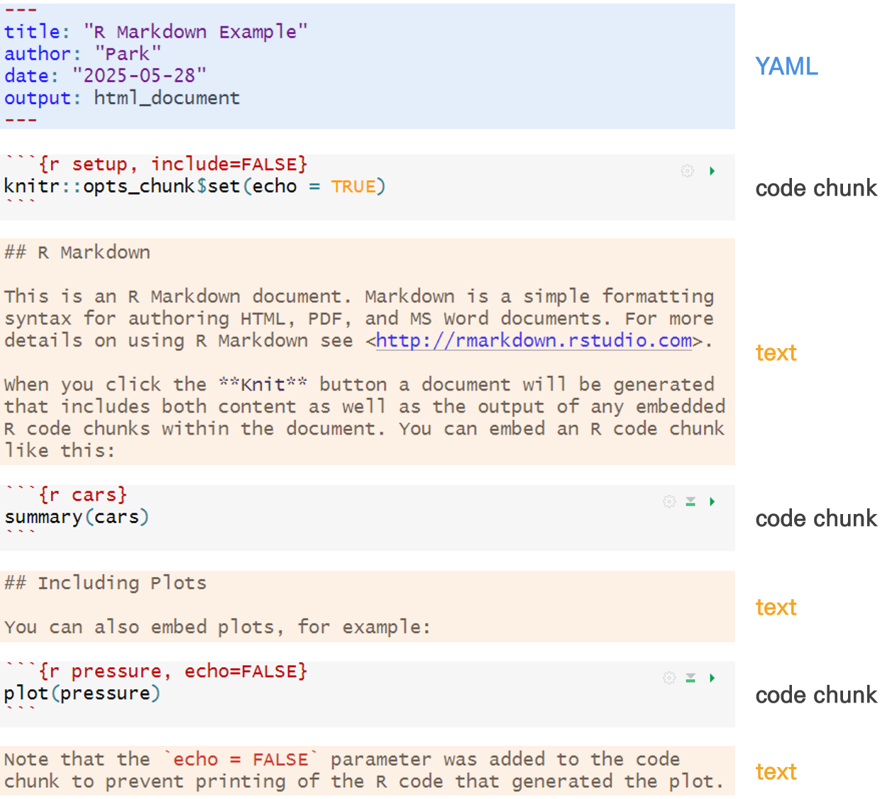

# R Markdown

## R Markdown 이해

### Markdown과 R Markdown
+ Markdown
  + 일반 텍스트 기반의 경량 마크업 언어(markup language)
  + 특수 기호와 문자를 이용한 간단한 문법으로 웹 콘텐츠를 빠르게 작성할 수 있음
  + 일반 마크업 언어에 비해 문법이 쉽고 간단하며 직관적임
  + 마크업 언어 : 태그(tag) 등을 이용하여 문서나 데이터의 구조를 명시하는 언어의 일종
+ R Markdown
  + Markdown을 기반으로 한 **데이터 과학을 위한 통합 문석 작성 도구**
  + R 코드와 분석 결과(표, 그래프 등)를 포함하는 콘텐츠 제작 도구
  + 완벽하게 재현 가능하며, HTML, PDF, MS Word 등 다양한 출력 형식을 지원
  + 파일 확장자 - ```.Rmd```
  + R Markdown 사용 방식
    1. 분석 결과에만 관심 있는 의사결정권자와의 소통(for communicating)
    2. 분석 결과와 그 과정에 관심 있는 다른 데이터 과학자와의 협업(for collaborating)
    3. 데이터 과학을 수행하는 환경으로써 현대식 실험실 노트와 같은 용도
  + 대표적인 3가지 활용 방법
    + 문서(pdf, html, docx) - ```bookdown``` 패키지
    + 프리젠테이션(pdf, html, pptx) - ```xaringan```, ```revealjs``` 패키지
    + 웹, 블로그(html) - ```blogdown```, ```distill```, ```quarto``` 패키지
  + [참고] [R Markdown Cheat Sheet](./file/rmarkdown-2.0.pdf)
  + [참고] [R Markdown Reference Guide](./file/rmarkdown-reference.pdf)
  + [참고] [R Markdown: The Definitive Guide (2022)](https://bookdown.org/yihui/rmarkdown/)

<br>

### R Markdown 시작하기

#### R Markdown 파일 생성
+ ```rmarkdown```, ```knitr``` 패키지 자동 사용(별도로 로드할 필요 없음)
+ R Markdown 파일 생성 - **[RStudio] > [File] > [New File] > [R Markdown...]**
+ 최종 결과물(HTML, PDF, MS Word) 생성
  + **Knit** 아이콘
  + 단축키 ```ctrl``` + ```shift``` + ```k```

<br>

#### R Markdown 구조
+ ```---```으로 둘러싼 **YAML** (option)
+ **Markdown 텍스트**
+ ``` ` ```(backtick)으로 둘러싼 **R 코드 청크(code chunk)**

<br>



<br>

#### R Markdown 작업 흐름
1. R Markdown 파일(.Rmd) 생성
2. 문서를 니트(knit)하면 .Rmd 파일을 ```knitr```로 보냄
3. ```knitr```는 코드 청크(code chunk)를 모두 실행하고, 코드와 그 출력을 포함하는 새로운 Markdown 파일(.md) 생성
4. 생성된 .md 파일은 pandoc 문서 변환기를 통해 다양한 형식(HTML, PDF, MS Word 등)으로 변환됨

<br>


<br>


----------------------------------------------------------------------


## YAML 헤더
+ R Markdown 문서의 메타 데이터(meta data)로, 문서의 맨 처음에 위치해야 함
+ 문서의 제목, 저자, 작성 날짜, 출력 형식 등의 정보를 포함
+ 사용하는 R 패키지(bookdown, rticles 등)에 따라 포함할 수 있는 항목이 달라질 수 있음
+ 기본적으로 ```key: value``` 형식이며, ``:``` 바로 뒤에는 반드시 공백(space)이 있어야 함

```
---
title: "제목"
subtitle: "부제목"
author: "작성자"
date: "작성일" 
output: 
   - "html_document"
   - "word_document"
   - "pdf_document"
   - "md_document"
   - "isoslides_presentation"
   - "slidy_presentation"
   - "beamer_presentation"
---
```

<br>


----------------------------------------------------------------------


## Markdown 문법

### 인라인 서식(inline formatting)
+ 강조(emphasis)
  + 이탤릭체 - *italic*, _italic_
  + 굵은글씨 - **bold**, __bold__

```
*italic*     _italic_
**bold**     __bold__
```

<br>

+ 인라인 코드(inline code) : ``` ` ```(backtick)으로 둘러쌈

```
We defined the `add` function to compute the sum of two numbers.
```

<br>

+ 고정된 코드 블록(plain code blocks) : ```` ``` ````(backticks)으로 둘러쌈

````
```
This text is displayed verbatim / preformatted
```
````

<br>

+ 줄 바꿈(manual line breks) : 줄 마지막에 두 개 이상의 공백(space) 입력
+ 가로줄(horizontal rule) : 세 개 이상의 ```***```(asterisks), ```---```(dashes) 입력


******

------


```
******

------
```

<br>

+ 표(tables)

 First Header |  Second Header  | Third Header
:-------------|:---------------:|--------------:
 Left-aligned |    Centered     | Right-aligned
 Content Cell |  Content Cell   |  Content Cell

```
 First Header |  Second Header  | Third Header
:-------------|:---------------:|--------------:
 Left-aligned |    Centered     | Right-aligned
 Content Cell |  Content Cell   |  Content Cell
```

<br>

+ 그 외 서식(miscellaneous)
  + 위 첨자 : superscript^2^
  + 아래 첨자 : subscript~2~
  + 삭제 표시 : ~~strikethrough~~

```
superscript^2^
subscript~2~
~~strikethrough~~
```

<br>

### 블록 요소(block-level elements)


+ 장/절(headers) : ```#```기호의 숫자로 표시하며, 최대 6단계까지 있음

```
# First-level header
## Second-level header
### Third-level header
```

<br>

+ 목록(list)
  + 순서가 없는 목록 : ```-```, ```+```, ```*``` 기호 중 하나를 사용
  + 순서가 있는 목록 : 숫자로 표현

```
* Item 1
* Item 2
    + Item 2a
    + Item 2b

1. Item 1
2. Item 2
3. Item 3
    + Item 3a
    + Item 3b
```

<br>

+ 인용구(blockquotes) : ```>``` 기호로 표시

> "Blaze with the fire that is never extinguished."
>
> ---Luisa Sigea de Velasco(1521~1577)

```
> "Blaze with the fire that is never extinguished."
>
> ---Luisa Sigea de Velasco(1521~1577)
```

<br>

+ 이미지(images)

{width=30%}

```

```

<br>

+ 링크(links) : [The Comprehensive R Archive Network](https://cran.r-project.org/)

```
[The Comprehensive R Archive Network](https://cran.r-project.org/)
```

<br>


### 수학 표현식(math expressions)
+ 인라인 수식(inline equation) : 문장 중간에 삽입되는 수식으로, ```$```으로 둘러쌈
+ 디스플레이 수식(display equation) : 한 줄 전체를 표현하는 수식으로, ```$$```으로 둘러쌈
+ 수학 표현식은 LaTeX 문법을 따름
$$f(k) = {n \choose k} p^{k} (1-p)^{n-k}$$

```
$$f(k) = {n \choose k} p^{k} (1-p)^{n-k}$$
```

<br>


----------------------------------------------------------------------


## R 코드 청크(code chunk)

### R 코드 청크 이해
+ 실제 R 코드가 실행되는 부분으로, 계산을 위한 코드 블록
+ ```` ```{r} ````와 ```` ``` ````사이에 코드를 작성함
+ 단축키 ```ctrl``` + ```alt``` + ```i```
+ 청크 옵션을 사용하여 코드 출력 여부, 결과 형식, 그래프 크기 등 다양한 설정 가능

````markdown
```{r, chunk_name, chunk_options, ...}
codes
```
````

<br>

### 청크 이름(chunk name)
+ 청크 이름 사용의 3가지 이점
  1. 편집(script) 영역 왼쪽 하단의 드롭다운 코드 탐색기를 통해 특정 청크로 쉽게 이동할 수 있음
  2. 청크에서 생성된 그래프가 의미 있는 이름을 가져 다른 곳에서 쉽게 활용 가능
  3. 캐시된 청크 네트워크 설정 시 불필요한 계산을 줄일 수 있음

<br>

### 청크 옵션(chunk options)
+ [참고] [Options (2020)](https://yihui.org/knitr/options/)

|옵션|초기값|자료형|설명|
|:--:|:--:|:--:|:--------------------|
|eval|TRUE|logical|코드 실행 여부|
|include|TRUE|logical|최종 문서에 코드와 출력 결과 포함 여부|
|echo|TRUE|logical|코드 출력 여부|
|results|'markup'|character|출력 결과 포맷 지정을 위한 옵션 <br>ㆍ'markup' : 출력 형식에 따라 적절한 환경으로 텍스트를 마크업 <br>ㆍ'asis' : 변환하지 않은 원래 R 출력 결과를 그대로(as is) 출력 <br>ㆍ'hide' : 출력 결과를 숨김 <br>ㆍ'hold' : 생성된 모든 코드와 출력을 단일 블록으로 축소|
|message|TRUE|logical|코드로부터 생성된 메세지 출력 여부|
|warning|TRUE|logical|경고 메세지 출력 여부|
|error|TRUE|logical|에러 메세지 출력 여부|


<br>

+ 청크 옵션이 제어 가능한 출력 유형

|Option|Run code|Show code|Output|Plots|Messages|Warnings|
|:---:|:---:|:---:|:---:|:---:|:---:|:---:|
|eval = FALSE|○||○|○|○|○|
|include = FALSE||○|○|○|○|○|
|echo = FALSE||○|||||
|results = "hide"|||○||||
|fig.show = "hide"||||○|||
|message = FALSE|||||○||
|warning = FALSE||||||○|


<br>

````markdown
# results = "markup"(default)
```{r, results = "markup"}
cat("I'm raw **Markdown** content.\n")
```

# results = "asis"
```{r, results = "asis"}
cat("I'm raw **Markdown** content.\n")
```
````

<br>

### 표(table) 삽입
+ 간단한 형태의 표 생성 - ```knitr::kable()``` 함수


``` r
head(iris)
kable(head(iris))
```


### 전역 옵션(global option)
+ 문서 전체에 적용할 기본(default) 청크 옵션을 설정할 수 있음
+ 청크 옵션을 모아 관리하는 객체인 ```knitr::opts_chunk``` 사용
  + ```opts_chunk$set()``` - 전역 옵션 설정
  + ```opts_chunk$get()``` - 현재 설정된 값 확인
  + ```opts_chunk$restore()``` - 초기값으로 리셋
+ 일반적으로 YAML 헤더 바로 아래, ```setup```이라는 이름의 코드 청크에 작성


``` r
opts_chunk$get("warning")
opts_chunk$set("warning" = FALSE)
opts_chunk$get("warning")
opts_chunk$restore()
opts_chunk$get("warning")
```

````markdown
# 전역 옵션 설정 : warning = FALSE
```{r setup, include = FALSE}
opts_chunk$set(warning = FALSE)
```

# 개별 청크에서 warning 옵션을 설정하지 않은 경우, 전역 옵션 설정을 따름
```{r}
as.numeric(c(1, 2, "a"))
```

# 개별 청크에서 warning 옵션을 설정하는 경우, 해당 옵션 설정을 따름
```{r, warning = TRUE}
as.numeric(c(1, 2, "a"))
```
````

<br>

### 인라인 코드(inline code)
+ 텍스트 중간에 R 코드를 직접 입력할 수 있음
  + ``` `r ```와 ``` ` ``` 사이에 코드 작성
+ 텍스트 안에서 데이터 값을 동적으로 표현할 때 매우 유용

> iris 데이터셋에는 150개의 관측값과 5개의 변수가 있습니다.


``` r
> iris 데이터셋에는 `r nrow(iris)`개의 관측값과 `r ncol(iris)`개의 변수가 있습니다.
```

